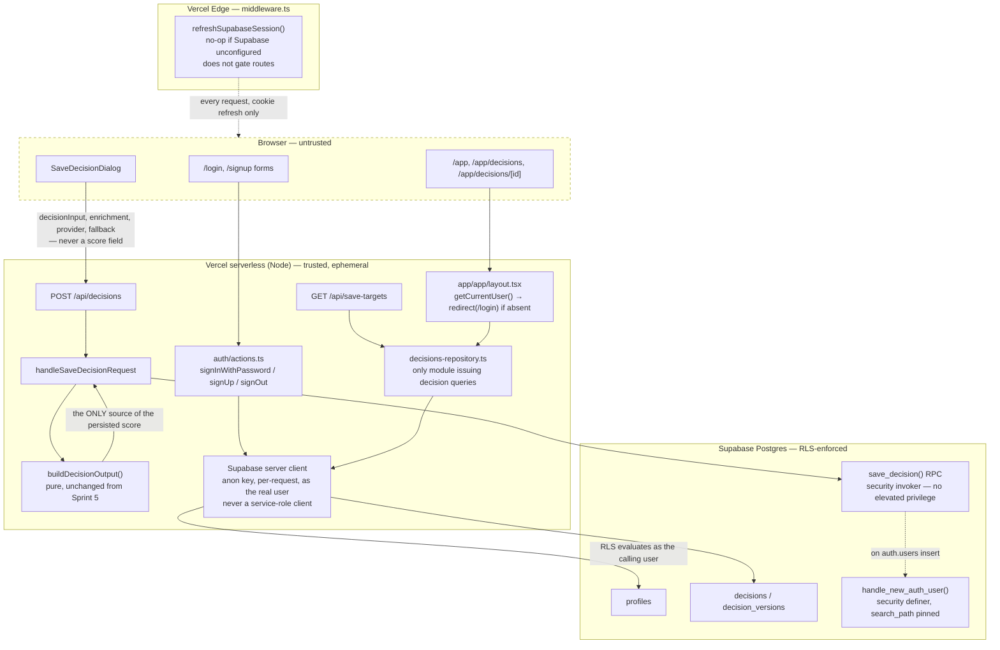

# Sprint 6.1 — Architecture Freeze

Status: **frozen**. This document is the authoritative record of what Sprint 6.1 built, verified directly against the code and a live run of every quality gate on 2026-08-08, not asserted from intent. Anything not described here was not built in this slice.

## 1. Overall architecture

Auth (email/password + magic link via Supabase), a per-user tenant bootstrap (personal organization/workspace/project created atomically on sign-up), and a save/persist/history path for Donna AI decisions (`decisions` + `decision_versions`, append-only). It sits directly on top of Sprint 5's deterministic decision engine and Sprint 4's tenancy schema (`organizations`, `organization_members`, `workspaces`, `projects`, `is_org_member()`/`is_org_admin()`) — no existing table from those sprints was altered.

**New files this sprint added** (nothing pre-existing was replaced): `middleware.ts`, `src/lib/supabase/{env,browser,server,middleware}.ts`, `src/app/{login,signup}/page.tsx`, `src/app/auth/{actions.ts,callback/route.ts}`, `src/app/app/{layout,page}.tsx`, `src/app/app/decisions/{page.tsx,[id]/page.tsx}`, `src/components/auth/AccountMenu.tsx`, `src/components/donna-ai/persistence/*`, `src/app/api/{decisions,save-targets}/route.ts`, `supabase/migrations/20260806130000_sprint6_1_profiles_and_bootstrap.sql`, `supabase/migrations/20260806130100_sprint6_1_decisions.sql`.

## 2. Auth flow

- **Sign-in (password or magic link)** — a Server Action (`auth/actions.ts`) calls `supabase.auth.signInWithPassword` / `signInWithOtp` using the per-request server client; the session cookie is set by the same request/response cycle. No credential round-trips through client JS beyond the browser's own form POST. Sign-in errors are always collapsed to one generic string (`GENERIC_AUTH_ERROR`) regardless of whether the account exists, to avoid account-enumeration via sign-in.
- **Sign-up** — `supabase.auth.signUp()` with `emailRedirectTo` pointed at `/auth/callback`. **As of this freeze pass, the action only `redirect("/app")` when `data.session` is actually present** (i.e. the Supabase project has email confirmation disabled). When no session comes back — either because confirmation is required for a genuinely new signup, or because the email already has an account — the action returns the exact same informational message (`CHECK_EMAIL_MESSAGE`), rendered as a non-error `role="status"` element on the signup page. The two cases are structurally indistinguishable in the response, closing the account-enumeration path.
- **Bootstrap** — `handle_new_auth_user()` (`security definer`, `set search_path = public`) fires `after insert on auth.users` and atomically creates: a `profiles` row, one personal `organizations` row (slug = `org-` + first 8 hex chars of the new user's UUID), an `owner` membership, one default workspace, one default project. This is the entire tenant-creation surface Sprint 6.1 ships — no self-service second-org creation, no invitations.
- **Sign-out** — clears the session via `supabase.auth.signOut()`, redirects to `/`.

## 3. Middleware flow

`middleware.ts` matches every route except static assets/Next internals and delegates to `refreshSupabaseSession()`. That function is a **session-refresh no-op layer only**:

- If Supabase env vars are absent, it passes the request through unchanged — the entire unauthenticated Donna AI experience keeps working with zero Supabase configuration.
- If configured, it constructs a server client bound to the request/response cookie jar and calls `supabase.auth.getUser()`, whose side effect (not its return value) is what triggers `@supabase/ssr`'s cookie rotation.
- **It does not gate any route.** Route protection is a deliberate architectural choice made at the layout level instead (`app/app/layout.tsx` calls `getCurrentUser()` and `redirect("/login")` on a null user) — Edge-runtime middleware is a heavier, less flexible place for a database-backed auth check than a Server Component with full Node context. Every route under `/app/*` inherits this guarantee once, at the layout.

## 4. Persistence flow

`decisions` (mutable pointer/metadata: title, status, `current_version_id`) and `decision_versions` (immutable, append-only content) are a deliberate two-table split, not one table doing both jobs — this makes "history is never overwritten" a schema property (no UPDATE/DELETE policy exists on `decision_versions` for any role) rather than a convention.

Reads (`listDecisionsForCurrentUser`, `getDecisionDetail`, `listSaveTargetsForCurrentUser`) apply no explicit `organization_id` filter beyond what RLS (`is_org_member()`) already enforces — a user with multiple org memberships sees decisions across all of them, matching every other list in this schema.

## 5. Save flow

1. Client submits `{ title, organizationId, workspaceId, projectId, decisionInput, enrichment, provider, fallback, changeReason? }` to `POST /api/decisions` — **no score field exists in the schema at all** (`.strict()` Zod schema).
2. `handleSaveDecisionRequest` checks `userId` first (401 before any parsing), validates the body, then **recomputes** `deterministicOutput` server-side via `buildDecisionOutput(decisionInput.wizardState)` — the same pure function every other code path uses. The client's own copy of the output, if it sent one, would be rejected by the strict schema; if it didn't send one, there was never anywhere for it to go.
3. `saveDecision()` calls the `save_decision()` Postgres RPC (`security invoker`), which atomically inserts one `decisions` row, one `decision_versions` row (version 1), and sets `current_version_id` — all in one transaction, all still evaluated against RLS as the calling user, and `created_by` is read from `auth.uid()` inside the function, never from a client parameter.

## 6. Repository pattern

`decisions-repository.ts` is the **only** module in the codebase that issues a Supabase query against `decisions`/`decision_versions`. It takes an already-constructed per-request server client as a parameter — it never constructs its own client, and never touches a service-role key. Every failure is passed through `classifySupabaseError()`, which maps any Postgres/PostgREST error message to one of three fixed, safe strings before it ever reaches a caller — the raw message (table/column/constraint names) never crosses this boundary. `getDecisionDetail` surfaces a cross-tenant ID and a truly nonexistent ID as the identical generic "Decision not found," never a distinct "not allowed," so the response itself cannot be used to probe for the existence of an ID outside the caller's access.

## 7. RLS model

Same `is_org_member()`/`is_org_admin()` predicate pattern as every existing table in the schema — no new predicate invented for this slice. Both predicate functions pin `set search_path = public` (search-path-hijacking hardening for `security definer` functions).

| Table | Select | Insert | Update | Delete |
|---|---|---|---|---|
| `profiles` | self only (`id = auth.uid()`) | (bootstrap trigger only) | self only | — |
| `decisions` | `is_org_member(organization_id)` | `is_org_member(...) and created_by = auth.uid()` | `is_org_member(organization_id)` | — |
| `decision_versions` | `is_org_member(organization_id)` | `is_org_member(...) and created_by = auth.uid()` | **none — append-only, structurally enforced** | — |

**Fixed this pass:** `decisions_update`'s `using` clause alone (no separate `with check`) permitted any org member to repoint `current_version_id` at an arbitrary `decision_versions.id`, including one belonging to a *different* decision within the same org — a database-level guarantee gap, not exploitable through the app's own UI (the sole write path, `save_decision()`, always points a decision at the version it just inserted for that same decision) but reachable via a direct PostgREST call. A new trigger, `decisions_check_current_version_match` (`before insert or update of current_version_id on decisions`), now rejects any write where the referenced version's `decision_id` doesn't match the row being written — added to `supabase/migrations/20260806130100_sprint6_1_decisions.sql` (still unexecuted against any live database, so edited directly rather than layered as a follow-up migration) and covered by a new regression case (Test 6) in `supabase/tests/sprint6_1_rls_verification.sql`.

## 8. Rendering strategy

Next.js 16 App Router, Turbopack build. `/app` and its children are forced dynamic (`export const dynamic = "force-dynamic"` in `app/app/layout.tsx`) — deliberate: a personalized, session-dependent route must never be statically prerendered, since that would bake one point-in-time (or, with Supabase unconfigured, an error) response into a file served to every subsequent visitor. `/donna-ai` is dynamic for the same reason (it reads `isSignedIn`). `/login`, `/signup`, `/privacy`, `/imprint`, `/terms`, and the marketing/product pages remain static (`○` in the build output). API routes (`/api/decisions`, `/api/save-targets`, `/auth/callback`) run on the Node.js runtime (`export const runtime = "nodejs"`), not Edge — required for the Supabase server SDK's cookie handling. Confirmed against a live `next build`, run this session — 21 routes, correct static/dynamic split, unchanged by this pass's fixes.

## 9. Security boundaries

| Boundary | Mechanism | Verified |
|---|---|---|
| Cross-tenant read (IDOR) | `decisions_select`/`decision_versions_select` RLS: `is_org_member(organization_id)`. Generic "not found" for both missing and unauthorized IDs. | Live code read + `decisions-repository.test.ts` |
| Same-org cross-decision integrity | **Fixed this pass** — `decisions_check_current_version_match` trigger (§7). | Live code read + new SQL regression test |
| Score tampering | `saveDecisionRequestSchema` has no output field and is `.strict()`; server always recomputes via `buildDecisionOutput`. | Live code read + `handle-save-decision-request.test.ts` |
| Deterministic scoring | Single pure function, unchanged from Sprint 5, called from every path that produces an `output`. | Live code read |
| Service-role key isolation | `grep -rn "SERVICE_ROLE\|service_role" src/` → zero matches. No admin client is ever constructed. | Live grep, this session |
| Middleware authentication | Middleware refreshes cookies only; does not gate routes (§3). Route gating confirmed present and unconditional in `app/app/layout.tsx`. | Live code read |
| Repository authorization | Every query in `decisions-repository.ts` runs as the calling user's own client — no service-role bypass anywhere in the module (§6). | Live code read |
| Error sanitization | `classifySupabaseError()` maps every Postgres/PostgREST error to one of three fixed strings. | Live code read + test asserting the raw RLS message is absent |
| No stack traces returned | `grep -n "\.stack" src/app/api/**/route.ts src/components/donna-ai/persistence/*.ts` → zero matches. | Live grep, this session |
| No unsafe logging | `grep -rn "console\."` across every auth/persistence file → zero matches. This domain does not log at all. | Live grep, this session |
| Secret leakage | `grep -rl "SUPABASE_SERVICE_ROLE\|service_role\|OPENAI_API_KEY" .next/static` → zero matches, checked against this session's actual production build output. | Live grep against `.next/static`, this session |
| Authorization boundaries (write) | `decisions_insert`/`decision_versions_insert`: `is_org_member(...) and created_by = auth.uid()`. `save_decision()` is `security invoker`, no elevated privilege. | Live code read |
| Account enumeration (sign-up) | **Fixed this pass** — duplicate-email sign-up (`error.code === "user_already_exists" \| "email_exists"`) now returns the identical message a genuine pending-confirmation signup returns. | Live code read, `auth/actions.ts` |
| Broken sign-up redirect | **Fixed this pass** — `redirect("/app")` now only fires when `data.session` is actually present. | Live code read, `auth/actions.ts` |
| Immutable decision persistence | `decision_versions` has no UPDATE/DELETE RLS policy for any role — structurally append-only. `current_version_id` can no longer be redirected across decisions (§7, fixed). | Live code read + SQL tests |
| `security definer` hardening | `handle_new_auth_user()` and both `is_org_member()`/`is_org_admin()` all pin `set search_path = public`. | Live grep against migrations |

## 10. Deterministic scoring model

A single pure function, `buildDecisionOutput()` (Sprint 5, unchanged), is the only code path in the entire system capable of producing a `DeterministicDecisionOutput`. The save flow (§5) never accepts one from the client — it always recomputes from the validated `decisionInput.wizardState`. This is a stronger guarantee than schema validation: it doesn't confirm a client-supplied score is plausibly shaped, it proves the persisted score *is* the actual, current, correct answer for that input. No second scoring implementation exists anywhere in the codebase to drift from it.

## 11. Known limitations

Carried forward from the prior review, current status noted:

1. ~~`decisions.current_version_id` integrity~~ — **fixed this pass** (§7, §9).
2. ~~Sign-up redirects to `/app` without checking for a session~~ — **fixed this pass** (§2, §9).
3. ~~Sign-up account-enumeration via raw error passthrough~~ — **fixed this pass** (§2, §9).
4. **No rate limiting on any auth or save action.** Password sign-in, sign-up, and the save-decision endpoint have no throttling — Supabase Auth's own platform-level limits are the only backstop.
5. **No audit logging.** Sprint 4's `audit_logs` table exists, untouched; nothing in Sprint 6.1 writes to it.
6. **No password reset flow.** Only sign-in, sign-up, magic link, and sign-out exist.
7. **RLS policy correctness (including this pass's new trigger) is not executed against a live database.** `supabase/tests/sprint6_1_rls_verification.sql` (now 6 test cases) is written but not run — no local Postgres instance is available in this environment.
8. **No React Testing Library / jsdom coverage.** Rendered-DOM behavior of `/login`, `/signup`, `SaveDecisionDialog`, and the decision list/detail pages is unverified beyond "the production build compiles them successfully."
9. **Personal-organization slug collision risk at scale.** `'org-' || substr(new.id::text, 1, 8)` draws from a 32-bit space; the `organizations.slug` unique index turns a collision into a failed sign-up rather than silent data corruption, but by the birthday bound that becomes a practically-reachable failure rate (~50%) somewhere past roughly 60–70k total sign-ups.
10. **`profiles` and Sprint 4's `users` table now coexist**, unreconciled — a disclosed, deliberate deferral.

## 12. Deferred items (explicitly out of Sprint 6.1)

Self-service creation of a second organization; organization invitations; any review/approval workflow; decision comments; version history UI beyond the current single-version view; replay; audit-log writes; password reset; rate limiting; vendor-catalog snapshotting. All of the above are Sprint 6.2+ candidates (`docs/roadmap/sprint-6.2.md`) — none were started, touched, or partially implemented during this freeze pass.

## 13. Live quality gate results (this session, 2026-08-08, after fixes)

| Gate | Result |
|---|---|
| `npm test` (`vitest run`) | 15 files, 113 passed, 1 intentionally skipped, 0 failed |
| `npm run lint` | 0 errors |
| `npx tsc --noEmit` (`apps/web`) | 0 errors |
| `npx tsc --noEmit` (`packages/database`) | 0 errors |
| `npm run build` | Succeeds; 21 routes, correct static/dynamic split |
| `npm audit --omit=dev` | 0 vulnerabilities |

## 14. Architecture freeze statement

Sprint 6.1's architecture — the auth/session model (§2–3), the two-table decision/version persistence model with server-side score recomputation (§4–6), and the RLS-as-primary-enforcement security posture (§7, now closing the `current_version_id` integrity gap) — is **frozen as of this document**. All three previously-disclosed high-severity findings (current_version_id integrity, sign-up redirect correctness, sign-up account enumeration) are fixed and re-verified against a live run of every quality gate. Sprint 6.2 (`docs/roadmap/sprint-6.2.md`) is expected to build strictly on top of this shape: new tables and read paths for version history/replay/audit, no changes to how `decisions`/`decision_versions` are written, no changes to the auth or middleware model. The remaining limitations in §11 (items 4–10) are known and explicitly *not* blocking for the alpha-stage save/history capability this sprint delivers.
