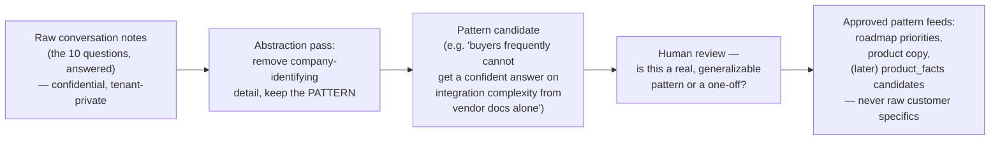

# The Customer Learning System

## Principle

**Every customer meeting improves Donna.**

Not as a slogan — as a structured, repeatable practice. A conversation with a real enterprise architect about a real decision is the single richest input this company can receive at this stage, richer than any amount of solo roadmap planning, because it's the only source of ground truth about whether the beachhead hypothesis (`06-go-to-market.md`) is actually right. The risk this document exists to manage is letting that richness evaporate into an unstructured Slack message or a founder's memory instead of becoming a durable, reusable asset.

## The ten questions, for every relevant customer interaction

1. **What decision was being made?** — named precisely (not "a platform decision" — "which cloud data platform for the 2027 finance data consolidation").
2. **Why now?** — the compelling event (`06-go-to-market.md`) that made this decision active rather than dormant.
3. **Which alternatives existed?** — the real shortlist they were actually considering, not a hypothetical one.
4. **Which evidence mattered?** — what actually moved their thinking: a vendor demo, a peer reference, an analyst report, an internal POC, a pricing conversation.
5. **Which uncertainty blocked progress?** — where they got stuck, what they couldn't get a confident answer to from any existing source.
6. **Which stakeholder influenced the decision?** — the real internal politics and authority structure, not the org chart's formal version of it.
7. **What commercial constraints mattered?** — budget, existing vendor relationships, procurement rules, sunk-cost pressure.
8. **What technical constraints mattered?** — existing landscape, integration requirements, skills availability, timeline.
9. **What ultimately changed the decision?** — the moment or fact that actually tipped it, if the decision has been made; if not yet made, what they expect will tip it.
10. **What should Donna have known or done?** — the single most important question in this list, asked directly: where did the product fall short of what this real decision actually needed.

## Why this structure, specifically

Questions 1–3 establish the decision's actual shape (validates or invalidates the beachhead use case). Questions 4–8 are the raw material for the knowledge graph and evidence engine — what real evidence and real constraints actually matter in practice, as opposed to what the architecture docs guessed they'd be. Question 9 is the closest thing to outcome data available before Sprint 6.2's outcome-tracking exists formally — a lightweight, conversational precursor to `docs/sprint-6/25-outcome-intelligence.md`'s structured version. Question 10 is the direct product-feedback loop, asked as its own explicit question so it never gets lost inside a general "how was it" conversation.

## What NOT to do with this information

**Do not store confidential employer/customer information in ClouDonna without explicit permission.** A design partner's specific pricing terms, their internal architecture diagrams, their unpublished vendor negotiation position — none of this becomes a `product_facts` row, an `evidence_sources` entry, or any other shared, structured asset without that specific customer's explicit, informed consent, following the same consent discipline `docs/sprint-6/25-outcome-intelligence.md` already specifies for outcome data (`tenant_private` by default, `shared` only by explicit action).

## How learnings become patterns, not leaked confidences

Concretely: "Acme Corp's CFO blocked the SAP decision over a specific undisclosed pricing term" is raw, confidential, and never leaves the design-partner relationship's own private notes. "Buyers in this segment frequently cite finance-stakeholder pricing objections as the actual blocker, more often than the technical evaluation itself" is a pattern — generalizable, useful for product and roadmap decisions, and safe to act on without identifying anyone. The discipline this system requires is doing the abstraction step deliberately, every time, rather than assuming it happens automatically because "it's just internal notes."

## Where this connects to the rest of the strategy

This is the concrete mechanism that makes `04-decision-intelligence-moat.md`'s flywheel real in the near term, before enough real decisions exist to populate the knowledge graph through the product itself. It is also the primary input to `12-founder-dashboard.md`'s customer-facing metrics (decision types observed, repeat usage) and the main evidence base for validating or revising the ICP and beachhead defined in `06-go-to-market.md`. Treat every Founding Customer Program conversation as required to run through this structure — not optional, not ad hoc — for exactly as long as the company remains small enough that a founder can personally be in the room for each one.
