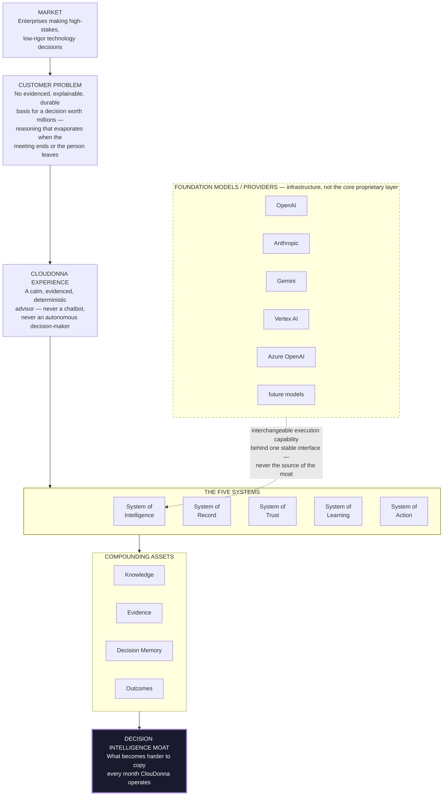

# Company Architecture — Master Diagram

## The one diagram

## Reading the diagram

**Top to bottom is the value chain**, not a build sequence — the market and customer problem are constant; the experience, systems, and assets are what ClouDonna builds to serve them, at different levels of maturity today (see `01-company-vision.md`'s product/platform/company-ambition distinction, and the maturity matrix in the final strategy report).

**The five systems are peers, not a pipeline** — drawn side by side deliberately, not as five sequential boxes, because `03-product-strategy.md`'s reinforcement loop is circular, not linear: Intelligence feeds Record feeds Trust feeds Learning feeds Action feeds back into Intelligence's knowledge. A top-to-bottom pipeline diagram would misrepresent this as a one-way assembly line.

**The compounding assets sit below the systems, not inside any one of them** — Knowledge, Evidence, Decision Memory, and Outcomes are each produced by more than one system (Knowledge is populated by both Intelligence and Learning; Decision Memory is Record's core output but read by Trust, Learning, and Action alike) — drawing them as a shared layer underneath the systems is more accurate than nesting them inside a single box.

**The moat is the bottom of the value chain, not a separate initiative** — it is what accumulates as a consequence of the systems and assets operating over real time with real customers, not a project with its own workstream. This is the single most important thing this diagram argues visually: there is no box labeled "build the moat."

**Foundation models sit outside and below everything, connected by one dashed arrow into System of Intelligence only** — this is the diagram's central, non-negotiable claim, made visually rather than just asserted in prose: foundation models are a **replaceable execution capability** feeding *into* the one system that needs to call a model at all (Intelligence's narrative layer) — they have no other connection to the diagram, they do not touch Record, Trust, Learning, or Action directly, and they are drawn dashed and boxed separately specifically so no future version of this diagram could accidentally imply a foundation model provider sits *inside* ClouDonna's proprietary layer. This is the manifesto's north star (`LLMs are replaceable. Decision Intelligence is not.`) rendered as an architectural fact, not a slogan.

## What would falsify this diagram

If a future architecture ever needed a second arrow from `Foundation` into anything other than `System of Intelligence` — say, a foundation model directly writing to Decision Memory, or directly adjusting a score — that change would contradict this diagram and, more importantly, the manifesto principle it represents. Any such proposal should be treated as a founder-level decision requiring explicit, separate review (`14-founder-decisions.md`), never a routine architecture change.
