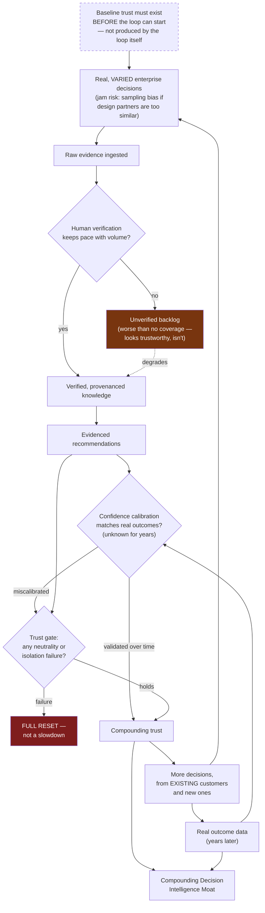

# The ClouDonna Flywheel — Complete Version

**Relationship to the prior pass:** `04-decision-intelligence-moat.md` already corrected the brief's original flywheel once — adding a human-review step between "more decisions" and "better knowledge," and reframing trust as a gate rather than a smooth link. This document does not repeat that correction; it starts from the corrected version and goes further, per this round's explicit ask to make it fully defensible, not just directionally right.

## The brief's proposed flywheel, restated

```
Real Enterprise Decisions → Evidence → Knowledge → Decision Intelligence
→ Better Recommendations → Customer Trust → More Enterprise Decisions
→ Even Better Decision Intelligence
```

## What's still wrong with it, beyond the prior correction

Even the corrected version from the prior pass has one remaining flaw: **it has no failure mode drawn into it.** A flywheel diagram that only shows the loop working is marketing, not architecture — the honest version has to show where it *stops* turning, because a company that hasn't thought about where its own flywheel jams hasn't actually designed a flywheel, it's designed an aspiration.

## Where the loop actually jams — named explicitly

1. **Evidence → Knowledge jams if verification throughput doesn't scale with evidence volume.** More raw evidence without more human review capacity doesn't produce more knowledge — it produces a growing backlog of `inferred`, unverified facts, which is worse than no facts, because it *looks* like coverage without being trustworthy coverage. This is a real operational bottleneck, not a hypothetical one, the moment real customer usage outpaces the knowledge-review function named in `09-operating-model.md`.
2. **Trust → More Decisions jams instantly and completely on a single neutrality or isolation failure**, as already established — but the flywheel diagram needs to show this isn't a slowdown, it's a full stop, and recovery from it is not symmetric with the speed it broke.
3. **Recommendations → Trust jams if confidence is systematically miscalibrated** — a recommendation that *sounds* well-evidenced but turns out wrong more often than its stated confidence implied breaks trust worse than an honestly uncertain one, and this is only detectable once real outcome data exists, which is years away. The flywheel has a multi-year blind spot in exactly the place it most needs a feedback signal.
4. **More Decisions → Better Knowledge jams if the decisions aren't actually varied.** Volume from one industry, one decision type, or one overrepresented design-partner profile produces a narrower, more confidently-wrong knowledge base, not a better one — the sampling-bias risk already flagged in `15-critical-review-v2.md`.

## The complete, defensible flywheel



## What makes this version defensible rather than aspirational

- **It names its own bottleneck (human verification throughput) as an explicit node, not an assumption.** This directly implies a real operational commitment: knowledge-review capacity must scale roughly with evidence-ingestion volume, or the flywheel actively degrades rather than merely slowing down — a concrete input to hiring decisions (`09-operating-model.md`), not just a diagram detail.
- **It shows trust failure as a reset, not a dip.** Any strategy document that draws trust as a smoothly-recoverable variable is lying to itself about the actual shape of enterprise trust, which behaves more like a one-way ratchet with a catastrophic release valve than a spring.
- **It shows the calibration question as genuinely unknown for years, not assumed positive.** The flywheel does not get to claim "better recommendations → more trust" as an automatic, mechanical fact — it's a bet that has to be *earned* by the confidence model actually being right often enough, which nobody, including this document, can currently prove.
- **It starts from a precondition, not a beginning.** The brief's version implies the loop can simply start; the honest version shows baseline trust (structural neutrality, real security posture) has to exist *before* the first turn, which is exactly why `01-company-vision.md`'s own recommended next move is customer engagement using what's already trustworthy today, not a rush to generate volume before the precondition is met.

## The one-sentence test for whether this flywheel is real

Ask, honestly, once a year: **did verified knowledge grow faster than unverified backlog, and did trust survive the year without a reset?** If the answer to either is no, the flywheel is not turning, regardless of how many decisions, customers, or dollars moved through the company that year.
