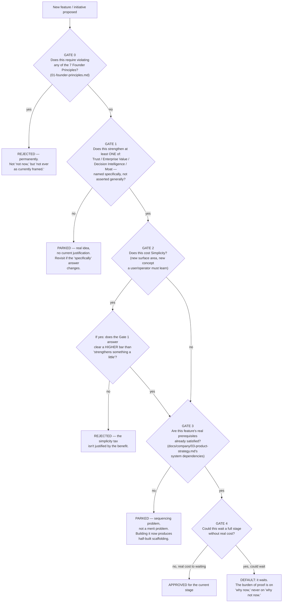

# Founder Playbook — How Product Decisions Get Made

## The decision framework

Deliberately **not a weighted score.** A blended number that combines trust, moat, and simplicity into one composite would be exactly the false-precision mistake this company's own Confidence Model refuses to make about a Donna Score (`docs/sprint-6/24-confidence-model.md`) — applying a lower epistemic standard to how the company evaluates itself than the product applies to its own customers would be a real inconsistency, not a convenience. Instead: a sequence of gates, each answerable yes/no, in order. A proposal that fails a gate stops there — it doesn't get averaged into a passing score by being strong somewhere else.

## Worked example, to prove this isn't decorative

**Proposal: "Add Enterprise SSO now — a Fortune 500 prospect asked for it."**

- Gate 0: no principle violated. Continue.
- Gate 1: strengthens Enterprise Value, specifically (a real, named blocker for a real deal-sized prospect) — not a vague "enterprises expect this." Continue.
- Gate 2: yes, real complexity cost (new auth surface, per-org IdP configuration, a login-routing branch — `docs/sprint-6/02-auth.md` already flags this as deliberately deferred). Gate 2b: does the Gate 1 answer clear a higher bar? If the prospect is real, named, and the deal is otherwise ready to close — yes. If it's a generic "enterprises will want this eventually" — no, rejected here.
- Gate 3: prerequisite check — does auth/persistence (Sprint 6.1) even exist in production yet? As of this document, no. **This is where the real proposal dies today** — SSO's prerequisite isn't satisfied, so it's parked regardless of how good the Gate 1 answer was.

**The output of running this framework honestly: SSO is parked, not rejected, not silently deprioritized without a reason on record.** This is what the framework is for — not to make every decision easy, but to make every decision traceable to a specific gate, so "why didn't we build X" always has a real answer instead of an institutional shrug.

## How founders should make product decisions, restated as a habit

- **Default to no.** Every yes is a permanent tax on Simplicity (`01-founder-principles.md` #7) — the bar for a new yes should feel slightly uncomfortable to clear, not routine.
- **Write the gate answers down.** A decision made through this framework but never recorded is indistinguishable, six months later, from a decision made on a whim. `docs/company/14-founder-decisions.md`'s register is the place this gets recorded for anything founder-level.
- **Prefer parking over rejecting when the only failing gate is sequencing (Gate 3).** A parked idea with a named prerequisite is a live asset; a rejected idea discourages the next person from proposing something adjacent that might actually be ready.
- **Revisit Gate 1 "parked" ideas on a real cadence**, not never — a specific justification that didn't exist six months ago (a design partner's actual, repeated ask; a competitor's move that changes the trust calculus) can turn a parked idea into an approved one. The framework isn't a one-way filter, it's a standing test applied every time new evidence shows up.

## What this playbook explicitly refuses to be

A stage-gate process with sign-offs, tickets, and a committee. At current company size, this is one person (or a very small founding office) applying five honest questions in order, in minutes, out loud if useful — the value is in the discipline of the sequence, not in any process weight around it. The day this needs a form to fill out is the day it's being followed for its own sake instead of the reason it exists.
