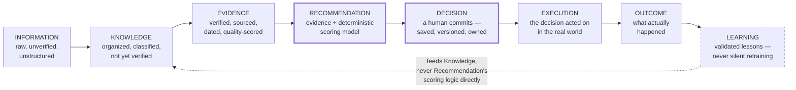

# The Decision Intelligence Framework

## Why these eight stages, kept separate rather than collapsed

Most software collapses several of these into one step — a chatbot treats "information" and "evidence" as the same thing; a BI dashboard stops at "recommendation" and calls it done. Keeping all eight distinct is itself the category's core intellectual claim: **a fact is not knowledge until it's organized, knowledge is not evidence until it's verified, and a recommendation is not a decision until a human commits to it.** Collapsing any of these boundaries is exactly how confident-sounding, unaccountable AI advice gets made — this framework exists to make each boundary a checkable, named thing instead of an implicit assumption.

## The eight stages

## Each stage, precisely — and what separates it from its neighbors

**Information.** A claim from anywhere — a vendor's webpage, a document, a conversation note. Zero trust attached. Distinguished from Knowledge by having no structure yet: it hasn't been assigned a domain, a key, or a place in the ontology.

**Knowledge.** Information that has been classified and given a home (`docs/sprint-6/14-product-knowledge-layer.md`'s `fact_domain`/`fact_key`) — organized, queryable, but explicitly *not yet trusted*. Distinguished from Evidence by verification status: Knowledge can sit at `inferred` or `vendor_provided` indefinitely; it only becomes Evidence when a named human reviewer verifies it, or a Claim is corroborated by an independent source.

**Evidence.** Knowledge that has earned the right to support a claim — sourced, dated, quality-scored across the eight dimensions already defined (`docs/sprint-6/15-evidence-engine.md`), distinguishable from a raw citation by having a real reliability tier, not just a link.

**Recommendation.** Evidence, run through the one deterministic scoring model, producing a ranked, explained answer with a confidence decomposition. The single most protected boundary in the entire framework: nothing upstream of this stage may be authored by an AI process and treated as authoritative past it (`01-founder-principles.md` #1).

**Decision.** A recommendation becomes a Decision only through an explicit human act — saved, versioned, owned by a specific person and organization. This is the boundary between "software suggested something" and "an enterprise did something," and it's the exact moment System of Record's guarantees (immutability, provenance) start applying.

**Execution.** The decision translated into real-world action — an implementation, a vendor contract, a migration. Today, almost entirely outside ClouDonna (System of Action is the least-built system, `docs/company/03-product-strategy.md`) — named here as its own stage precisely because it's the stage most tempting to skip past, and skipping past it is how a platform loses track of whether its own recommendations mattered.

**Outcome.** What actually happened — measured, reported by the tenant, with a stated confidence in the measurement itself (`docs/sprint-6/25-outcome-intelligence.md`). Distinguished from Execution by requiring real elapsed time: an outcome cannot exist the day a decision is made, only after reality has had a chance to respond to it.

**Learning.** Outcome compared honestly against the original recommendation's confidence and evidence, producing a validated lesson — which becomes new Knowledge, reviewed like any other fact, never a direct adjustment to the deterministic scoring model. This is the loop closing, drawn dashed deliberately (matching `docs/company/13-company-architecture.md`'s master diagram) because it is the one arrow in this entire framework that must never become an unreviewed, automatic write path.

## How ClouDonna owns this lifecycle — and where it doesn't yet

| Stage | ClouDonna owns it today? |
|---|---|
| Information | Partially — ingestion is manual/illustrative today, not a real pipeline. |
| Knowledge | Designed, not built — `product_facts` doesn't exist yet. |
| Evidence | Designed, not built — the Evidence Engine is roadmap. |
| Recommendation | **Yes, live, real.** The deterministic engine is the one stage of this entire eight-stage chain that is genuinely production-tested today. |
| Decision | Implemented, not yet deployed — Sprint 6.1's save/persist/version capability. |
| Execution | Almost entirely unbuilt — the least mature stage in the framework. |
| Outcome | Designed, not built. |
| Learning | Designed, not built, and deliberately the furthest stage from being rushed — it requires every stage before it to be real first. |

## Why owning the whole chain is the actual claim, not any single stage

No competitor named in `docs/company/19-category-ownership.md` owns more than two or three consecutive stages of this chain today. Gartner owns something like Information-through-Evidence but nothing past Recommendation. A chatbot owns something that looks like Recommendation with no real Evidence stage underneath it and nothing past Decision. Consultants own Decision and sometimes Execution but nothing that compounds into owned Knowledge afterward. **The category claim is specifically that all eight stages are one continuous, owned chain — not eight separate features.** This is also, read plainly against the table above, the most honest possible statement of how much of the category ClouDonna has actually built versus designed: one stage production-real, one implemented-but-undeployed, six designed-but-unbuilt. The framework is a real, differentiated claim about what the category requires; it is not yet a description of a finished product.
