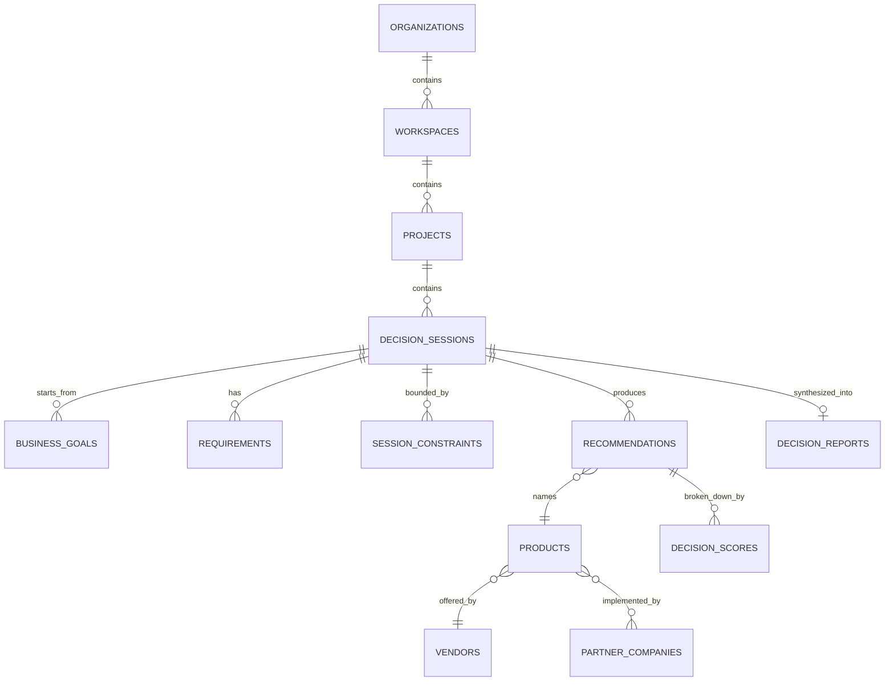
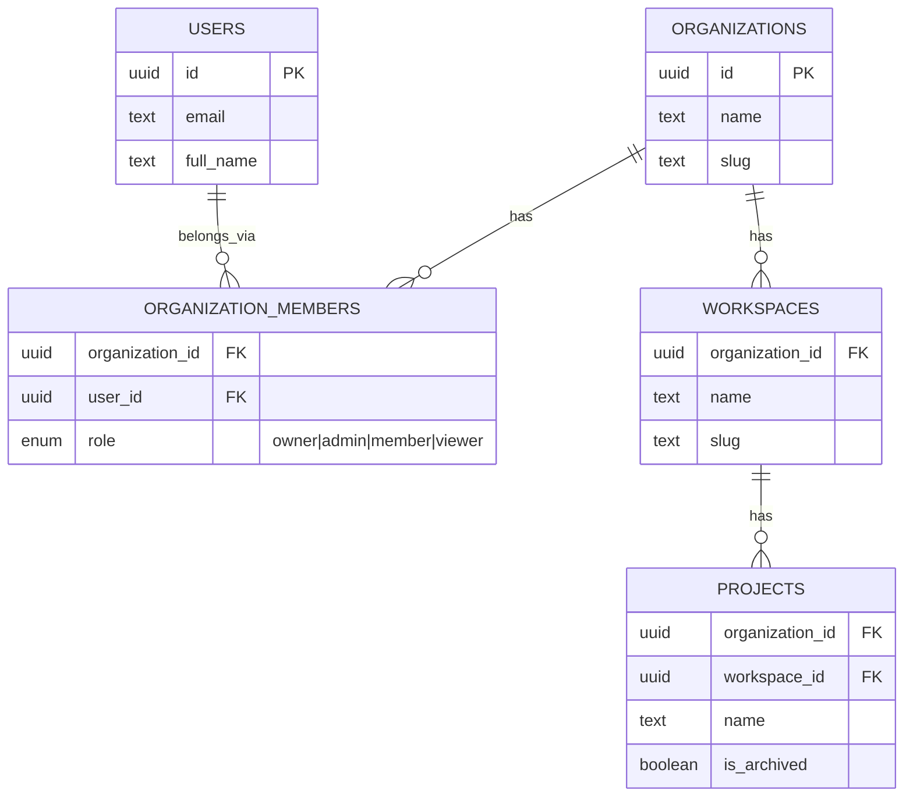
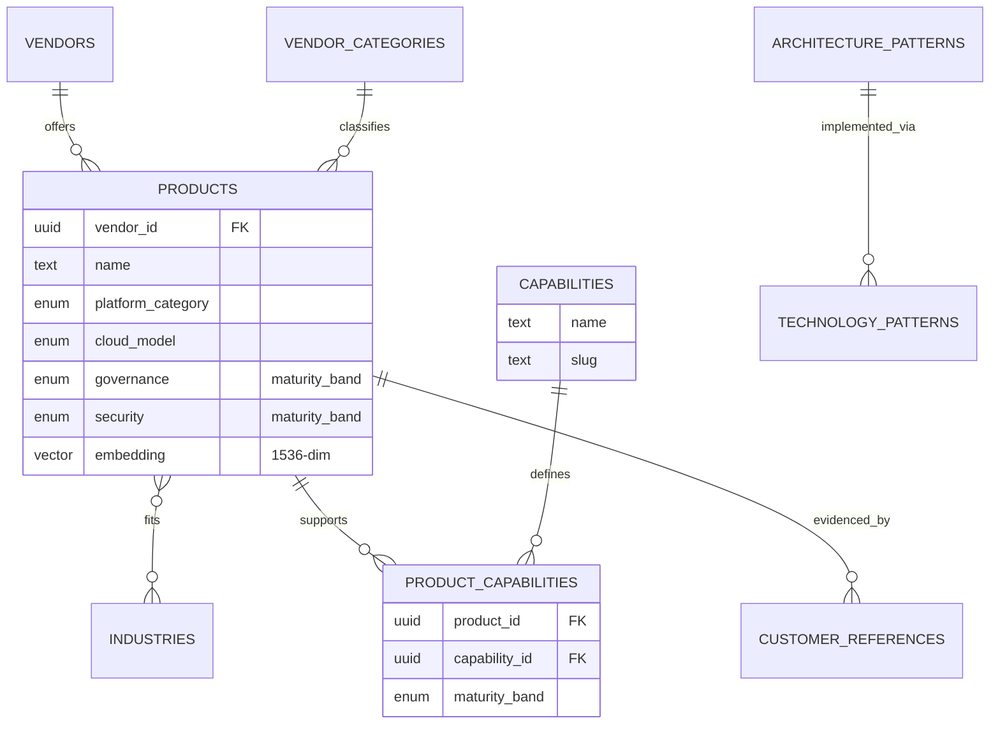
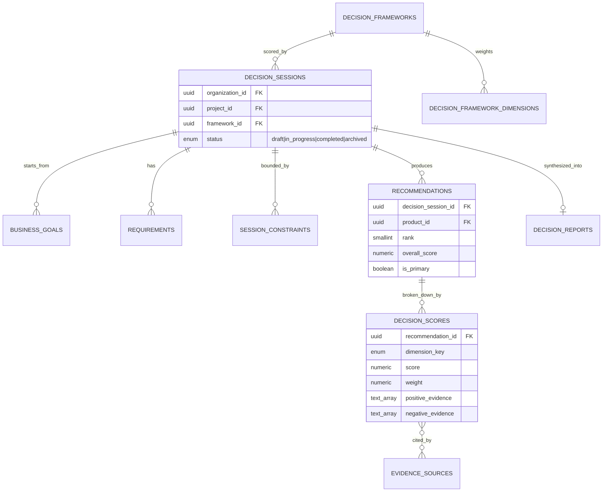
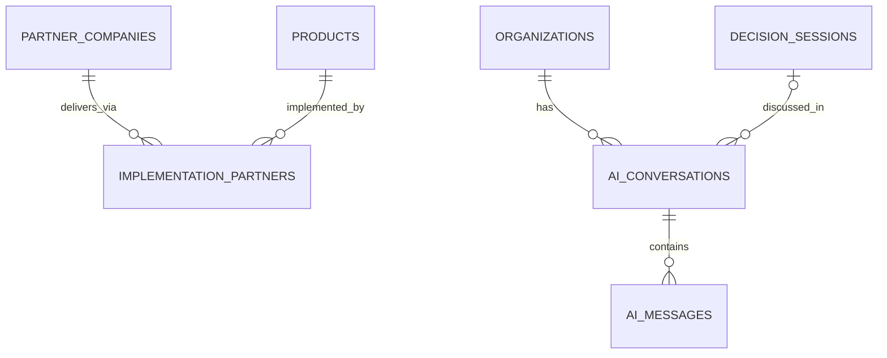

# ClouDonna Platform — Database Architecture

**Sprint:** 4 — Database Foundation
**Branch:** `worktree-database-foundation`
**Status:** Implemented, not yet applied to a live project, not committed
**Scope:** `supabase/migrations/`, `packages/database`

This is the persistence foundation for the ClouDonna Decision Framework —
**Business Goal → Capabilities → Solution Approaches → Technology → Vendor**,
generalized from a single in-browser demo (Sprint 2/3's Donna AI) into a
multi-tenant platform capable of holding millions of decision sessions,
thousands of vendors, thousands of implementation partners, and many
enterprise customer organizations at once.

Nothing in this migration set implements authentication, payments, or an
OpenAI/LLM integration. Every table needed to eventually support those is
here — the seams are real — but none of them are wired to anything live.
See "Explicitly out of scope" at the end of this document.

**Read [`enterprise-intelligence-graph.md`](./enterprise-intelligence-graph.md)
first.** That document is the actual source of truth for this domain —
nodes and semantically-named relationships (`SUPPORTS`, `IMPLEMENTS`,
`COMPETES_WITH`, `RECOMMENDED_FOR`, ...), designed before any table existed.
Every table below is one relational projection of that graph, not an
independent design. Doing the graph exercise surfaced four missing
relationships and three missing node types that an earlier, tables-first
pass of this schema had missed — see that document's §1 — now reflected
in migration 11 (`20260806121000_graph_extensions.sql`) below.

---

## 1. Principles this schema follows

1. **No business logic inside the database.** Postgres enforces *shape*
   (types, foreign keys, not-null, a handful of `CHECK` constraints like "a
   score is between 0 and 100") and *access* (Row Level Security). It never
   decides *what a score should be*, *what happens next in a workflow*, or
   *what a fabricated market number would look like* — those decisions stay
   in application code. The one exception worth naming: `set_updated_at()`
   is a trigger, but it only stamps a timestamp; it contains no
   conditionals and touches no other column.
2. **Global reference data vs. tenant-scoped data.** Roughly half the
   tables in this schema (the vendor catalog, the shared taxonomy, the
   partner directory) are **not** owned by any organization — a vendor
   profile or an industry definition is shared platform-wide, the same way
   a country list would be. The other half (decision sessions and
   everything under them, saved comparisons, AI conversations) belongs to
   exactly one organization. A few tables (`decision_frameworks`,
   `knowledge_articles`) are **hybrid**: a nullable `organization_id` where
   `null` means "the platform-wide default" and a real value means "this
   organization's own customization." This is a deliberate, documented
   deviation from "every table gets organization_id" — see §3.
3. **organization_id is denormalized, not just derivable.** Every
   tenant-scoped table carries its own `organization_id` column, even
   though it could technically be looked up through
   `decision_session_id → decision_sessions.organization_id`. This keeps
   every Row Level Security policy in the schema a single equality check,
   never a multi-hop join — cheaper to evaluate and far easier to audit for
   correctness than recursive policies would be.
4. **Soft deletes, with one deliberate exception.** Every table a human can
   meaningfully "lose data" from has `deleted_at`. Pure many-to-many
   junction tables (`product_industries`, `decision_session_capabilities`,
   `saved_comparison_products`, `decision_score_evidence_sources`) don't —
   they represent current-state selections, not independently editable
   records, so a row is either part of the relationship right now or it
   isn't. `audit_logs` has no `deleted_at` for the opposite reason: an
   audit trail that can be deleted by the thing it's auditing isn't one.
5. **UUIDs everywhere**, generated by `gen_random_uuid()` (pgcrypto), never
   auto-incrementing integers — required for a system that will eventually
   sync across services and can never leak "how many rows exist" through a
   sequential ID.
6. **Every catalog judgment is qualitative, never fabricated.** Every
   `maturity_band` column holds `emerging | developing | established |
   leading` — curated editorial judgment, not a number, not market share,
   not a benchmark result, not live pricing. This carries forward the rule
   established in Sprint 3B for the in-memory vendor catalog, now applied
   to its schema.

---

## 2. Big picture



Everything to the left of `PRODUCTS` is tenant-scoped (an organization's
own decision work). `PRODUCTS`, `VENDORS`, and `PARTNER_COMPANIES` are
global reference data, curated by ClouDonna and shared by every
organization. That boundary — where a tenant's private decision work
reaches out to touch shared platform knowledge — is the single most
important structural fact about this schema.

---

## 3. Global reference data vs. tenant-scoped data — the full split

| Global (no `organization_id`, curated by ClouDonna, read-open RLS) | Hybrid (nullable `organization_id`) | Tenant-scoped (`organization_id` NOT NULL) |
|---|---|---|
| `vendor_categories`, `industries`, `use_cases`, `architecture_patterns`, `technology_patterns`, `capabilities` | `decision_frameworks` | `organizations`, `organization_members`, `workspaces`, `projects` |
| `vendors`, `products`, `product_industries`, `product_capabilities`, `analyst_reports`, `customer_references` | `knowledge_articles` | `decision_sessions`, `business_goals`, `requirements`, `session_constraints`, `recommendations`, `decision_scores`, `decision_reports`, `saved_comparisons` |
| `partner_companies`, `implementation_partners`, `evidence_sources` | | `ai_conversations`, `ai_messages` |

`audit_logs.organization_id` is nullable for a different reason (a small
number of platform-level, non-tenant events) — see §7.

Why this split matters in practice: a vendor's product profile is exactly
the same row whether ten organizations are looking at it or one, so storing
it per-tenant would mean ten copies drifting out of sync the moment one is
edited. Global tables are read-open (any role, including an unauthenticated
`anon` request, can `SELECT` non-deleted rows — this is public catalog
data meant to power public pages like `/donna-ai` and a future `/vendors`)
and write-closed (no `INSERT`/`UPDATE` policy exists for any role other
than `service_role`, which bypasses RLS by Supabase's own design — writes
happen through the repository layer running with elevated credentials, not
through anything a browser session could reach).

---

## 4. Tenancy



| Table | Why it exists |
|---|---|
| `organizations` | The tenant root. Everything that isn't shared reference data hangs off an organization, directly or via workspace/project. |
| `users` | A standalone profile table — **deliberately not wired to Supabase Auth yet.** In production this row's `id` is expected to equal the corresponding `auth.users.id`, synced by a trigger added when authentication is implemented. That trigger does not exist in this migration set. |
| `organization_members` | Join table carrying the `role` that every RLS policy in this schema is ultimately keyed on. Soft-deleted on removal, so membership history survives. |
| `workspaces` | An optional sub-division within an organization (business unit, region). Most organizations will only ever need one. |
| `projects` | The unit customers actually work inside day to day (e.g. "2027 Data Platform RFP"). Decision sessions belong to a project, not directly to an organization. |

Two SQL functions, `is_org_member(org_id)` and `is_org_admin(org_id)`,
defined alongside `organization_members`, are what every later RLS policy
in the schema calls. Both are `security definer`, the standard Supabase
pattern for letting a policy check membership without granting every role
direct read access to the membership table itself, and both return `false`
— not an error — when `auth.uid()` is null. **Practically, this means every
tenant-scoped table in this entire schema is closed to everyone until
authentication exists and issues real sessions.** That's intentional:
closed-by-default until Sprint 5 (or whichever sprint implements auth)
opens it up, not an oversight to fix later.

---

## 5. Vendor catalog and shared taxonomy



| Table | Why it exists |
|---|---|
| `vendor_categories` | Top-level market category a product competes in (e.g. "Data Cloud Platform"). Coarser than `platform_category`, the SQL enum used for architecture-level comparability — this is the human-facing catalog label. |
| `industries` | Controlled vocabulary of industries. Seeded to match the six values already used by the Sprint 3 TypeScript `Industry` type, but modeled as an extensible table rather than a fixed enum, so a new industry never requires a schema migration. |
| `use_cases` | A named, concrete scenario (e.g. "Real-time fraud detection"), optionally tied to one industry. |
| `architecture_patterns` / `technology_patterns` | A named structural approach (e.g. "Data Mesh"), independent of any vendor. Solution Approaches in Discovery are architecture patterns *before* a technology is named — this is the schema's representation of "technology recommendations are an outcome, not the starting point." |
| `capabilities` | Controlled vocabulary of capabilities a solution might need to provide. The bridge between a business goal and a product: goals imply required capabilities (`decision_session_capabilities`); products declare which capabilities they support and how well (`product_capabilities`). |
| `vendors` | The company behind one or more products (e.g. "Snowflake Inc."). Kept separate from `products` because one vendor can offer several distinct products. |
| `products` | **The persistence target for the Sprint 3 in-memory `VendorPlatformProfile` catalog** (`apps/web/.../vendor-intelligence/catalog.ts`, currently 10 hardcoded TypeScript objects). Every column name and enum type mirrors that TypeScript type field-for-field so a future migration script can move the data across with no reshaping — see the migration file's header comment. Nothing in this repository layer imports or depends on that file today; the alignment is a naming discipline, not a runtime link. |
| `product_industries` | Which industries a product typically fits (`VendorPlatformProfile.industryFit`). A join table against `industries` rather than an array column, since `industries` is itself an extensible catalog. |
| `product_capabilities` | How well a product supports a capability, and why (`notes`). What a session's required capabilities ultimately get matched against. |
| `analyst_reports` | Citation metadata (title, publisher, date, URL) for a third-party analyst publication used as evidence. Stores **only bibliographic metadata and an optional ClouDonna-written summary** — never a reproduced rating or quadrant position, which would be licensed data this platform has no rights to restate. |
| `customer_references` | A case study or reference customer for a product. `is_public=false` with a null `company_name` supports anonymized references ("a global manufacturer") — the application layer must never display a company name that wasn't explicitly marked public. |

---

## 6. Decision engine core



| Table | Why it exists |
|---|---|
| `decision_frameworks` | A named, versioned scoring methodology. `organization_id is null` means the platform-wide default, visible to every org; a non-null value means an org-specific customization. **The seeded platform default corresponds exactly to today's Donna Score v2 model.** |
| `decision_framework_dimensions` | One row per scoring dimension within a framework — **the persistence target for the Sprint 3 `SCORE_WEIGHTS`/`SCORE_DIMENSION_LABELS` TypeScript constants** (`apps/web/.../scoring/weights.ts`). Today those are a hardcoded record; here they become data, and an organization could someday define its own weighting without a code change. The database does not check that a framework's weights sum to 1.0 — that validation is application logic, kept out of the database on purpose. |
| `decision_sessions` | The aggregate root. One run of the Discovery → Recommendation flow for a project. Corresponds to a single completed Donna AI assessment today, generalized beyond the current single-form UI. |
| `business_goals` | The starting point of every session — deliberately first in the dependency chain, mirroring "business-first, vendor-agnostic." Supports both the fixed `goal_tag` vocabulary from today's wizard **and** free-text goals, since a business-first platform cannot limit real customers to eight pre-set tags. |
| `decision_session_capabilities` | The required capabilities implied by a session's goal(s). Pure junction/current-state table — see §1.4 for why it has no `deleted_at`. |
| `requirements` | A specific, session-authored requirement (e.g. "Must support row-level security for EU entities"), optionally traced to a shared `capability`. Distinct from `decision_session_capabilities`: capabilities are *which areas* matter; requirements are the concrete specifics within them. |
| `session_constraints` | Budget, timeline, risk appetite, and similar bounding factors. `value` is free text rather than one SQL enum per constraint type — today's wizard's small fixed vocabularies (`BudgetLevel`, `RiskAppetite`, etc.) are application-layer validation, not a database-level type per row. (Named `session_constraints`, not `constraints`, out of caution around `CONSTRAINTS` as a SQL keyword in some contexts — cheap to avoid, expensive to discover wrong later.) |
| `recommendations` | One ranked platform option for a session — the "Recommended Platforms" and "Alternatives" of today's executive report are both rows here, distinguished by `rank`/`is_primary`. `product_id` uses `ON DELETE RESTRICT`: a catalog product must never silently vanish from a customer's historical recommendation record. |
| `decision_scores` | The per-dimension breakdown behind one recommendation's `overall_score` — the persistence target for `scoring/types.ts`'s `DimensionResult`. `weight` is **copied** from `decision_framework_dimensions` at generation time, not looked up live, so a later change to a framework's weights never silently rewrites the meaning of a past report. |
| `decision_reports` | The final, shareable artifact. `full_report` is `jsonb` because the report's section list (see `docs/sprint-3.md`, "Executive Report v2") is still evolving — this table is an **append-only history** of report versions per session, not a single mutable "current report" field. |
| `evidence_sources` | A reusable citation, global like `analyst_reports`. Most evidence today is generated narrative text (`decision_scores.positive_evidence`/`negative_evidence`); this table is for when a specific external source backs a score and is very likely cited again elsewhere. `decision_score_evidence_sources` is the junction connecting the two. |
| `saved_comparisons` / `saved_comparison_products` | The persisted form of the `ComparisonMatrix` component's side-by-side view. Optionally, but not necessarily, tied to a `decision_session` — a user can compare products speculatively. |

---

## 7. Partner ecosystem, knowledge, and governance



| Table | Why it exists |
|---|---|
| `partner_companies` | A consultancy or systems integrator, independent of which products they implement. Backs the `/for-partners` journey shipped in the Web Presence Sprint. `verification_status` gates public visibility — an unverified or rejected partner is never shown, only ClouDonna-reviewed ones are. |
| `implementation_partners` | Join between a partner company and a specific product they deliver (e.g. "Acme Consulting implements Snowflake"). `certification_level` is free text because certification tiers are vendor-defined, not a shared cross-vendor vocabulary. |
| `knowledge_articles` | Long-form reference content (methodology explainers, glossary entries). Same hybrid global/org pattern as `decision_frameworks`. |
| `ai_conversations` / `ai_messages` | **Empty seams, not a feature.** Nothing in this migration set creates a conversation, calls a model, or defines a prompt. These exist so a future AI enrichment layer has tenancy and RLS in place on day one, instead of retrofitting multi-tenancy onto chat history after the fact. `ai_messages` has no `updated_at`/`deleted_at`: a sent message is immutable, the same reasoning as `audit_logs`. |
| `audit_logs` | Append-only, no `updated_at`, no `deleted_at`, no `UPDATE`/`DELETE` policy for any role. Written by **application code in a future service layer**, never by a database trigger — an automatic audit-on-write trigger would itself be business logic living inside the database, which this schema avoids everywhere. `organization_id` is nullable to allow a small number of platform-level (non-tenant) events, which the RLS policy does not expose to any non-service role. |

---

## 8. Row Level Security strategy

- **Tenant-scoped tables:** `SELECT`/`INSERT`/`UPDATE` policies keyed on
  `is_org_member(organization_id)`. No table in this schema has a `DELETE`
  policy for any role — every delete is a soft delete via `UPDATE`, so
  Postgres itself refuses a hard `DELETE` from any client-facing role even
  if application code tried to issue one.
- **Global reference tables:** read-open (`deleted_at is null`, no role
  restriction — including `anon`), write-closed (no policy for any
  non-service role).
- **Hybrid tables:** two `SELECT` policies — one for the global row
  (`organization_id is null`), one for the org's own rows
  (`is_org_member(organization_id)`).
- **Junction tables joining a tenant-scoped row to a global one**
  (`decision_score_evidence_sources`): policy checks membership through the
  tenant-scoped side via a subquery, since the junction row itself carries
  no `organization_id`.
- Every helper function (`is_org_member`, `is_org_admin`) is
  `security definer` + `stable`, returns `false` rather than erroring when
  unauthenticated, and is the **only** place any policy reads
  `organization_members` — no policy queries that table directly, avoiding
  RLS recursion.

---

## 9. AI-readiness: embeddings, semantic search, RAG

Five tables carry a nullable `vector(1536)` `embedding` column —
`products`, `analyst_reports`, `knowledge_articles`, and `ai_messages` (plus
the `evidence_sources`/`analyst_reports` pair together covering citations).
1536 is the dimensionality of OpenAI's `text-embedding-3-small`; the column
is sized for that model but nothing here calls it — every `embedding`
column is `null` until a future ingestion job populates it.

Each embedding column has an `hnsw` index with `vector_cosine_ops` (via the
`vector` extension, enabled in the first migration), created now rather
than deferred until "real" data volume exists — an HNSW index on an empty
table costs nothing and means similarity search is ready the moment rows
with embeddings start appearing, not after a follow-up migration.

Two SQL functions, `match_products` and `match_knowledge_articles`
(migration 10), expose cosine-similarity nearest-neighbour search over
`RPC` — necessary because PostgREST cannot express the pgvector `<=>`
operator through a plain `.select()` call. Both are `security invoker`
(the default): a semantic search must never become an RLS bypass, so a
caller only ever gets back ids/similarity for rows they could already see
through the normal table policy.

This is retrieval infrastructure, not a RAG pipeline. There is no prompt
template, no LLM call, no embedding-generation code anywhere in this
migration set — those belong to the (separately designed, still unbuilt)
AI enrichment layer described in `docs/future-ai-integration.md` on
`worktree-sprint-3`, which this schema is compatible with but does not
depend on.

---

## 10. Repository layer (`packages/database`)

A new npm workspace, `@cloudonna/database`, added under `packages/*` (the
monorepo's root `package.json` already declared that glob — this is its
first tenant). Nothing in `apps/web` or `apps/admin` imports it yet; wiring
it into the running application is explicitly future work.

```
packages/database/src/
  client.ts        — createDatabaseClient(): thin factory around
                      @supabase/supabase-js, no env-var reading, no
                      singleton, no session persistence.
  enums.ts          — hand-authored mirror of every SQL enum type.
  types.ts          — hand-authored row shapes, one per table.
  repositories/
    organizations.repository.ts
    vendor-catalog.repository.ts
    decision-sessions.repository.ts
    recommendations.repository.ts
    decision-reports.repository.ts
    partners.repository.ts
    knowledge.repository.ts
    audit-log.repository.ts
  index.ts          — barrel + createRepositories(db) convenience bundle.
```

**Why hand-authored types instead of generated ones:** `supabase gen types
typescript` requires a live Supabase project to introspect. None exists
yet — this sprint is schema-only, by instruction. `enums.ts`/`types.ts` are
written to match the migrations exactly today, with a header comment
flagging them for replacement by generated types the moment a real project
exists. If the two drift before then, the migration is the source of
truth.

**What each repository is, and isn't:** every method is a direct,
single-purpose query against one or two tables — list, get, create, or a
narrowly-scoped update (e.g. `markExported`, `updateStatus`). None of them
compute a score, decide what "done" means for a session, validate that a
framework's weights sum to 1.0, or orchestrate a write across multiple
repositories. `RecommendationsRepository`, for instance, only **stores**
whatever the scoring engine (a separate, not-yet-connected piece of code)
already computed — it has no scoring logic of its own. That orchestration
is a **service layer**, deliberately not built in this sprint.

**Error handling:** every method throws a `RepositoryError` wrapping the
underlying `PostgrestError` unchanged — a repository surfaces what the
database said, it doesn't decide what a unique-violation should mean to an
end user. That interpretation is a service-layer concern.

---

## 11. How to apply these migrations

Once a Supabase project exists (out of scope for this sprint to create):

```bash
supabase link --project-ref <project-ref>
supabase db push          # applies every file in supabase/migrations/, in order
supabase gen types typescript --linked > packages/database/src/database.types.ts
```

The eleven migration files run in filename order — each depends only on
tables/types defined in an earlier file, verified by a static check across
every `references` clause during this sprint (46 tables, 20 enum types, no
dangling foreign key, no duplicate table name, no reference to a table
before it is created).

---

## 12. Explicitly out of scope in this sprint

- **Authentication.** `users`/`organization_members` exist, but nothing
  creates a Supabase Auth user, nothing syncs `auth.users` to `public.users`,
  and — as a direct consequence — every tenant-scoped RLS policy is closed
  to everyone until that trigger and a real login flow exist.
- **Payments.** No billing, plan, or subscription table exists anywhere.
  Nothing in this schema assumes a pricing model.
- **OpenAI / any LLM call.** `ai_conversations`/`ai_messages` are storage
  shape only. No prompt, no API key, no network call anywhere in this
  migration set or in `packages/database`.
- **Seeding real data.** No migration inserts the 10 Sprint 3 vendor
  profiles, the platform-default `decision_frameworks` row, or any other
  starting data. The schema is ready to receive it; populating it is a
  separate, deliberate step.
- **Wiring into `apps/web`.** `packages/database` is not imported by the
  running Next.js application anywhere in this sprint.
