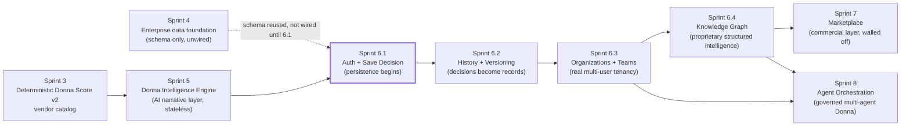

# ClouDonna — Platform Roadmap

**Status at time of writing:** Sprint 6.1 (Supabase Auth and Save Decision) implemented, tested, locally verified, not yet committed — awaiting founder approval. See `docs/sprint-6/16-implementation-slice-6-1.md` through `22-test-report.md` for the full account, and `10-release-sequencing.md` in this directory for the gap analysis against this roadmap.

This document is the master index. `01-product-principles.md` through `09-outcome-intelligence.md` go deep on one stage each; `10-release-sequencing.md` is the dependency chain and the current gap/risk register.

## The official sequence

```
Sprint 6.1 — Supabase Auth and Save Decision           [implemented, pending approval]
Sprint 6.2 — Decision History and Versioning            [not started]
Sprint 6.3 — Organizations, Workspaces and Teams        [not started]
Sprint 6.4 — Knowledge Graph and Semantic Search        [not started]
Sprint 7   — Marketplace and Partner Matching           [not started]
Sprint 8   — Donna Agent and Multi-Agent Orchestration  [not started]
```

Each stage is independently designed, implemented, tested, reviewed, committed, released, and verified — never collapsed into a neighboring stage, and never started before the previous one has explicit founder approval. This is a process rule as load-bearing as any architectural one: the platform's credibility depends on every stage being individually trustworthy, not on the roadmap moving fast.

## Complete product evolution



*Figure: Sprint 4's schema was designed early and sat unwired for two full sprints before Sprint 6.1 finally connected it — evidence that "build the schema first, wire it when the product need is concrete" was the right sequencing, not a stall. Sprint 8 depends on both 6.3 (tenant-scoped agent context) and 6.4 (structured knowledge for agents to query), not on Sprint 7 — the roadmap deliberately does not require the commercial layer to exist before the orchestration layer does.*

## What "done" means for every stage

A stage is not done when its code compiles. It is done when: the scope document for that stage (`03` through `09`) has been read and matches what was actually built; every non-negotiable behavior listed for that stage is verified, not assumed; quality gates are green from a cold state; security and privacy boundaries are documented; and the founder has explicitly approved it. `02-engineering-operating-model.md` is the checklist this applies to, uniformly, every time.

## Reading order

1. `01-product-principles.md` — the "why," restated as engineering constraints.
2. `02-engineering-operating-model.md` — the "how," for every stage without exception.
3. `03` through `09` — one document per stage, in sequence.
4. `10-release-sequencing.md` — dependencies, current gaps, and what's actually true right now versus what's planned.
