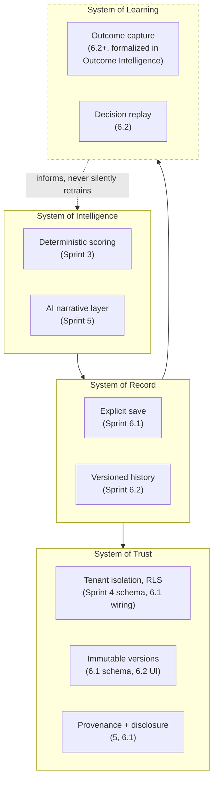

# ClouDonna — Product Principles

The full narrative version of these principles lives in `docs/manifesto/cloudonna-manifesto-v1.md`. This document restates them as engineering constraints — the form every later roadmap stage is actually held to.

## What ClouDonna must remain

Business-first, vendor-neutral, evidence-based, explainable, auditable, privacy-conscious, multi-tenant by design, deterministic at the scoring layer, provider-independent at the AI layer, human-governed. Each of these is a testable property, not a value statement:

| Principle | The test that proves it |
|---|---|
| Business-first | The authoritative framework starts at Business Goals; no UI or prompt leads with a vendor name. |
| Vendor-neutral | The scoring engine has no field a commercial relationship could occupy. Verified structurally in Sprint 3, unchanged since. |
| Evidence-based | Every AI-narrated claim traces to an evidence id in the shortlist it was given — enforced by `findUnsupportedNumericClaims`/`findUnsupportedVendorMentions` (Sprint 5) rejecting anything that doesn't. |
| Explainable | A saved decision (Sprint 6.1 onward) carries its own rationale, assumptions, and risks, not just a score. |
| Auditable | Every tenant-scoped table's RLS policy resolves to `auth.uid()` in one join; every mutation is attributable to a real, authenticated user (`created_by`, never client-supplied). |
| Privacy-conscious | Anonymous use never persists; saving requires an explicit action; raw prompts and raw provider responses are never stored (structurally — the persisted types have no field for either). |
| Multi-tenant by design | `organization_id` denormalized onto every descendant table since Sprint 4; Sprint 6.1 through 6.3 build directly on this, never around it. |
| Deterministic at the scoring layer | One engine, `scoring/engine.ts`, computes every score. No AI provider call is in that code path. |
| Provider-independent at the AI layer | `IntelligenceProvider` is an interface; swapping OpenAI for Anthropic or a local model is a new file implementing that interface plus a config change — never a rewrite of the orchestrator. |
| Human-governed | Every approval, every save, every irreversible action in every roadmap stage requires an explicit human click — never an automated trigger. |

## System of Intelligence + System of Record + System of Trust + System of Learning

*Figure: the dashed arrow is deliberate — outcome learning informs future human decisions (a person reading "this pattern underperformed twice before") but never automatically feeds back into the deterministic scoring engine. That boundary is a non-negotiable principle (`09-outcome-intelligence.md`), not an implementation gap.*

## No AI provider may directly change

Donna Score, confidence score, ranking, shortlist, vendor eligibility, or commercial neutrality. This is the single sentence every future roadmap stage's design must satisfy before anything else. Sprint 8's multi-agent orchestration in particular is designed around this constraint from the start (`08-sprint-8-agent-orchestration.md`) rather than having it retrofitted after the fact.

## LLMs are replaceable; decision intelligence is not

Restated here as an engineering consequence, not just a slogan: every integration with a specific model provider (OpenAI today) sits behind the `IntelligenceProvider` interface Sprint 5 already established. No future sprint may couple business logic — scoring, evidence validation, tenant rules — to a specific provider's API shape. If Anthropic, Gemini, Azure OpenAI, or a local model is added later (Sprint 8's provider strategy), it is a new file implementing an existing interface, never a reason to touch the orchestrator, the schema, or the RLS model.
