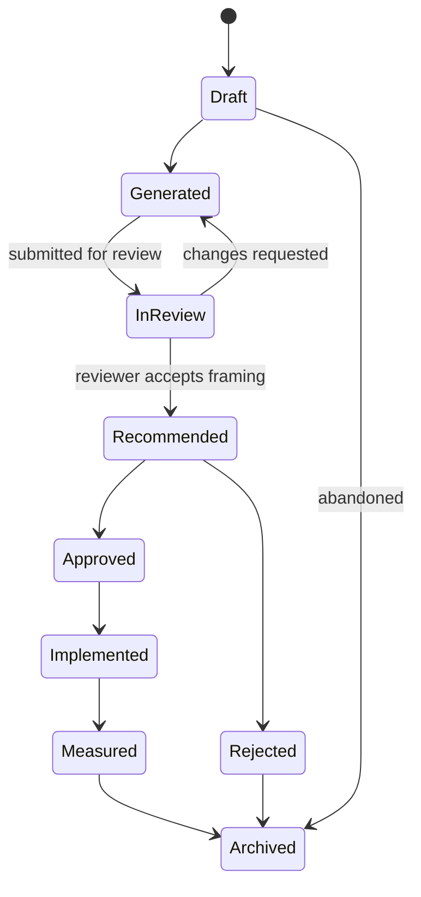

# Sprint 6.2 — Decision History and Versioning

**Status: not started.** Builds directly on Sprint 6.1's `decisions`/`decision_versions` schema — see `10-release-sequencing.md` for why this, not Sprint 4's original `decision_reports` table, is the foundation this stage extends.

## Mission

Transform saved recommendations into immutable and replayable enterprise decision records.

## Decision lifecycle

Nine states, richer than Sprint 6.1's minimal three-value `decision_status` enum (`draft`/`saved`/`archived`) — Sprint 6.2 is where that enum grows to match this full lifecycle, since only now does the product have review/approval UI to drive the intermediate states.

## What to implement

- Decision list (extends Sprint 6.1's `/app/decisions`, adding richer status filtering).
- Decision detail (extends `/app/decisions/[id]`, adding version history and comparison).
- Immutable decision versions — **already built in Sprint 6.1** (`decision_versions` has no UPDATE/DELETE policy for any role). Sprint 6.2 is the first stage that actually creates version 2+.
- Current-version pointer — **already built** (`decisions.current_version_id`).
- Append-only version creation, change reason, version author, timestamps — **already built** (`decision_versions.change_reason`/`created_by`/`created_at`).
- Schema version, scoring-engine version, knowledge-base version — **already built** (the three provenance string columns).
- Version comparison — new: a UI and query that diffs two versions' `deterministic_output_json` for score/ranking deltas.
- Decision replay inputs, evidence-at-the-time snapshot, provider and fallback metadata, historical reproducibility status — new: the actual replay mechanism (re-run the deterministic engine against a stored `decision_input_json`, diff against the stored output).

## Rules

- Historical versions must never be overwritten — enforced by the database (Sprint 6.1's `decision_versions` has no UPDATE/DELETE policy, verified — see `docs/sprint-6/19-rls-verification.md`).
- Re-running Donna creates a new version — never mutates an existing one.
- Old scores remain historically visible — a version's `deterministic_output_json` is permanent, readable regardless of what the current version says.
- Raw provider payloads remain excluded — unchanged from Sprint 6.1's structural guarantee; Sprint 6.2 adds no new field capable of holding one.
- Decision replay must clearly distinguish: the original result, the current engine's result for the same input, changed evidence, changed assumptions, and changed knowledge version — each surfaced as a named, attributed difference, never a bare "results differ."

## A known limitation this stage inherits, not solves

The vendor catalog is not itself versioned or snapshotted (a Sprint 5-era limitation, restated in Sprint 6.1's replay design). Sprint 6.2's replay can prove the catalog's version string changed and show what the recommendation would be *today*, but cannot reconstruct the exact historical catalog if a platform's traits were edited without a version bump. A full historical catalog snapshot is real, larger, explicitly deferred work — candidate for Sprint 6.4's knowledge graph, not Sprint 6.2.

## Out of scope

Complex approval workflow (Sprint 6.3's reviewer/approver/observer seam is the extent of it), marketplace, outcome benchmarking across tenants.
