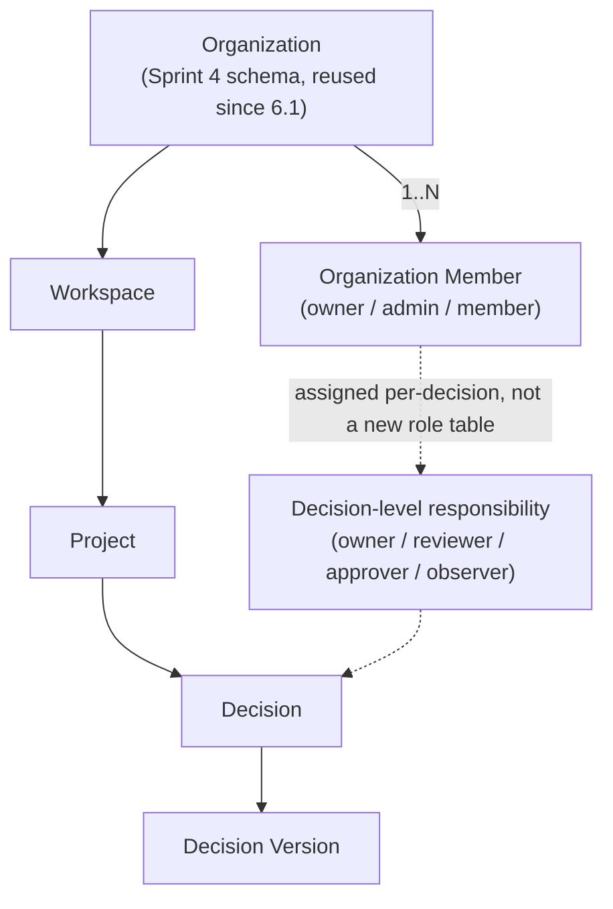

# Sprint 6.3 — Organizations, Workspaces and Teams

**Status: not started.**

## Mission

Make ClouDonna a true multi-user enterprise workspace.

## Tenant hierarchy

*Figure: organization-level roles (owner/admin/member) and decision-level responsibilities (owner/reviewer/approver/observer) are two different, deliberately separate concepts — the second is a lightweight assignment on a specific decision, not a second permission system with its own membership table.*

## What Sprint 6.1 already built, that this stage extends rather than replaces

Sprint 6.1 auto-provisions exactly one organization, one workspace, one project per new user, with zero UI for creating a second one or inviting anyone. **Every table this stage needs already exists** (`organizations`, `organization_members`, `workspaces`, `projects` — Sprint 4's schema, unchanged since). Sprint 6.3 is UI and RLS-policy-refinement work on an already-correct foundation, not a schema redesign.

## What to implement

- Organization creation (self-service — currently only the auto-bootstrap path exists; a user creating a *second* organization has no UI yet).
- Organization membership, organization switching, account menu (Sprint 6.1's `AccountMenu` shows sign-in/sign-out only — no organization context yet).
- Workspace creation, workspace membership where required.
- Project creation (currently only auto-provisioned; needs a real "create project" UI).
- Team invitation (schema already designed in the broader Sprint 6 architecture set, `docs/sprint-6/03-tenants.md` — `organization_invitations` table, not yet migrated).
- Owner, admin, and member roles — **already enforced by RLS** via the existing `is_org_member()`/`is_org_admin()` functions; this stage is UI work exposing what the database already governs.
- Decision owner, reviewer seam, observer seam.
- Membership removal, organization offboarding design.
- Tenant-safe navigation, role-sensitive UI.
- Complete RLS verification — this is the stage where `docs/sprint-6/19-rls-verification.md`'s script (written in 6.1, not yet executed) should finally be run against a real Postgres instance and become a real, passing CI gate, since multi-organization scenarios are exactly what it was written to exercise.

## Initial roles — deliberately not over-engineered

Organization owner, organization admin, member. Decision-level responsibilities (owner, reviewer, approver, observer) layer on top without a separate granular permission matrix. This mirrors the exact caution already exercised in the broader Sprint 6 architecture set (`docs/sprint-6/03-tenants.md`, "No fake enterprise workflow complexity") — Sprint 6.3 is where that caution gets tested against a second real organization per user, not relaxed.

## Acceptance criteria

- No cross-tenant reads, no cross-tenant writes — the same property Sprint 6.1's (unexecuted) RLS script already asserts; Sprint 6.3 is where it must actually run and pass.
- No organization enumeration — a user cannot discover organizations they aren't a member of by any means (id guessing, slug guessing, search).
- Revoked members lose access — immediately, verified by a real test: remove a membership row, confirm the next request from that user returns zero rows for that organization's data.
- Switching organizations cannot leak cached data — a real risk once a user belongs to more than one organization for the first time; Sprint 6.1's UI never had to consider this since every user only ever had one.
- Server and browser clients both respect tenant boundaries — RLS is the actual enforcement either way, but this is the stage where a browser client finally has a real caller (the organization switcher), so it's the first point this claim is genuinely exercised end to end.

## Out of scope

Full enterprise SSO (still a documented seam — see `docs/sprint-6/02-auth.md`, "Enterprise identity roadmap" and `docs/sprint-6/17-auth-implementation.md"), granular per-workspace/per-project permission matrices, external directory sync (SCIM).
