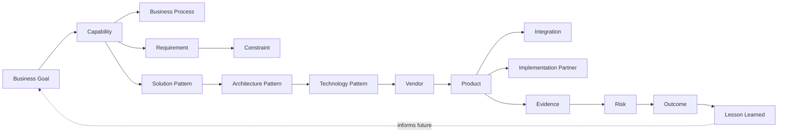

# Sprint 6.4 — Knowledge Graph and Semantic Search

**Status: not started.**

## Mission

Build ClouDonna's proprietary structured intelligence layer.

## Canonical Decision Graph

## Reuse Sprint 4's schema before building anything new

This is the most consequential engineering decision for this stage: **Sprint 4 already built pgvector-ready, source-tracked tables for a meaningful slice of this graph**, sitting unused in `main`'s tree since the Platform Foundation v1 release:

| Already exists (Sprint 4) | Graph entity it already covers |
|---|---|
| `evidence_sources` (with `evidence_reliability_tier`: primary_source / vendor_published / analyst_report / community / internal_review) | Evidence, with provenance and reliability tiering already modeled |
| `decision_score_evidence_sources` | The edge linking a specific score to its supporting evidence |
| `knowledge_articles` (has an `embedding vector(1536)` column, hybrid global/org-scoped) | A starting point for capability/pattern reference content, semantic-search-ready |
| `ai_conversations`/`ai_messages` (has `embedding vector(1536)`) | **Not reused** — wrong shape for this graph (chat-message-shaped, not entity-shaped); left alone, as Sprint 6.1 already decided for `DecisionReport` persistence |
| `decision_frameworks`/`decision_framework_dimensions` | The scoring-methodology side of "Capability," already versioned and tenant-or-global |

**Do not rebuild evidence provenance or reliability tiering — Sprint 4 already designed it correctly**, including exactly the distinction this stage's own design principles require (verified/vendor-provided/community-provided/inferred maps directly onto `evidence_reliability_tier`'s existing enum values). The genuinely new entities this stage must add: capabilities, business processes, requirements, constraints, solution patterns, architecture patterns, technology patterns, vendors-as-graph-nodes (today they're rows in the vendor-intelligence TypeScript catalog, not database rows), products, product capabilities, integrations, partners, partner competencies, claims, implementation patterns, and lessons learned.

## Design principles

- Graph relationships must remain explainable — a traversal a business stakeholder can follow, not just a database join.
- Every material claim needs provenance — extending, not replacing, Sprint 4's `evidence_sources` model.
- Distinguish verified, vendor-provided, community-provided, and inferred knowledge — already an enum in Sprint 4's schema (`evidence_reliability_tier`); this stage's job is populating and enforcing it consistently across the new entity types, not inventing a new taxonomy.
- Track source date and freshness; support validity periods; record confidence and verification status.
- **Do not treat LLM-generated text as verified evidence.** An AI-narrated claim (Sprint 5's `IntelligenceEnrichment`) is never itself an `evidence_sources` row — it can *cite* evidence, never *become* it.
- Semantic search complements structured queries; it does not replace them — a capability lookup should still be a real, indexed, structured query first, with embedding-based similarity search as an addition for fuzzy/exploratory cases, not the primary retrieval path.
- Tenant-private knowledge must remain separated from global reference knowledge — the exact hybrid pattern Sprint 4 already established (`organization_id` nullable = global, non-null = tenant-private) across `decision_frameworks` and `knowledge_articles`; this stage extends that pattern to every new entity, not a new one.

## Semantic search should support

Capability discovery, evidence retrieval, similar decisions, comparable architecture patterns, vendor-fit evidence, implementation lessons, risk retrieval.

## Preferred initial architecture — explicitly not a graph database

**PostgreSQL/Supabase, relational canonical model, JSONB only where genuinely appropriate, pgvector for embeddings, explicit edge tables where graph traversal is required, versioned knowledge records, source-backed evidence.** A separate graph database is not adopted unless PostgreSQL is demonstrably insufficient — and given Sprint 4 already proved out `pgvector` + tenant-scoped RLS + hybrid global/private tables at this schema's scale, that bar has not been approached yet. This mirrors the exact reasoning Sprint 6.1 already applied at smaller scale (a relational `decisions`/`decision_versions` split, not a document store, for append-only versioned records) — consistency of architectural philosophy across stages, not a new one invented per sprint.

## What this document does not decide

- The exact new-entity schema (capabilities, solution patterns, etc.) — a real design task for Sprint 6.4 itself, not pre-decided here; this document commits to the *architecture* (relational + pgvector + reuse of Sprint 4), not the final column list.
