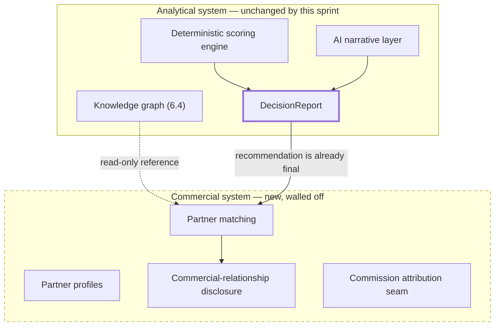

# Sprint 7 — Marketplace and Partner Matching

**Status: not started. Blocked on Sprint 6.4 (decision engine, persistence, and knowledge layer must be credible first) per the official sequence.**

## Mission

Connect trusted decisions to implementation options without compromising neutrality.

## Marketplace neutrality boundary

*Figure: the arrow from `Report` to `Matching` only ever flows one way, and only after the report is already final — matching happens on top of a completed, unchangeable recommendation. Nothing in the Commercial system has a write path back into the Analytical system. This is the single diagram every future PR touching either system must be checkable against.*

## Non-negotiable neutrality controls

- Commissions never affect Donna Score.
- Sponsorship never affects ranking.
- Vendors cannot buy preferred recommendation status.
- Matching happens only after the recommendation is complete — never influences it in progress.
- Commercial matches are displayed separately from analytical recommendations — a different UI surface, not an inline "sponsored" row mixed into the ranked list.
- Users must see why a partner was matched — the same explainability standard the decision engine already holds itself to.
- Commercial relationships must be disclosed — extending Sprint 5's own disclosure pattern (every AI-enriched result already carries a disclosure field; a matched partner result carries an equivalent one).
- **Analytical and commercial systems require separate services and data contracts.** Not a suggestion — the literal architecture: `Decision Engine ≠ Marketplace Ranking ≠ Commercial Attribution` are three different code paths, three different data models, and ideally three different services, so a bug or a bad incentive in one cannot structurally reach the others.

## Implement conceptually and incrementally

Partner profiles, vendor profiles, service offerings, industry expertise, regional coverage, certifications, implementation capabilities, verified references, availability seam, request-for-introduction flow, partner matching, transparent match rationale, disclosure of commercial relationships, lead and engagement lifecycle, commission attribution seam.

## Explicit dependency: why this is blocked on 6.4, not just 6.3

Partner matching needs the knowledge graph's structured entities (products, capabilities, vendors-as-graph-nodes) to have a real rationale to match *against* — without Sprint 6.4, "why was this partner matched" has no structured answer to point to, only prose, which would undermine the "transparent match rationale" requirement from day one.

## Do not

Introduce billing or commission payouts until the neutrality architecture above has been reviewed and approved as its own, separate gate — not bundled into "Sprint 7 is approved" as a whole. This mirrors the Platform Foundation v1 release's own precedent: database-foundation content was excluded from a release until its own explicit approval covered it, rather than riding along with an adjacent approval.

## What this document does not decide

- The actual commission/lead-attribution business model — a business decision requiring founder input, not an engineering one this roadmap resolves.
