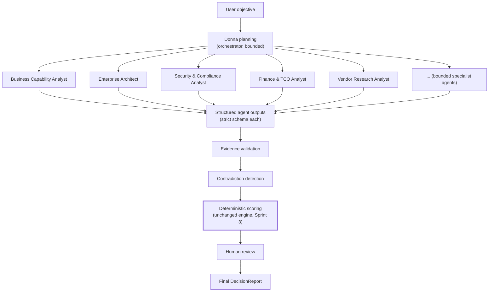

# Sprint 8 — Donna Agent and Multi-Agent Orchestration

**Status: not started. Depends on Sprint 6.3 (tenant-scoped context for agent operation) and Sprint 6.4 (structured knowledge for agents to query) — not on Sprint 7.**

## Mission

Turn Donna into a governed orchestration layer for complex enterprise decisions. Donna must not become an unrestricted chatbot.

## Multi-agent orchestration model

*Figure: `Score` is the same box, unchanged, that has existed since Sprint 3 — no agent output flows directly into it. Every agent's structured output is validated and contradiction-checked before the deterministic engine ever runs, and a human reviews the result before it becomes final. This is the same "AI enriches, Donna decides" boundary from `docs/manifesto/cloudonna-manifesto-v1.md`, now drawn for a multi-agent system instead of a single narrative call.*

## Potential agents

Executive Advisor, Business Capability Analyst, Enterprise Architect, Data and AI Architect, Security and Compliance Analyst, Finance and TCO Analyst, Procurement Analyst, Vendor Research Analyst, Implementation Risk Analyst, Evidence Validator, Decision Challenger, Outcome Analyst.

## Non-negotiable controls

- Agents never directly change authoritative scores.
- Agents cannot call unrestricted tools — every tool requires an explicit contract, the same "no arbitrary capability" discipline Sprint 5's `IntelligenceProvider` interface already enforces at a smaller scale.
- Every agent output uses a strict schema — literally the same `.strict()` Zod pattern already used for `IntelligenceEnrichment` (Sprint 5) and the Sprint 6.1 save-boundary schemas, extended per-agent.
- Unsupported claims are rejected — the same `findUnsupportedNumericClaims`/`findUnsupportedVendorMentions` class of validator Sprint 5 already built, generalized to however many agents contribute narrative claims.
- Conflicts between agents are surfaced, not hidden — a "Contradiction detection" step is explicit in the orchestration diagram above, not an implicit merge.
- Tool and provider activity is auditable — extends the audit-logging gap already flagged as open in Sprint 6.1 (`docs/sprint-6/21-security-review.md`); this stage cannot ship without that gap closed first, since agent auditability is meaningless without a working audit trail underneath it.
- Sensitive tenant context is minimized — the same data-minimization principle Sprint 5's evidence package already applies (never send more than a bounded, necessary shortlist) extended to whatever context each specialist agent receives.
- No autonomous purchasing, no autonomous contracting, no autonomous customer communication, no irreversible action without explicit human approval.
- Cost, latency, and token limits are enforced — per-agent, extending Sprint 5's existing `DONNA_AI_TIMEOUT_MS`/`DONNA_AI_MAX_OUTPUT_TOKENS` pattern rather than inventing a new configuration shape per agent.
- Deterministic fallback remains available — if the multi-agent pipeline fails at any stage, the system falls back to the existing single-pass deterministic + single-narrative-layer flow, never to no result at all.

## Provider strategy

OpenAI, Anthropic, Gemini/Vertex AI, Azure OpenAI, local or private models — provider choice is policy-driven and replaceable, the direct, larger-scale application of the manifesto's "LLMs are replaceable" principle. Every agent is built against the same `IntelligenceProvider`-shaped interface discipline Sprint 5 established, not a bespoke integration per agent per provider.

## What this document does not decide

- The exact tool contracts each specialist agent gets — a real design task for Sprint 8 itself.
- Whether "Donna planning" is itself a model call or a deterministic routing function — an open architecture question this roadmap does not resolve in advance, since resolving it prematurely risks over-committing to a specific orchestration framework before the underlying knowledge graph (6.4) and tenant model (6.3) it depends on even exist.
