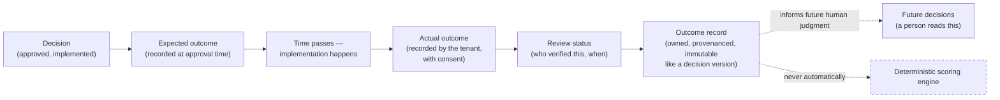

# Outcome Intelligence

**Status: seam preserved from Sprint 6.1 onward; not a standalone sprint — a cross-cutting requirement every stage from 6.2 forward must keep true.**

## Mission

Preserve the seam for validated outcome learning across every future sprint, without ever letting unverified outcomes silently change what "authoritative" means.

## Future supported questions

Did the decision achieve its expected outcome? Which assumptions proved incorrect? Which implementation risks materialized? Which architecture patterns performed well? Which partners delivered successfully? What was the time to value? What was the budget variance? Would Donna recommend the same path today?

That last question is exactly what Sprint 6.2's Decision Replay answers for the deterministic half of the system — Outcome Intelligence is the human-reported half: not "would the engine compute the same score," but "did reality agree with it."

## Outcome learning loop

*Figure: the loop closes back to a human reading a past outcome when making a future decision — never back into the scoring engine automatically. The dashed line into `Engine` is the one arrow that must never become solid without an explicit, separate, reviewed decision far more significant than any single sprint's scope.*

## Non-negotiable: never train or update authoritative scoring automatically from unverified outcomes

This is the single most consequential constraint in the entire roadmap, restated at its own dedicated position because it's the constraint most tempting to relax quietly ("just weight the score slightly by historical success rate" is exactly the kind of change that erodes "deterministic and reproducible" one plausible-sounding increment at a time). Any future proposal to let outcome data influence scoring must be its own explicit, separately-reviewed decision — never a side effect of an outcome-tracking feature shipping.

## Outcome records require

- Ownership — a specific organization, a specific decision.
- Provenance — who recorded it, when, based on what.
- Review status — recorded but unverified, versus verified by a second party.
- Measurement period — an outcome reported one week after implementation means something different than one reported a year later.
- Confidence — the reporter's own stated confidence in the outcome assessment.
- Tenant consent — an organization must explicitly agree before its outcome data is used for anything beyond its own historical record.
- Anonymization policy where cross-tenant aggregation is considered — "which architecture patterns performed well" *across* tenants is a real, valuable future question, but answering it requires an explicit anonymization policy this document does not itself define, only requires before that aggregation is ever built.

## Relationship to Sprint 6.2's schema

Outcome records extend the same immutable-append-only philosophy `decision_versions` already established in Sprint 6.1/6.2 — an outcome record, once reviewed, is not silently editable either. The exact schema (a new table, or columns on an existing one) is a Sprint 6.2 implementation decision, not decided by this document.
