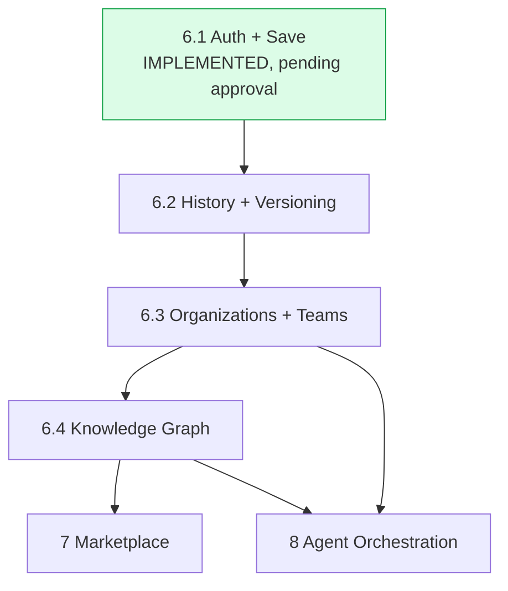

# Release Sequencing, Gaps, and Sequencing Risks

This is the one document in this set that compares plan against reality, updated as of the moment Sprint 6.1's implementation finished (see `docs/sprint-6/16-implementation-slice-6-1.md` through `22-test-report.md` for the full account this document summarizes).

## Release dependency chain

*Green = implemented. Everything else is sequenced but not started. Note the fan-out at 6.4: both remaining major stages (7 and 8) depend on it, and 8 additionally depends on 6.3 but explicitly not on 7 — the roadmap does not require the commercial layer before the orchestration layer.*

## Reuse of Sprint 4 work — the actual, verified picture

| Sprint 4 asset | Reused by Sprint 6.1? | Reused by a later stage? |
|---|---|---|
| `organizations`, `organization_members`, `workspaces`, `projects` | **Yes, directly, unmodified.** Every RLS policy Sprint 6.1 wrote follows the exact `is_org_member()`/`is_org_admin()` pattern these tables already established. | Sprint 6.3 extends the UI on top of these, still unmodified. |
| `users` | **No.** Sprint 6.1 created a new `profiles` table instead — see "Gap" below. | Open — reconciliation is unresolved. |
| `decision_reports` | **No.** Sprint 6.1 created a new `decisions`/`decision_versions` two-table split instead — see "Gap" below. | Sprint 6.2 builds on Sprint 6.1's new tables, not this one. |
| `evidence_sources`, `decision_score_evidence_sources`, `evidence_reliability_tier` | No — not needed by Sprint 6.1's scope. | **Sprint 6.4 should reuse this directly** — see `06-sprint-6-4-knowledge-graph.md`. This is real, valuable, already-designed work that would otherwise risk being rebuilt from scratch. |
| `knowledge_articles` (pgvector-ready) | No. | Sprint 6.4, same reasoning. |
| `ai_conversations`/`ai_messages` (pgvector-ready) | No — deliberately, wrong shape for `DecisionReport` persistence. | Correctly not reused by Sprint 6.4 either (chat-message-shaped, not entity-shaped) — flagged in that document. |
| `audit_logs` | **No.** Untouched, unwritten-to. | Real, load-bearing gap — see below. |

## Identified architectural gaps

1. **`profiles` vs. `users` overlap.** Sprint 6.1 needed an auth-linked profile table with a specific, minimal shape (id/email/full_name/timestamps) and Sprint 4's `users` table, while close, carries extra fields (`avatar_url`, `deleted_at`, self-referential `created_by`) and — more importantly — was never wired to `auth.users`. Rather than silently reinterpret the task's explicit `profiles` naming as "really means `users`," Sprint 6.1 created `profiles` fresh and disclosed the resulting overlap plainly (`docs/sprint-6/18-persistence-schema.md`). **Not resolved by this document set — a real decision for a founder or a dedicated cleanup task: retire `users`, migrate its intended purpose onto `profiles`, or reconcile them some other way.**
2. **`decision_reports` sits unused, parallel to the new `decisions`/`decision_versions` tables.** Sprint 4 built `decision_reports` as a single append-only table; Sprint 6.1 built a deliberately different two-table split (mutable pointer + immutable versions) because it more cleanly makes "never overwrite history" a structural database property. This was the right call for Sprint 6.1's actual requirements, but it leaves `decision_reports` as dead schema. **Recommendation: mark it explicitly deprecated in a future migration, or remove it, once it's confirmed nothing else has started depending on it — not urgent, but worth a conscious decision rather than indefinite ambiguity.**
3. **No audit logging exists anywhere in the running system yet**, despite `audit_logs` (Sprint 4) being fully designed and ready. This is now a named blocker for Sprint 8 specifically (`08-sprint-8-agent-orchestration.md` requires "tool and provider activity is auditable," which has no foundation to build on today) and a real gap against the manifesto's own "auditable" principle. **Recommendation: audit logging should land no later than Sprint 6.2 or 6.3 — not wait until Sprint 8 makes it unavoidable.**
4. **Two documents named "roadmap" now exist:** `docs/sprint-6/12-roadmap.md` (the phase-by-phase implementation plan from the earlier Sprint 6 architecture pass, predating this task) and this document set's `docs/roadmap/*`. This task's own framing ("use this roadmap as the authoritative sequencing plan for future ClouDonna development") makes `docs/roadmap/` authoritative going forward. **Recommendation: a future pass should either fold `docs/sprint-6/12-roadmap.md`'s still-relevant implementation-level detail (per-phase files/schema/tests) into the corresponding `docs/roadmap/0X-*.md` document, or add a one-line pointer marking it superseded — not resolved here, since this task's own rules say "do not modify completed implementation merely to match wording" and this is documentation, not implementation, but still worth flagging rather than leaving two same-named documents with different authority silently coexisting.**
5. **The RLS verification script (`supabase/tests/sprint6_1_rls_verification.sql`) has never been executed.** Written correctly, disclosed honestly, but "tenant-safe RLS" for Sprint 6.1 is a design-verified claim, not an execution-verified one, until this runs against a real Postgres instance.

## Identified sequencing risks

1. **Sprint 6.4 is a bottleneck.** Both Sprint 7 and Sprint 8 depend on it, and it's the largest, most novel stage in the sequence (a genuinely new entity model, not an extension of existing tables the way 6.1–6.3 are). A delay in 6.4 delays both remaining major stages simultaneously — worth planning extra review time for this stage specifically, not treating it as "just another sprint."
2. **Sprint 8's audit-logging dependency isn't sequenced as its own stage.** The roadmap's official sequence has no dedicated "add audit logging" stage — it's implicitly expected to exist somewhere between 6.1 and 8. Without an explicit owner, this is the kind of cross-cutting requirement that's easy to discover missing only when Sprint 8 actually starts. **Recommendation: name it explicitly as part of Sprint 6.2 or 6.3's scope now, rather than leaving it implicit.**
3. **Outcome Intelligence (`09-outcome-intelligence.md`) is cross-cutting, not a stage with its own dependency slot in the diagram above.** It depends on Sprint 6.2's schema existing, but nothing enforces that a later stage doesn't ship an outcome-adjacent feature without checking this document's non-negotiable ("never train scoring from unverified outcomes") first. This is a process risk more than a technical one — worth a standing item in Sprint 6.2's own scope review, not a one-time check.

## Product decisions requiring founder approval

1. Approve Sprint 6.1 as complete and ready to commit/merge/push/deploy (the immediate, direct ask this document set follows).
2. `profiles`/`users` reconciliation direction.
3. Disposition of the now-unused `decision_reports` table.
4. Whether audit logging should be pulled forward into Sprint 6.2's scope rather than left implicit.
5. Whether `docs/sprint-6/12-roadmap.md` should be reconciled with `docs/roadmap/*` now or left as historical record.

## Recommended next action

Do not start Sprint 6.2. Bring Sprint 6.1 (implementation) and this manifesto/roadmap package (documentation) to the founder together, since the roadmap package's own framing depends on Sprint 6.1's actual result to be accurate (as this document's gap analysis demonstrates) — reviewing them separately risks approving a roadmap that doesn't yet reflect what was actually built.
