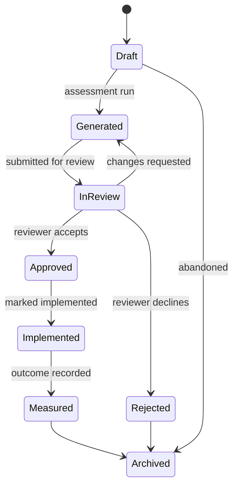

# Sprint 6.2 — Decision History and Versioning

**Status: not started. Documentation only — this document plans Sprint 6.2, it does not implement any part of it.**

Builds directly on Sprint 6.1's real, shipped `decisions` / `decision_versions` schema (`docs/architecture/sprint-6.1-freeze.md`) — not the earlier, superseded single-table `decision_reports` design sketched in `docs/sprint-6/05-versioning.md`–`07-replay.md`, which predates Sprint 6.1's actual implementation. Those documents' ideas (immutability guarantees, a lifecycle enum, replay-as-diff) are still the right ideas; this document re-grounds them in the schema that actually exists and in the fixes Sprint 6.1's own freeze pass applied — most notably, the `current_version_id` integrity trigger this sprint's Version History and Replay features now get to assume, rather than re-derive.

## Decision lifecycle (for reference — not yet built)

Sprint 6.1's `decision_status` enum (`draft` / `saved` / `archived`) is intentionally minimal — there was no review/approval UI yet to drive anything richer. Sprint 6.2 is where it grows to match a real lifecycle:

`rejected` is a real terminal branch, not a variant of the happy path — a decision that was reviewed and declined is a complete, honest historical record on its own.

---

## MUST HAVE

Load-bearing for Sprint 6.2's own stated scope (Decision Replay, Immutable Versions, Version Diff, Timeline, Replay UI, Change Explanation, Audit Trail) — without these, the sprint's headline features either don't work or trust an unverified foundation.

- **Version List + Detail read paths.** Extends `/app/decisions/[id]` with all `decision_versions` rows for one `decision_id`, ordered by `version_number`, RLS-scoped by the existing `decision_versions_select` policy — no new RLS policy needed, the read path already exists.
- **Re-run → save-as-new-version write path.** Re-running an assessment against a saved decision produces a fresh, in-memory computation (Sprint 5's unchanged pipeline), then two distinct save actions: **save as a new version** (new `decision_versions` row, `version_number` increments, `decisions.current_version_id` repointed to it — now validated at the database level by Sprint 6.1's `decisions_check_current_version_match` trigger) or **save as a new, unrelated decision** (its own lineage, its own `human_readable_id`).
- **Immutable Versions — already a database guarantee, not new work.** `decision_versions` has no UPDATE/DELETE policy for any role; a version's `deterministic_output_json` is permanently readable regardless of what the current version says. Sprint 6.2 only needs to *surface* this, not build it.
- **Version Diff (structural).** Given two `decision_versions.id` values within one lineage: score delta, ranking changes between the recommended option and alternatives, confidence-dimension deltas, and a metadata diff (`title`, `status`, the three provenance version strings — "engine changed from X to Y," not just "differs"). Every surfaced difference is attributed to a named cause where one exists — never a bare "results differ."
- **Decision Replay (core mechanism).** Re-run `buildDecisionOutput()` — the exact same pure function Sprint 6.1's save path already calls, reused not reimplemented — against a stored version's `decision_input_json`, diff the fresh output against the stored one. Pure, read-only, no mutation of the stored version. Real-time, compute-on-click (the engine is already proven sub-second in production; a background-job architecture would add operational complexity for a computation that doesn't need it).
- **Replay UI.** Stored version and fresh replay result shown side by side using the Version Diff output; explicit plain-language labeling of *why* a difference exists (engine version bump / catalog version bump / genuinely different recommendation); no mutation affordance anywhere — "save as a new version" is a separate, explicit action, never an implicit side effect of viewing a replay.
- **Audit Trail — minimum viable.** Sprint 6.1 disclosed writing zero audit events. Sprint 6.2's status transitions (submitted for review, approved, rejected, implemented, outcome recorded) are the first events this system logs to the existing `audit_logs` table, gated to `is_org_admin()` for approval actions, mapping onto the existing four organization roles — no new workflow-role table.
- **Timeline.** A rendering, not a new event-log table — built from `decision_versions` rows (already exist) plus the newly-written `audit_logs` rows above. One system of record for both the audit trail and the user-facing timeline, so they can't drift into two different stories about the same decision.
- **`decision_status` enum expansion + migration**, matching the lifecycle diagram above — required before InReview/Approved/Rejected states have anywhere to live.

## SHOULD HAVE

Meaningfully improves the sprint but the MUST HAVE list is coherent and shippable without these; can slip a phase without blocking the core replay/version/timeline story.

- **Narrative-text change indicator.** Narrative prose (executive summaries, enrichment text) is not line-diffed (deliberately — see Version Diff's own scope note below) but a version comparison should at least flag *that* the narrative changed, with a pointer to read both versions side by side.
- **`decision_comments`.** A small, separate table (`id, decision_version_id, organization_id, author_id, body, created_at`), RLS-gated to `is_org_member()` — deliberately not folded into `audit_logs`, whose natural read scope is narrower. May ship in the same phase as approval or slightly after.
- **Fresh security/RLS verification pass specifically for the new audit-log write path and the new `is_org_admin()`-gated approval-transition surface** — following the same live-code-verification discipline this Sprint 6.1 closeout used (grep-based secret/logging checks, a full quality-gate run), not an assumed pass. Should happen before Sprint 6.2 ships, need not block early implementation work.
- **Replay performance check against a larger vendor catalog** than Sprint 5/6.1's — the real-time, compute-on-click design assumes sub-second execution; worth confirming rather than assuming it still holds as the catalog grows.

## LATER

Explicitly deferred past Sprint 6.2, named here so they're not silently dropped or accidentally re-scoped in.

- **Full review/approval workflow beyond the four-role mapping** — configurable approval chains, multi-stage sign-off. The four-role (owner/reviewer/approver/observer → member/member/admin/viewer) mapping is the extent of Sprint 6.2's workflow; anything more configurable is a distinct, larger feature.
- **Vendor catalog snapshotting / historical catalog reconstruction.** Replay can prove the catalog's `knowledge_base_version` string changed and show what the recommendation would be *today*, but cannot reconstruct the exact historical catalog if a platform's traits were edited without a version bump. A full historical snapshot table is real, larger, explicitly deferred — a Sprint 6.4 (knowledge graph) candidate, not this sprint.
- **Multi-organization / team features** (self-service second-org creation, invitations) — Sprint 6.3.
- **Line-level narrative-text diffing.** Deliberately out of scope, not just deferred: diffing prose produces low-value noise; the product surfaces *that* it changed, never a word-level diff.
- **Rate limiting, password reset, audit-log write paths beyond the status-transition minimum above** — carried in Sprint 6.1's own known-limitations list (`docs/architecture/sprint-6.1-freeze.md` §11), independent of and not blocking Sprint 6.2's versioning/replay scope.
- **Any change to the auth model, middleware, or the `decisions`/`decision_versions` write path's core shape.** Sprint 6.1's freeze statement holds; Sprint 6.2 adds read/diff/audit surface on top of it, it does not restructure what's already frozen.

## Risks

- **Diff Engine scope creep.** "Diff two decision versions" is an easy feature to over-scope into a general-purpose JSON-diff tool. The MUST HAVE boundary (structural output diff + named metadata diff, explicitly no narrative-text line-diffing) needs to hold during implementation, not just in this document.
- **Timeline/audit coupling.** Making the Timeline a rendering of `audit_logs` rather than its own table avoids drift, but means any future change to `audit_logs`'s shape or retention policy now has a second, user-facing consumer.
- **New RLS policies for audit-log writes and the approval surface need the same live-database verification Sprint 6.1 disclosed it couldn't do** (no local Postgres/Docker/psql available in this environment). Written-but-unexecuted SQL test coverage is real risk, not a formality, until a verification environment exists.

## Milestones

1. `decision_status` enum expansion + `audit_logs` write paths for status transitions.
2. Version List + Detail read paths; re-run → save-as-new-version write path.
3. Version Diff (structural output diff + metadata diff), unit-tested against known version pairs — mirroring Sprint 6.1's own precedent of mocked-Supabase-client tests, no live database required for this layer.
4. Timeline (rendering of versions + audit events for one decision lineage).
5. Replay endpoint (re-run engine, diff against stored, label by cause) + Replay UI (side-by-side, no mutation affordance).
6. Verification pass — quality gates (tsc/lint/vitest/build) plus a fresh security review specifically covering the new audit-log write path and the new `is_org_admin()`-gated approval-transition surface.
