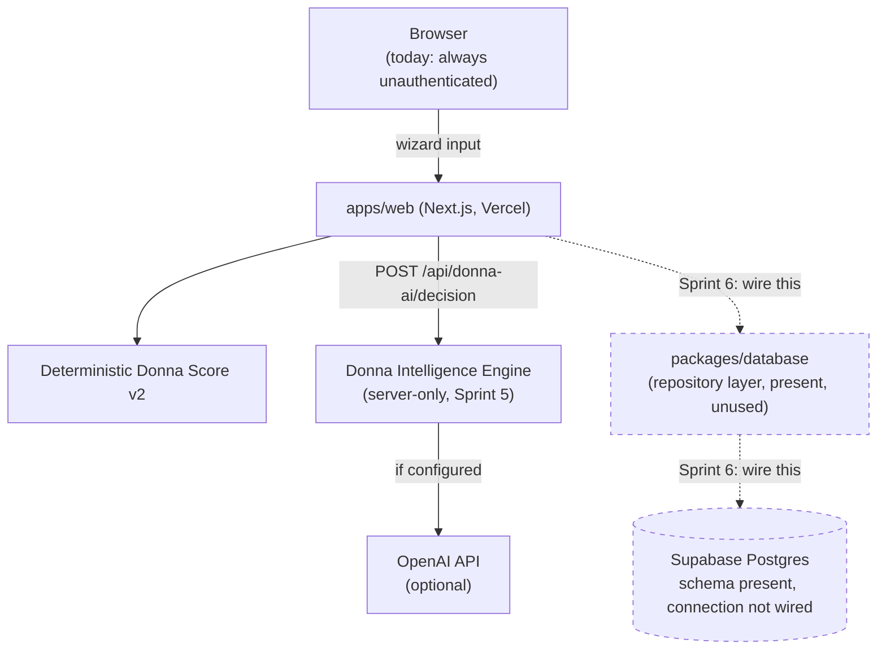

# Sprint 6 — 00. Current State

**Baseline:** `main` @ `b5abcfd` — "ClouDonna Platform Foundation v1," Sprint 3 + Sprint 4 + Sprint 5, live in production at `cdonna.com`.

This is the first Sprint 6 document written after the foundation release, and the baseline is meaningfully better than it was a day ago: **the database schema Sprint 6 needs is no longer a plan — it's already in the repository.**

## What's live in production today

- The deterministic Donna Score v2 engine (10-platform catalog, 10-dimension weighted scoring) — client-computable, zero network calls.
- The Donna Intelligence Engine (Sprint 5) — server-only narrative enrichment, `DecisionReport` contract, full deterministic fallback, `/api/donna-ai/decision`.
- The public marketing site and Discovery journey.
- **No authentication. No persistence. No tenant.** Every request is stateless — a `DecisionReport` is computed and returned; nothing is written anywhere. This remains true today even with the schema present, because nothing in the running application imports from `packages/database` or reads a `SUPABASE_*` environment variable — verified directly, not assumed.

## What's already in the tree, unwired

`packages/database` (a complete TypeScript repository layer) and `supabase/migrations/` (11 migration files, ~1,700 lines of SQL) are present in `main` as of the Platform Foundation v1 release. This is the single biggest change since the last Sprint 6 draft: previously this schema existed only in a separate, unmerged worktree; now it's sitting in the same repository Sprint 6 builds in.

Already built, close to verbatim-reusable:

| Concern | Table(s) | Status |
|---|---|---|
| Tenancy | `organizations`, `users`, `organization_members`, `workspaces`, `projects` | Full RLS via `is_org_member()`/`is_org_admin()`. `users.id` not yet synced to `auth.users.id` — the one real gap. |
| Scoring methodology | `decision_frameworks`, `decision_framework_dimensions` | Versioned, tenant-or-global. Persistence target for `scoring/weights.ts`. |
| Decision engine | `decision_sessions`, `business_goals`, `requirements`, `session_constraints`, `recommendations`, `decision_scores` | Tenant-scoped, RLS-protected, maps closely to today's `DecisionOutput`. |
| Decision Memory | `decision_reports` | **Already append-only capable** (multiple rows per session, by design) — needs extension (versioning columns, lifecycle status, provenance), not a redesign. |
| Evidence | `evidence_sources`, `decision_score_evidence_sources` | Reusable as-is. |
| Audit | `audit_logs` | Already append-only, no update/delete policy for any role, metadata-shaped exactly as Sprint 6 needs. |
| Future AI persistence | `ai_conversations`, `ai_messages` | Built empty, wrong shape for `DecisionReport` — not reused (see `08-security.md`). |

**System context — where we're extending, not rebuilding:**

*Figure: two dashed lines. Everything solid already runs in production, unchanged by Sprint 6. Sprint 6's entire job is making those two dashed lines real, safely.*

## The one real gap: authentication

There is no `auth.uid()` anywhere in this system yet. Every RLS policy in the existing schema is written against it, correctly anticipating it — but nothing produces it. This is Sprint 6's true starting line, detailed in `02-auth.md`.

## What this changes about Sprint 6's shape

Because the schema is already reviewed, migrated (in history), and structurally sound, Sprint 6 is less "design a database" and more "connect a proven design to a proven engine, safely, with real tenancy and trust." The risk surface has shifted from "did we model this right" to "did we wire the trust boundary right" — which is exactly why `08-security.md` is the document this plan leans on hardest.
