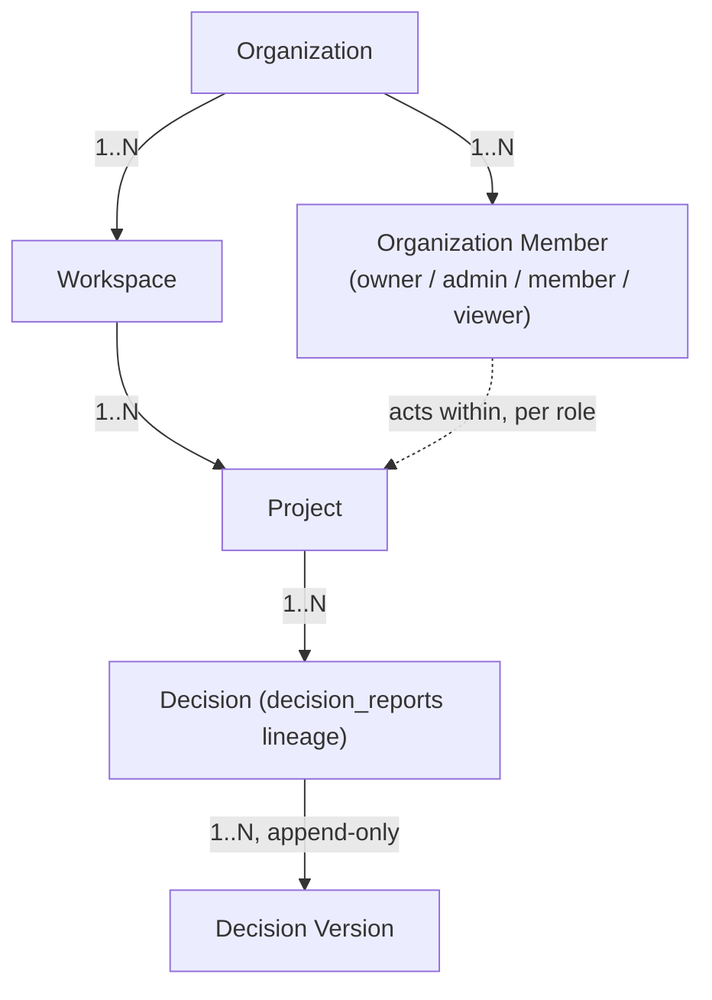
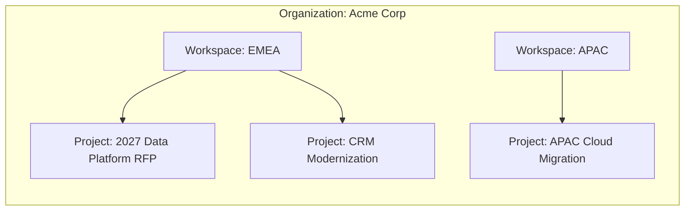

# Sprint 6 — 03. Tenants

## The model, as it already exists in `main`

```
Organization → Workspace → Project → Decision → Decision Version
```

`organizations`, `workspaces`, `projects` are already migrated, with `organization_id` denormalized onto every descendant table — a deliberate design already committed in `supabase/migrations/20260806120200_tenancy.sql` specifically so every RLS policy is a single-join `is_org_member(organization_id)` check, never a multi-hop join. Sprint 6 does not redesign this; it authenticates against it and builds the UI on top of it.

## Tenant model



## Workspace model — one layer deeper



*Figure: workspaces are an optional subdivision (region, business unit) most small organizations will use exactly one of. Projects — not workspaces — are where decisions actually live day to day.*

## Roles

`organization_member_role` (already an enum in the schema): `owner`, `admin`, `member`, `viewer`.

| Capability | viewer | member | admin | owner |
|---|---|---|---|---|
| Read decisions, history, timeline | ✓ | ✓ | ✓ | ✓ |
| Create workspaces/projects, run assessments, save decisions | | ✓ | ✓ | ✓ |
| Approve/reject a decision | | | ✓ | ✓ |
| Invite/remove members, change roles | | | ✓ | ✓ |
| Organization settings, deletion | | | | ✓ |

Maps directly onto the existing `is_org_member()` (viewer+) and `is_org_admin()` (admin+) helpers — zero new RLS primitives required for role enforcement.

## Deliberately not built in v1: workspace/project-level membership

Every organization member can see every workspace and project in their organization — no `workspace_members` table exists or is added. This is a considered simplicity decision, not a gap discovered late: most organizations adopting an enterprise decision platform want visibility across their own team by default, and a finer-grained membership model is a clean, additive change (one junction table, one more RLS predicate) the moment a real customer needs it. Building it speculatively now would be exactly the kind of unrequested complexity this platform's own design philosophy argues against.

## New: self-service organization creation and invitations

Today, `organizations` has no `insert` policy for regular authenticated users (Sprint 4's own migration: org creation is "service-role... not something any authenticated user can self-serve yet"). Sprint 6 changes this for the specific, narrow case of a brand-new user with no organization:

```sql
create policy organizations_insert_self_service on organizations
  for insert with check (created_by = auth.uid());
```

Paired with a `security definer` function that atomically creates the organization **and** its owner membership row in one transaction — so it's structurally impossible to create an organization with no owner. This is the single highest-scrutiny new RLS grant in the entire Sprint 6 plan (flagged again in `08-security.md` and `12-roadmap.md`) because it's the one place an otherwise-unprivileged authenticated user gets a genuine `insert` right on a previously backend-only table.

`organization_invitations` (new table): email, role, inviter, token, expiry. Acceptance runs as a `security definer` function, not a direct RLS-gated write, since the accepting user isn't a member yet at the moment they accept.

## What this document does not decide

- Whether a user may belong to more than one organization in v1. **Recommendation: yes** — the schema already supports it via `organization_members` with no change — but the "which organization am I in" switcher is a real UI surface, detailed in `10-ui.md`.
