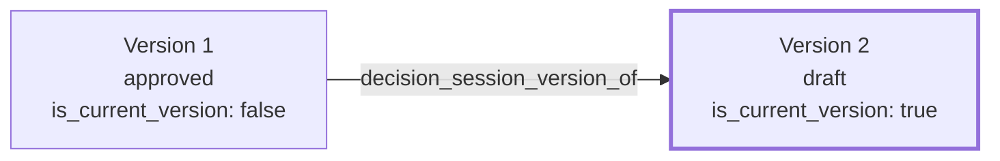

# Sprint 6 — 05. Versioning

## Rule: immutable, append-only, one current pointer per lineage — enforced by the database, not by discipline

A `decision_reports` row is never updated after creation except its `status`, outcome fields, and `is_current_version` flag. A new version is always a new row. This is not a convention developers are asked to remember — it's a constraint the database itself refuses to violate.

```sql
-- Exactly one "current" version per lineage, always.
create unique index decision_reports_one_current_version
  on decision_reports (coalesce(decision_session_version_of, id))
  where is_current_version and deleted_at is null;

-- No content field is ever mutable after creation, period.
create function reject_decision_report_content_mutation()
returns trigger
language plpgsql
as $$
begin
  if old.decision_input is distinct from new.decision_input
     or old.deterministic_output is distinct from new.deterministic_output
     or old.enrichment is distinct from new.enrichment
  then
    raise exception 'decision_reports content columns are immutable after creation';
  end if;
  return new;
end;
$$;

create trigger decision_reports_immutable_content
  before update on decision_reports
  for each row execute function reject_decision_report_content_mutation();
```

Two independent guarantees, both real database constraints: the partial unique index makes "two current versions" or "zero current versions" structurally impossible, even under concurrent writes; the trigger makes "silently rewrite history" impossible even for a future bug or a developer bypassing the repository layer.

## The model



## Re-run behavior

Re-running an assessment never overwrites a saved decision. It always produces a fresh, in-memory computation (Sprint 5's existing pipeline, unchanged), then offers the user two distinct actions:

- **Save as a new version** — `decision_session_version_of` points to the prior version, `version_number` increments, the prior row's `is_current_version` flips to `false` in the same transaction that inserts the new row's `true`.
- **Save as a new, unrelated decision** — starts its own lineage, its own `human_id`.

The distinction matters: a new version is the same question, evolving; a new decision is a different question, even inside the same project.

## Compare versions

A pure read — no new persistence. Given two `decision_reports.id` values in one lineage, compute a structural diff of `deterministic_output` (score/ranking deltas) and status/notes. Narrative-text diffing is deliberately not attempted (low-value noise on prose); the comparison surfaces *that* a narrative changed, not a line-by-line diff of it.

## Change reason and authorship

Every version carries `change_reason` (free text, encouraged not mandatory), `created_by`, `created_at` — already-existing columns on `decision_reports`. Authorship of a version is whoever triggered its creation; *approval* of a version is a separate concept, tracked via `status` transitions in the timeline (`06-timeline.md`), never conflated with authorship.

## What this document does not decide

- Whether old versions are ever purged. **Recommendation: no**, for the organization's lifetime — retention is a separate, explicit policy question (`08-security.md`), not a versioning default.
