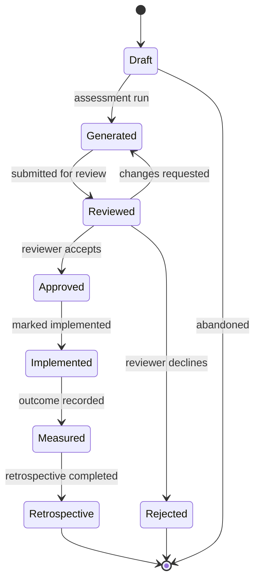

# Sprint 6 — 06. Decision Timeline

## Lifecycle



Persisted as a dedicated enum, distinct from the existing `decision_session_status` (draft/in_progress/completed/archived — which tracks *wizard progress*, a different concept from a *saved decision's* approval state, and must not be conflated with it):

```sql
create type decision_report_status as enum (
  'draft', 'generated', 'reviewed', 'approved', 'rejected', 'implemented', 'measured', 'retrospective'
);
```

`draft` and `generated` are both pre-save states in practice (a session in progress vs. a computed-but-not-yet-saved report); a `decision_reports` row typically comes into existence already at `generated` the moment it's explicitly saved, and moves right from there. `rejected` is a real terminal branch, not modeled as a variant of any happy-path state — a decision that was reviewed and declined is a complete, honest historical record on its own.

## Timeline — a rendering, not a new table

Built from two sources already in the schema, not a bespoke event log:

1. `decision_reports` rows themselves (one event per version created).
2. `audit_logs` rows scoped to `entity_type = 'decision_reports'`, `entity_id` in the lineage — status transitions, approvals, comments.

```sql
select * from audit_logs
where entity_type = 'decision_reports' and entity_id = any(:lineage_ids)
order by created_at;
```

This is deliberate: the same events that satisfy tenant-scoped audit review (`08-security.md`) also *are* the user-facing timeline. One system of record for these facts, not two that could drift apart.

## Approval and comments

Approval is a status transition (`reviewed → approved` / `reviewed → rejected`), gated to `is_org_admin()` and logged as an `audit_logs` row (`action = 'decision_report.status_changed'`). Comments are a small, separate `decision_comments` table (`id, decision_report_id, organization_id, author_id, body, created_at`), RLS-gated to `is_org_member()` — deliberately *not* folded into `audit_logs`, whose read policy is admin-only; a `member` reviewer should be able to comment without being an admin. No fake enterprise workflow beyond this: owner, reviewer, approver, observer map onto the existing four roles (member/member/admin/viewer respectively) — no separate workflow-role table, no configurable approval chains.

## Outcome and retrospective, on the same timeline

```sql
alter table decision_reports
  add column expected_outcomes text,
  add column actual_outcomes text,
  add column success_measures text,
  add column implementation_status text,
  add column retrospective_notes text,
  add column outcome_recorded_at timestamptz;
```

Free text for v1 — a structured success-measure taxonomy is a real future feature that needs product research this sprint doesn't have. "Retrospective completed" is the timeline's own last entry, not a separate entity with its own lifecycle.

## What this document does not decide

- Whether `decision_comments` ships in the same phase as approval, or slightly after — see `12-roadmap.md`, Phase 6.7.
