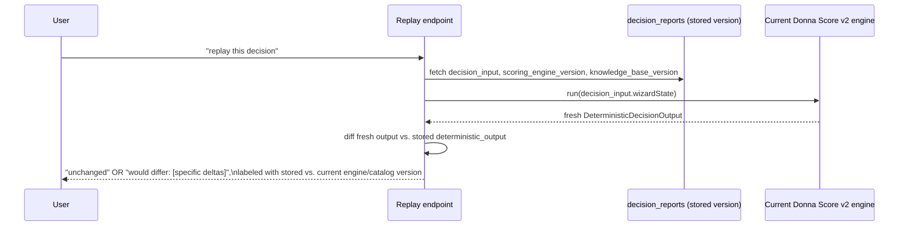

# Sprint 6 — 07. Decision Replay

Replay answers a specific, hard question honestly: **"if we ran this decision again today, would the answer be different — and if so, why?"** Not a guess, not a vibe — a real re-execution of the real, unchanged deterministic engine against the real, stored input.

## Mechanism

Pure, read-only, no mutation of the stored (immutable) version. If the deterministic engine's own tests already prove it's idempotent and side-effect-free (they do — verified in Sprint 5), replay is just calling that same function again with the same input and comparing.

## What replay answers, one line each

- **What inputs existed at the time** — `decision_input`, stored immutably, read verbatim.
- **What evidence existed** — `evidence_references` joined against `evidence_sources` and the shortlist as recorded at save time.
- **What engine version was used** — `scoring_engine_version`, stored.
- **What changed later** — a direct comparison of stored vs. current `scoring_engine_version`/`knowledge_base_version` strings, surfaced as a plain-language reason, not a guess.
- **Whether the recommendation would differ today** — the actual re-run diff, computed live.
- **Compare assumptions** — stored `assumptions` (text array, `04-decision-memory.md`) diffed against what the current deterministic output would generate for the same input.
- **Compare evidence** — stored `evidence_references` vs. what today's `KnowledgeProvider` would select for the same shortlist.
- **Explain differences** — every diff surfaced is attributed to a named cause (engine version bump, catalog change, or a genuinely different score) — never a bare "things changed" with no reason given.

## A limitation, stated plainly rather than hidden

The vendor catalog (`vendor-intelligence/catalog.ts`) is **not itself versioned or snapshotted**. Replay can prove the catalog's `knowledge_base_version` string differs from what's stored, and can show what the recommendation would be *today* against the current catalog — but it **cannot reconstruct the exact historical catalog** if a platform's traits were edited without a version-string bump. This is a known, disclosed gap, not something this document pretends to solve. A full historical catalog snapshot table is a real, larger feature, explicitly deferred (`12-roadmap.md`).

## Why this is a UI action, not a background job

The deterministic engine is fast — client-computable, sub-second, already proven at that speed in production. A background-job architecture for replay would add real operational complexity (queues, polling, job status) for a computation that doesn't need it. **Recommendation: real-time, compute-on-click.**

## What replay explicitly does not do

- It does not modify the stored version under any circumstance — replay's output is never written back to the decision it examined.
- It does not re-run AI enrichment — replay is about the deterministic, reproducible half of the system; re-running enrichment against a new prompt would produce different prose every time even with nothing else changed, which is not a meaningful "would this differ" signal.
