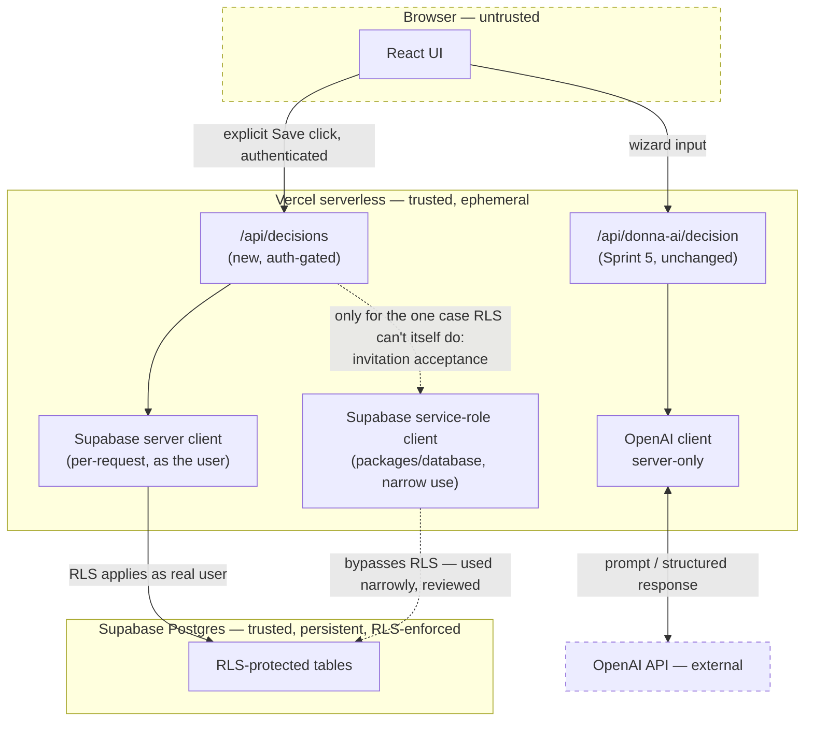
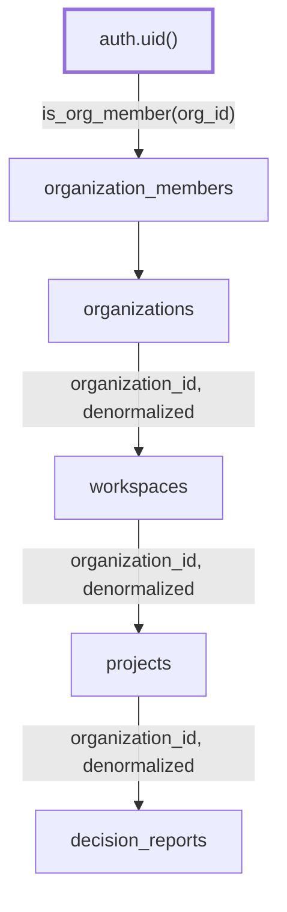
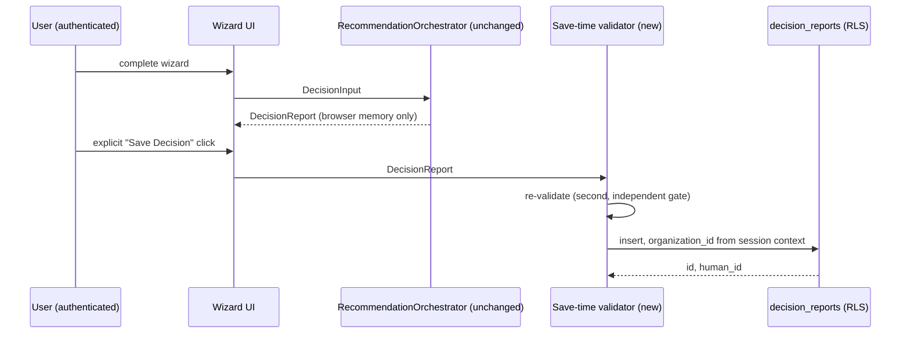

# Sprint 6 — 08. Security and Trust Architecture

Four boundaries, each with a distinct mechanism. Naming them separately matters — conflating "provider boundary" with "security boundary" is exactly how a real gap hides.

**Correction (architecture extension pass):** this document was written before Sprint 6.1's implementation. Three things below describe intent that implementation resolved differently — each corrected inline rather than silently: (1) Sprint 6.1 built `decisions`/`decision_versions`, not `decision_reports`, as the persisted table (`docs/sprint-6/18-persistence-schema.md`); (2) Sprint 6.1 created **no** service-role client at all — not even for invitation acceptance, which itself was deferred entirely to Sprint 6.3 (`docs/sprint-6/17-auth-implementation.md`, "Why no admin client"); (3) `audit_logs` remains unwritten-to — the "Auditability without surveillance" section below describes a design intent, not yet a built fact.

## Trust boundaries

## 1. Provider boundary (unchanged from Sprint 5, extended)

`server-only` guards every module that touches the OpenAI SDK or a Supabase service-role key. Verified today (not assumed) by grepping a real production build's client bundles for `OPENAI_API_KEY` and OpenAI SDK calls — zero occurrences. The same verification method applies to the new Supabase server/service-role clients in Sprint 6: neither the anon key's server-side usage pattern nor the service-role key may ever appear in a client bundle, checked the same way at every release gate.

## 2. Security boundary — authentication and input validation

- Every write endpoint requires a valid `auth.uid()`, checked server-side before any database call — never inferred from a client-supplied field.
- `organization_id` on every write is derived from the authenticated user's session context, never accepted as client input — closes the obvious tenant-spoofing path.
- Save-time re-validation: the exact same Zod schemas (`intelligenceEnrichmentSchema`, and a new `decisionReportSchema` covering the full persisted shape) gate a `DecisionReport` a second time at the save boundary — not trusting the client's copy, even though it was already validated once when produced.
- Rate limiting moves from Sprint 5's single-instance in-memory limiter (explicitly documented as a seam, not a production control) to a distributed one, now keyed by `auth.uid()` where available — a strict improvement only possible because auth now exists. **Recommendation: Upstash Redis** (`@upstash/ratelimit`), chosen for its serverless-native REST client (no connection-pooling problem in short-lived functions) and native Vercel integration. Fails open on outage — never blocks all traffic because a rate-limit check itself failed.

## 3. Tenant boundary — RLS as the enforcement mechanism, not a convention

Every table's RLS policy resolves to `auth.uid()` in exactly one join, because `organization_id` is denormalized onto every descendant table — the schema's own founding design principle, unchanged by Sprint 6. Application-layer `WHERE organization_id = ?` filtering is a UX/performance convenience, never the actual security boundary: a query that forgot the filter still cannot leak cross-tenant rows, because Postgres itself rejects them. The one new RLS grant that needs extra scrutiny is `organizations`' self-service `insert` policy (`03-tenants.md`) — every other new table follows the existing `is_org_member()`/`is_org_admin()` pattern with no new mechanism invented.

## 4. Data flow — from wizard to saved row

## Raw prompts and raw OpenAI responses — never persisted, structurally

Not a redaction step — a type-level fact. `DecisionReport.enrichment` is `IntelligenceEnrichment | null`, a bounded, schema-validated narrative object with no field for a prompt or an SDK response envelope. The save endpoint's input type *is* `DecisionReport` — there is nothing to redact because the type accepted was never capable of holding a raw value. The Sprint 4 `ai_conversations`/`ai_messages` tables (designed for a chat-shaped feature that doesn't exist) are **not** repurposed for this — doing so would require inventing a prompt-shaped value specifically to fit their schema, the exact anti-pattern this boundary exists to prevent.

## Auditability without surveillance

`audit_logs.before_data`/`after_data` are populated by application code choosing what to log — a status change logs the status, never a copy of the decision's narrative text. Page-view/access tracking is **not built** in Sprint 6; if a real need for "who has seen this" emerges later, it is a separate, deliberate, disclosed feature — not a byproduct of instrumenting every read.

**Status as of Sprint 6.1 (architecture extension pass correction):** this section describes the intended design; Sprint 6.1's actual implementation writes **no** `audit_logs` rows at all — the table remains fully unused. This is a real, disclosed gap (`docs/sprint-6/21-security-review.md`, `docs/roadmap/10-release-sequencing.md`), not a completed capability. It is now an explicit blocker for Sprint 8's "tool and provider activity is auditable" requirement (`docs/roadmap/08-sprint-8-agent-orchestration.md`) and should land no later than Sprint 6.2 or 6.3.

## No compliance claim

As with Sprint 5, **no GDPR-compliance claim is made.** Real customer data reaching this system requires, before it happens: a documented lawful basis for processing, a data-processing agreement covering Supabase's and OpenAI's actual regions/terms, and explicit retention/export/deletion policies — none of which engineering can resolve unilaterally. Flagged for founder decision in `12-roadmap.md`.

## Security implications of the Knowledge Graph, Evidence Engine, and Outcome Intelligence extensions

Added in the architecture extension pass, additive to the four boundaries above, not a fifth boundary:

- **Tenant boundary, extended.** Every new table in `13-knowledge-graph.md`/`14-product-knowledge-layer.md` follows the same hybrid global/tenant-private pattern (`organization_id` nullable) already established — no new RLS mechanism, same `is_org_member()`/`is_org_admin()` functions.
- **A new database constraint, not just a policy.** `14-product-knowledge-layer.md`'s `product_facts_ai_never_self_verifies` check constraint is the first place in this schema a `CHECK` constraint (not RLS) enforces a trust rule — worth naming explicitly here since it's a different enforcement mechanism than everything else in this document, and a good pattern to reuse: some rules ("AI output can't self-verify") are cheaper and more reliable to enforce as an unconditional table constraint than as a policy that depends on which role is asking.
- **Outcome data privacy.** `25-outcome-intelligence.md`'s `decision_outcomes` table introduces tenant-consent fields (`retrospective_visibility`, `benchmark_eligible`, `anonymization_status`) that are new to this schema's vocabulary — no existing table had a "shared beyond this tenant, with consent" concept before. This is a genuinely new privacy surface, not just an extension of the existing tenant-isolation model, and deserves its own review pass when implemented, not just a checkbox against this document's existing checklist.

## What this document does not decide

- Retention period, per-organization and post-offboarding.
- Organization-deletion UX — cascade is architecturally ready (existing `on delete cascade` foreign keys throughout the schema), but the confirmation flow for something this destructive deserves its own design pass before it ships.
