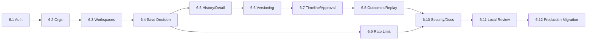

# Sprint 6 — 12. Roadmap

> **Superseded as the authoritative sequencing plan, kept as historical phase-level detail.** `docs/roadmap/00-platform-roadmap.md` through `10-release-sequencing.md` is now the authoritative sequencing document across the whole platform (Sprint 6.1 through Sprint 8), per explicit instruction in the task that produced it. This document's "Phase 6.1" through "Phase 6.12" numbering is a **different, finer-grained numbering than the "Sprint 6.1"/"Sprint 6.2"/"Sprint 6.3"/"Sprint 6.4" naming `docs/roadmap/` uses** — worth stating plainly rather than leaving the two numbering schemes to silently confuse a reader. The mapping, as actually implemented:
>
> | This document's phases | `docs/roadmap/`'s sprint | Status |
> |---|---|---|
> | Phase 6.1 (Auth foundation) + Phase 6.4 (Save Decision) | **Sprint 6.1** (Auth + Save Decision) | **Implemented** — Sprint 6.1 as actually built combined this document's Phase 6.1 and 6.4 into one implementation pass, and did not build Phase 6.2 (org self-service/invitations) or 6.3 (workspace/project creation UI) at all — every user gets one auto-provisioned org/workspace/project instead (`docs/sprint-6/17-auth-implementation.md`). |
> | Phase 6.5, 6.6, 6.8 (History, Versioning, Replay) | **Sprint 6.2** (Decision History and Versioning) | Not started. |
> | Phase 6.2, 6.3, 6.7's approval/roles portion | **Sprint 6.3** (Organizations, Workspaces and Teams) | Not started. |
> | *(not covered by this document at all)* | **Sprint 6.4** (Knowledge Graph, Evidence Engine, Explainability, Confidence Model) | Not started — see `13-knowledge-graph.md` through `27-sprint-6-4-implementation-plan.md`, added in this architecture-extension pass. |
> | Phase 6.9 (Rate limiting), 6.10 (Security/tests) | Cross-cutting, folded into `docs/roadmap/02-engineering-operating-model.md` | Partially done — Sprint 6.1's own gates ran; Upstash migration not started. |
>
> The rest of this document is kept for its still-useful phase-level file/schema/test detail (Phases 6.5–6.12 in particular remain a reasonable decomposition of Sprint 6.2/6.3's work), not because its own "Phase 6.1"-through-"6.4" numbering should be followed literally going forward.

## Phases

### Phase 6.1 — Auth foundation
- **Objective:** wire Supabase Auth into `apps/web`; the existing unauthenticated flow remains the only *functional* flow.
- **Files:** `lib/supabase/{server,client,middleware}.ts`, `app/login/page.tsx`, `app/auth/callback/route.ts`.
- **Schema:** `handle_new_auth_user()` + `on_auth_user_created` trigger.
- **RLS:** none beyond Sprint 4's existing policies — this phase only establishes `auth.uid()`.
- **APIs:** `/auth/callback`.
- **UI:** Login page, session-aware layout shell.
- **Tests:** sign-up produces a matching `public.users` row (pgTAP); session refresh via middleware.
- **Acceptance:** `public.users.id = auth.uid()` for a freshly signed-up user; `/donna-ai` completely unaffected.
- **Risks:** none beyond `02-auth.md`.
- **Out of scope:** organizations, workspaces, any decision persistence.

### Phase 6.2 — Organizations and memberships
- **Objective:** self-service org creation, invitations, roles.
- **Files:** `app/onboarding/page.tsx`, `app/[orgSlug]/settings/members/page.tsx`, `organization-invitations.repository.ts`.
- **Schema:** self-service `organizations` insert policy + atomic owner-creation function; `organization_invitations`.
- **RLS:** the self-service insert policy — highest-scrutiny change in this entire roadmap, reviewed explicitly, not just tested.
- **APIs:** `POST /api/organizations`, `POST /api/organizations/[id]/invitations`, `POST /api/invitations/[token]/accept`.
- **UI:** Onboarding, member list, invite form.
- **Tests:** org creation → exactly one owner membership; invitation accept → membership only for the invited email; cross-tenant invitation-token guessing fails.
- **Acceptance:** create an org, invite a colleague, colleague accepts and appears in the roster with the right role.
- **Risks:** the self-service RLS grant.
- **Out of scope:** workspace/project-level membership.

### Phase 6.3 — Workspaces and projects
- **Objective:** the remaining tenancy layers and Organization Switcher / Workspace Dashboard / Project Dashboard shells.
- **Files:** `app/[orgSlug]/[workspaceSlug]/page.tsx`, `.../[projectSlug]/page.tsx`, switcher/nav components.
- **Schema/RLS:** none — `workspaces`/`projects` already correct.
- **APIs:** `POST /api/workspaces`, `POST /api/projects`.
- **UI:** creation forms, org/workspace switcher, empty-state project dashboard.
- **Tests:** cross-tenant read of a guessed workspace/project UUID returns zero rows — the Sprint 5 `it.skip` cross-tenant test finally gets a real implementation here.
- **Acceptance:** create a workspace and project, navigate between them.
- **Out of scope:** anything decision-related.

### Phase 6.4 — Save Decision (Decision Memory goes live)
- **Objective:** the core new capability.
- **Files:** `app/api/decisions/route.ts`, `persistence/save-decision.ts` (the save-boundary validator), minimal changes to `DonnaAIExperience.tsx`/`ResultPanel.tsx` to accept a project context and repurpose "Save decision."
- **Schema:** the full `decision_reports` extension (`09-database.md`) — the largest single migration in this plan.
- **RLS:** none new — existing `is_org_member()` policies already cover the extended columns.
- **APIs:** `POST /api/decisions`, `GET /api/decisions/[humanId]`.
- **UI:** Save flow, Decision Detail rendering through the existing `ResultPanel`/`IntelligenceTab`, unchanged.
- **Tests:** the full save-boundary failure-mode list (`08-security.md`, `11-testing.md`).
- **Acceptance:** save a decision, reopen it from a stable URL, scores byte-identical to what was computed.
- **Risks:** save-boundary validator drifting from Sprint 5's schemas over time — mitigated by reusing the same Zod schemas directly.
- **Out of scope:** versioning (6.6), approval (6.7).

### Phase 6.5 — Decision History and Detail
- **Objective:** list and browse saved decisions.
- **Files:** history/detail route pages.
- **APIs:** `GET /api/projects/[id]/decisions`.
- **UI:** Decision History list, Decision Detail (reuses 6.4's rendering).
- **Tests:** list returns current versions only by default.
- **Acceptance:** every saved decision in a project is visible and openable.

### Phase 6.6 — Versioning and Compare
- **Objective:** implement `05-versioning.md` for real.
- **Schema:** the one-current-version unique index, the immutability trigger.
- **APIs:** `POST /api/decisions/[humanId]/versions`, `GET .../versions`.
- **UI:** Version Compare.
- **Tests:** the concurrency test — two simultaneous version-saves, exactly one wins as current; immutability trigger rejects a direct content update.
- **Acceptance:** re-running an assessment offers "new version" vs. "new decision," both work; two versions compare correctly.

### Phase 6.7 — Timeline, Approval and Comments
- **Objective:** `06-timeline.md`'s lifecycle, approval, `decision_comments`.
- **Schema:** `decision_report_status` enum (if not already in 6.4), `decision_comments`.
- **RLS:** `is_org_member()` on comments.
- **APIs:** `POST /api/decisions/[humanId]/status`, `POST .../comments`.
- **UI:** Timeline, approval actions, comment thread.
- **Tests:** only `is_org_admin` approves/rejects; comments visible to any member.
- **Acceptance:** a decision's full history renders as one coherent timeline; a non-admin reviewer can comment but not approve.

### Phase 6.8 — Outcome Tracking and Replay
- **Objective:** `06-timeline.md`'s outcome fields, `07-replay.md`'s replay capability.
- **APIs:** `PATCH /api/decisions/[humanId]/outcome`, `POST .../replay`.
- **UI:** Outcome Tracking form, replay result view.
- **Tests:** replay against unchanged versions → "unchanged"; replay after a fixture version bump → a real, attributed diff.
- **Acceptance:** record actual outcomes; ask "would this differ today" and get a specific, honest answer.
- **Risks:** the disclosed vendor-catalog-snapshot limitation — surfaced honestly in the replay UI's copy, not solved.

### Phase 6.9 — Distributed Rate Limiting
- **Objective:** replace the Sprint 5 single-instance limiter with Upstash, keyed by `auth.uid()`.
- **Files:** `lib/rate-limit/upstash.ts`.
- **Tests:** enforced per-endpoint limits; fails open on simulated outage.
- **Acceptance:** every new write endpoint is rate-limited by identity; the Sprint 5 IP-based limiter keeps working unauthenticated.
- Runs in parallel with 6.5–6.8 (only depends on 6.4 existing).

### Phase 6.10 — Security, Tests and Documentation
- **Objective:** the Sprint-5-style final gate — full pgTAP/SQL RLS suite, a security review mirroring Sprint 5's Stage A (secrets, cross-tenant leakage, service-role boundary, safe error messages), documentation reconciled against what actually got built.
- **Acceptance:** every RLS policy has a passing/failing test; no service-role key reachable from the browser (same build-output grep method Sprint 5 used); every doc in `docs/sprint-6/` matches implementation reality.

### Phase 6.11 — Local Visual Review
- **Objective:** the Sprint-5-style manual verification — full flow (sign up → org → invite → assess → save → version → approve → outcome) against a local Supabase instance, mobile layout, keyboard navigation, reported honestly including any tooling gaps.

### Phase 6.12 — Production Migration
- **Objective:** execute the real rollout — provision the environment, apply migrations, feature-flag launch. **Gated on the founder decisions below being resolved first.**

## Phase dependency order

## Risks

| Risk | Mitigation |
|---|---|
| Provenance-version discipline depends on a developer remembering to bump a string constant | No automated enforcement proposed; a code-review checklist item is the realistic mitigation |
| No historical vendor-catalog snapshot | Disclosed limitation, not solved; a real deferred feature if it matters later |
| No workspace/project-level membership in v1 | Deliberate simplicity; additive if a real customer needs it |
| Self-service org-creation RLS policy | Highest-scrutiny new grant in this plan — flagged twice, reviewed explicitly at implementation time |
| Upstash as a new external dependency | Fails open by design; free tier likely sufficient at this scale |
| No end-to-end browser test infrastructure exists yet | Flagged as a candidate, not committed |

## Decisions requiring founder approval before implementation starts

1. Save-after-login: carry in-memory wizard state through a sign-in redirect, or require re-running the wizard post-login.
2. Data retention policy — how long decision data is kept, per organization and after offboarding.
3. Whether email/password is offered by default or magic-link is the only path shown.
4. Which Supabase environment tier to provision first, and a real timeline for production migration.
5. Organization-deletion UX — deliberately deferred past Phase 6.1–6.11; needs its own design pass.
6. Whether `decision_comments` ships in Phase 6.4 or waits for 6.7.

## Sprint 6.4 (added in the architecture extension pass)

Not decomposed into "Phase 6.x" sub-phases in this document — see `27-sprint-6-4-implementation-plan.md` for the smallest production-suitable vertical slice (deliberately narrow: core node types the existing engine already needs, manual fact entry before automated ingestion, coverage/missing-information before contradiction detection) and `docs/roadmap/06-sprint-6-4-knowledge-graph.md` for the roadmap-level framing.

## The one clear recommendation

Ship Phases 6.1–6.5 as the smallest coherent release: **log in, create an organization, run an assessment, save it, reopen it.** That loop is the real product validation — an authenticated user trusting the platform enough to save something and come back to it. Everything from 6.6 onward (versioning, approval, outcomes, replay) is genuine depth this platform needs to earn the word "enterprise," but none of it matters if the core save-and-reopen loop isn't solid and trusted first. Build the foundation narrow and correct before building it wide.
