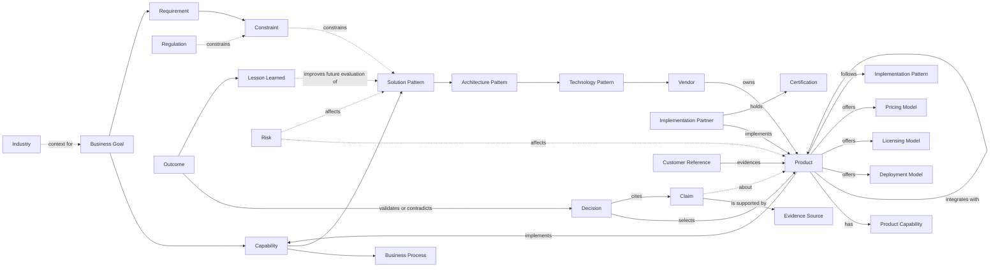

# Sprint 6 — 13. Knowledge Graph

This document extends the Sprint 6 architecture with the canonical ClouDonna Knowledge Graph — the structural home for everything left of "Vendors" in the authoritative chain that today lives only as a hardcoded TypeScript catalog (`vendor-intelligence/catalog.ts`). It is additive to, not a replacement of, `00-current-state.md` through `12-roadmap.md` — see `20-sprint-6-4-implementation-plan.md`'s critical review for exactly what, if anything, those documents need correcting.

## The authoritative chain, extended

```
Business Goals → Capabilities → Business Processes → Requirements → Constraints
→ Solution Patterns → Architecture Patterns → Technology Patterns
→ Vendors → Products → Evidence → Recommendation → Decision
→ Implementation → Outcome → Decision Memory → Lessons Learned
```

Everything through "Vendors" already exists as deterministic scoring inputs (Sprint 3). "Decision" through "Decision Memory" already exists as of Sprint 6.1. This document's scope is the graph structure connecting them — the part of the chain that today is implicit in code, not explicit in data.

## Canonical ontology



*Figure: dashed edges are influence/context relationships (constrain, affect, inform); solid edges are structural composition (owns, implements, requires). This distinction matters for traversal — a query for "what would change if this regulation changed" follows dashed edges outward; a query for "what does this product actually do" follows solid edges.*

## Required node types (27, matching the task specification exactly)

Business Goal, Capability, Business Process, Requirement, Constraint, Industry, Regulation, Solution Pattern, Architecture Pattern, Technology Pattern, Vendor, Product, Product Capability, Integration, Deployment Model, Licensing Model, Pricing Model, Implementation Pattern, Implementation Partner, Certification, Evidence Source, Claim, Risk, Customer Reference, Decision, Outcome, Lesson Learned.

Three of these already have real tables: **Decision** and its version history (Sprint 6.1's `decisions`/`decision_versions`), and **Evidence Source** (Sprint 4's `evidence_sources`, unused since, with `evidence_reliability_tier` already modeling exactly the verified/vendor-provided/community-provided distinction this document's "Product Knowledge Layer" companion (`14-product-knowledge-layer.md`) requires). Everything else is new schema.

## Relationship examples, as edge tables

Every relationship in the ontology diagram above is a real, explicit edge table — never a JSONB blob of related-ids, and never a foreign key pretending to be a many-to-many relationship:

```sql
-- Illustrative shape, not a final migration — see 27-sprint-6-4-implementation-plan.md
-- for what actually ships in the smallest vertical slice.
create table capability_requires_goal (
  capability_id uuid references capabilities(id),
  business_goal_id uuid references business_goals(id),
  primary key (capability_id, business_goal_id)
);

create table product_implements_capability (
  product_id uuid references products(id),
  capability_id uuid references capabilities(id),
  coverage_level text, -- 'full' | 'partial' | 'via-integration'
  primary key (product_id, capability_id)
);

create table claim_supported_by_evidence (
  claim_id uuid references claims(id),
  evidence_source_id uuid references evidence_sources(id),
  primary key (claim_id, evidence_source_id)
);
```

An explicit edge table (rather than a single polymorphic "relationships" table with a `type` column) is the deliberate choice here, for the same reason Sprint 4's schema already avoided that pattern everywhere else: a typed edge table lets Postgres enforce the actual foreign key constraints and lets a query planner use real indexes, where a generic `(subject_id, subject_type, predicate, object_id, object_type)` table would defeat both.

## Entity ownership: global vs. tenant-private

Every node type follows the exact hybrid pattern Sprint 4 already established for `decision_frameworks` and `knowledge_articles`: `organization_id uuid references organizations(id)`, **nullable** — `null` means a ClouDonna-curated, platform-wide reference entity (a vendor, a product, a published architecture pattern); non-null means an organization's own private extension (a custom requirement, a tenant-specific constraint, an internal lesson learned). RLS policy is the same two-clause shape everywhere: `organization_id is null` (globally readable) `or is_org_member(organization_id)` (tenant-private, member-only) — no new RLS mechanism, the same pattern used throughout this schema since Sprint 4.

## Versioning, provenance, and freshness model

Every fact-bearing node (not junction/edge tables) carries:

```sql
source_id uuid references evidence_sources(id)
source_type text  -- see 14-product-knowledge-layer.md's source-class taxonomy
verification_status text  -- 'verified' | 'vendor_provided' | 'community_provided' | 'inferred' | 'disputed' | 'stale'
confidence numeric(3,2)  -- see 24-confidence-model.md — never a bare, unexplained percentage
effective_date date
last_verified_date date
revalidation_due date
reviewer_id uuid references profiles(id)
version integer default 1
```

**A new version of a fact is a new row, never an in-place update to the old one** — the exact immutability discipline Sprint 6.1's `decision_versions` already established, applied here to knowledge instead of decisions. A product's "supports EU data residency" claim from 2025 and a contradicting claim from 2026 both remain queryable; which one is "current" is a view over `effective_date`/`last_verified_date`, not a fact that got overwritten.

## Graph traversal patterns

- **Forward (goal → recommendation):** the deterministic engine's existing path — goals to capabilities to solution/technology patterns to a shortlist. This document does not change that path; it gives it a queryable structure instead of a hardcoded catalog.
- **Backward (product → why it was recommended):** `Decision.cites → Claim.about → Product`, joined against `Product.implements → Capability`, joined against the original `Business Goal.requires → Capability` — a real query, not narrative reconstruction. This is the structural foundation `23-explainability-layer.md`'s "Evidence Trace" output is built on.
- **Lateral (similar decisions, comparable patterns):** semantic search (below) plus structural queries like "which other decisions selected a product implementing the same capability set."

## Semantic-search seam

`pgvector`, on an `embedding` column, exactly as Sprint 4 already provisioned on `knowledge_articles` and `ai_messages` — this document does not invent a new embedding strategy, it extends the existing one to the new node types that need fuzzy/exploratory retrieval (capability descriptions, lesson-learned free text, claim text). **Semantic search complements structured queries; it never replaces them** — a capability lookup is a real indexed `WHERE`/`JOIN` first; embedding similarity is an addition for "find me something like this" queries structure alone can't answer.

## Migration path from the existing vendor catalog

`vendor-intelligence/catalog.ts` (Sprint 3, TypeScript, in-memory, 10 platforms) becomes `Vendor`/`Product`/`Product Capability` rows — a data migration, not a schema redesign, since the catalog's own fields (`vendor`, `productName`, `category`, `integrationStrengths`, `architectureCharacteristics`, etc.) already map cleanly onto this ontology's node types. **The deterministic scoring engine (`scoring/engine.ts`) is not changed by this migration** — it continues reading whatever shape it reads today; the graph becomes the source of truth the catalog is generated *from*, not a replacement the engine must be rewired to query directly, until that rewiring is itself a deliberate, separately-reviewed decision (flagged in `27-sprint-6-4-implementation-plan.md`'s vertical slice as explicitly out of scope for the first cut).

## What this document does not decide

- The exact column list for each of the 27 node types — `27-sprint-6-4-implementation-plan.md` defines the smallest slice that actually ships first; this document commits to the ontology and its structural principles, not a complete migration.
