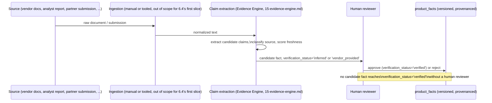

# Sprint 6 — 14. Product Knowledge Layer

How Donna acquires and maintains the facts that populate `Product`, `Product Capability`, and their neighbors in the Knowledge Graph (`13-knowledge-graph.md`). This document is about **fact lifecycle**, not graph structure — the graph says what a fact connects to; this document says where a fact came from and how long it's allowed to be trusted.

## Knowledge domains

Capabilities, supported processes, architecture patterns, integrations, deployment options, security, compliance, data residency, licensing model, pricing model, implementation complexity, operational maturity, roadmap status, references, known limitations, risks, time to value, skills requirements, partner ecosystem. Every one of these is a fact *about a product*, distinct from a fact *about a decision* (which lives in Sprint 6.1's `decision_versions`, immutable per-decision) — a product's pricing model can and does change over time; a saved decision's recorded understanding of that pricing model at save time must not.

## Source classes

Official vendor documentation, product release notes, architecture guides, public pricing, licensing documentation, analyst research, independent technical research, partner submissions, vendor submissions, customer evidence, implementation outcomes, internal expert validation, inferred knowledge.

This is a strict superset of Sprint 4's existing `evidence_reliability_tier` enum (`primary_source` | `vendor_published` | `analyst_report` | `community` | `internal_review`) — the mapping is direct, not a competing taxonomy:

| This document's source class | Sprint 4's `evidence_reliability_tier` |
|---|---|
| Official vendor documentation, product release notes, licensing documentation, public pricing | `vendor_published` |
| Architecture guides, analyst research | `analyst_report` |
| Independent technical research | `primary_source` (if the researcher directly tested/verified) or `analyst_report` |
| Partner submissions, vendor submissions | `vendor_published`, flagged distinctly at the fact level (see "Verification status," below) |
| Customer evidence, implementation outcomes | Feeds from Outcome Intelligence (`25-outcome-intelligence.md`), tagged `internal_review` until independently corroborated |
| Internal expert validation | `internal_review`, but with `verification_status = 'verified'` — the one source class allowed to mark a fact verified on its own authority |
| Inferred knowledge | No `evidence_reliability_tier` value maps here — inferred facts are never `evidence_reliability_tier`-eligible at all; see "Inferred knowledge," below |

## Per-fact metadata — the actual schema shape

```sql
create table product_facts (
  id uuid primary key default gen_random_uuid(),
  product_id uuid not null references products(id),
  fact_domain text not null,  -- 'capability' | 'security' | 'pricing' | 'licensing' | ... (the knowledge domains above)
  fact_key text not null,     -- e.g. 'supports_eu_data_residency'
  fact_value jsonb not null,  -- typed per fact_key at the application layer, not the database
  source_id uuid references evidence_sources(id),
  source_class text not null,
  publication_date date,
  effective_date date,
  last_verified_date date,
  verification_status text not null default 'inferred',
  confidence numeric(3,2),
  reviewer_id uuid references profiles(id),
  organization_id uuid,  -- null = global reference fact, non-null = tenant-private extension
  revalidation_due date,
  superseded_by uuid references product_facts(id),  -- append-only: a correction is a new row, linked
  created_at timestamptz not null default now()
);
```

`superseded_by` is how a fact gets corrected without ever being edited in place — the same immutability discipline as `decision_versions` (Sprint 6.1) and knowledge-graph nodes generally (`13-knowledge-graph.md`), applied at the individual-fact grain. A query for "the current answer" always means "the row with no successor, or the most recent in its supersession chain," never "the only row."

## Product knowledge ingestion



*Figure: the "Extract" step is the Evidence Engine's job (`15-evidence-engine.md`), not a separate system — Product Knowledge Layer facts and Decision-time Evidence Sources share one extraction/classification pipeline, not two.*

## Explicit fact-status taxonomy

- **Verified** — `verification_status = 'verified'`, confirmed by a named human reviewer (`reviewer_id` set), not merely sourced from a reputable-seeming document.
- **Vendor-provided** — sourced from the vendor itself (docs, submission), not independently corroborated. Usable in a recommendation's evidence, but distinguishable in the UI from `verified`.
- **Community-provided** — sourced from a partner submission, forum, or other non-vendor, non-analyst source. Lowest-trust *human*-sourced tier.
- **Inferred** — derived by the Evidence Engine or an AI process from other facts, never a directly-sourced claim. **Never eligible to become `verified` without an explicit human review step** — an inference about an inference is not evidence, no matter how many times it's repeated.
- **Stale** — `last_verified_date` older than `revalidation_due`; still queryable, but flagged, and excluded from a recommendation's evidence by default until revalidated or explicitly overridden by a reviewer.
- **Disputed** — two facts with the same `fact_key` for the same product, both currently unsuperseded, disagreeing — surfaced explicitly (`15-evidence-engine.md`'s contradiction detection), never silently resolved by picking the more recent or more "trusted" one without a human decision.

## No LLM-generated statement becomes verified evidence automatically — restated as a database constraint, not just a rule

```sql
alter table product_facts
  add constraint product_facts_ai_never_self_verifies
  check (not (source_class = 'ai_generated' and verification_status = 'verified'));
```

This is the single most important line in this document. An AI process (Sprint 5's enrichment layer, or any future Donna Brain, `26-donna-brains.md`) may propose a candidate fact at `verification_status = 'inferred'`. It can never write `verified` for its own output — that transition requires a `reviewer_id` and a human action, enforced at the database level, not just by convention in application code.

## What this document does not decide

- Whether ingestion is manual (a reviewer pastes/uploads a source document) or tooled (an automated crawler/parser) for the first Sprint 6.4 slice — `27-sprint-6-4-implementation-plan.md` scopes this down explicitly; this document commits to the fact-lifecycle model regardless of how ingestion is triggered.
