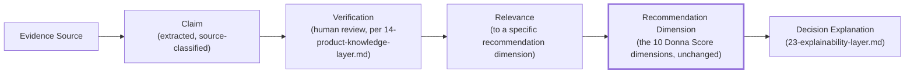

# Sprint 6 — 15. Evidence Engine

## Mission

Every material recommendation must be able to answer: Why? Based on which evidence? How current is the evidence? How trustworthy is the source? Which claims remain uncertain? Which facts contradict each other? Which information is missing?

Sprint 5 already built a narrow, working slice of this — `findUnsupportedNumericClaims`/`findUnsupportedVendorMentions` reject a narrative claim that isn't traceable to evidence. The Evidence Engine generalizes that from "reject the untraceable" to "trace, score, and explain everything," and gives it a real home instead of living entirely inside `orchestrator.ts`'s validation step.

## Evidence pipeline

*Figure: `Recommendation Dimension` is the exact, unchanged set of 10 dimensions Sprint 3's deterministic engine already scores against (architecture, business, technology, governance, AI readiness, security, ecosystem, cost, time-to-value, strategic). The Evidence Engine attaches evidence *to* those dimensions; it never adds an eleventh dimension or reweights the existing ten.*

## Required capabilities, and what each actually means

- **Evidence ingestion** — receiving a claim from any source class (`14-product-knowledge-layer.md`).
- **Normalization** — the same claim stated three different ways by three sources becomes one canonical `Claim` row with three `claim_supported_by_evidence` edges, not three duplicate claims.
- **Duplicate detection** — before normalization can work, near-duplicate claims (different wording, same fact) must be identified — a real, nontrivial NLP-adjacent problem, explicitly flagged as needing either embedding-similarity (pgvector, already provisioned) or a simpler key-based heuristic for the first slice; not fully solved by this document.
- **Claim extraction** — turning source text into structured `Claim` rows. Where an AI process does this, its output is `verification_status = 'inferred'` by construction (`14-product-knowledge-layer.md`'s database constraint) — extraction is not verification.
- **Source classification** — assigning `source_class`/`evidence_reliability_tier` per `14-product-knowledge-layer.md`'s mapping.
- **Freshness scoring** — a function of `last_verified_date` vs. `revalidation_due`, feeding both the per-fact `stale` status and the Confidence Model's "product-data freshness" dimension (`24-confidence-model.md`).
- **Confidence scoring** — see "Evidence quality model," below; never a single unexplained number.
- **Contradiction detection** — two unsuperseded facts with the same `fact_key` for the same product disagreeing (`14-product-knowledge-layer.md`'s "Disputed" status) — surfaced, not resolved automatically.
- **Provenance tracing** — for any claim appearing in a `DecisionReport`, a real, traversable path back to its `Evidence Source` row (`13-knowledge-graph.md`'s backward traversal pattern).
- **Evidence-to-score mapping** — which specific evidence contributed to which specific dimension score being what it is. This is explanatory metadata *about* a score, never an input the score computation itself reads — the deterministic engine's formulas (`scoring/weights.ts`) are unchanged by anything in this document.
- **Evidence coverage calculation** — for a given shortlist, what fraction of the dimensions scored have at least one piece of `verified` or `vendor_provided` evidence behind them, versus dimensions resting entirely on `inferred` or absent evidence. Feeds the Confidence Model's "evidence coverage" dimension directly.
- **Missing-information detection** — the inverse of coverage: which dimensions, for which shortlisted products, have no evidence at all. Already partially built (Sprint 3/5's `knownInformationGaps`); this document generalizes it into a queryable property of the graph rather than a one-off computed list.
- **Audit trail** — every claim's extraction, review, and supersession is itself an append-only record (the same `superseded_by`-chain pattern as `product_facts`), not a mutable log.

## Evidence must never directly override deterministic scoring rules without a versioned governance decision

Restated precisely: the Evidence Engine can change *what evidence exists* and *how much confidence a recommendation should carry* — it can never change *the formula* that turns dimension inputs into a Donna Score. If a future finding suggests a scoring formula itself should change (e.g., "security should be weighted higher given what the evidence shows across many decisions"), that is a `scoring/weights.ts` change, requiring the same review rigor as any other authoritative-scoring change — not something the Evidence Engine can trigger on its own, ever, by design.

## Evidence quality model — the dimensions underneath the number

Per the explicit instruction not to invent an arbitrary single confidence number: every claim's quality is decomposed across eight named dimensions before any single score is derived (and that derived score is itself only ever shown alongside its dimensions — see `24-confidence-model.md` for the UI/output contract):

| Dimension | What it measures |
|---|---|
| Source authority | Is this an official/primary source, or secondhand? |
| Source independence | Does the source have a commercial stake in the claim being true? |
| Recency | How old is the claim relative to how fast this fact type typically changes (pricing changes faster than architecture)? |
| Directness | Is this a direct statement of the fact, or an inference from something adjacent? |
| Specificity | Is the claim precise ("supports EU-West data residency") or vague ("supports data residency")? |
| Corroboration | How many independent sources agree? |
| Contradiction | Does any unsuperseded fact disagree? |
| Completeness | Does the source cover the full scope of the claim, or a partial case being generalized? |

## What this document does not decide

- The exact scoring formula combining these eight dimensions into a single per-claim quality score — a real design task for `27-sprint-6-4-implementation-plan.md`'s vertical slice, not pre-decided here, since committing to a specific formula before any real evidence has been run through it risks the same "false precision" trap `24-confidence-model.md` explicitly warns against.
