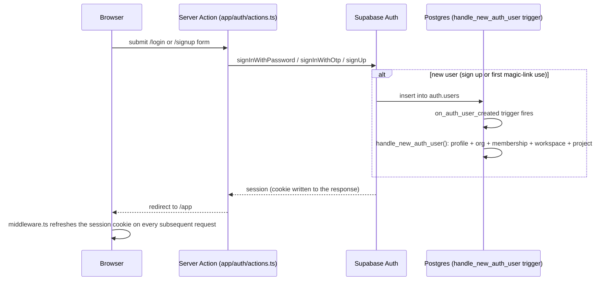

# Sprint 6.1 — Auth Implementation

**Files:** `apps/web/src/lib/supabase/{env,browser,server,middleware}.ts`, `apps/web/middleware.ts`, `apps/web/src/app/{login,signup}/page.tsx`, `apps/web/src/app/auth/{actions.ts,callback/route.ts}`, `apps/web/src/components/auth/AccountMenu.tsx`.

## Supabase client boundaries

| Client | File | Key | Used for |
|---|---|---|---|
| Browser | `lib/supabase/browser.ts` | anon | Not currently used by any shipped page — created for completeness/future client-side auth UI, but every Sprint 6.1 auth action is a Server Action instead (see below). |
| Server | `lib/supabase/server.ts` | anon, per-request cookies | Every RLS-protected read/write in this domain — `createSupabaseServerClient()` (throws if unconfigured) and `getCurrentUser()` (never throws, returns `null` if unconfigured or unauthenticated). |
| Middleware | `lib/supabase/middleware.ts` | anon, per-request cookies | Session cookie refresh only, on every request. No-ops entirely when Supabase isn't configured. |
| Admin/service-role | **Not created.** | — | See "Why no admin client," below. |

## Why every auth mutation is a Server Action, not a client-side call

`app/auth/actions.ts` — `signInWithPassword`, `signInWithMagicLink`, `signUp`, `signOut` are all `"use server"` functions, invoked directly as a `<form action={...}>`. The form submits to the server; the server talks to Supabase using the per-request server client; the resulting session cookie is set in that same request/response cycle. No credential or session token needs to round-trip through client-side JavaScript beyond what an ordinary form submission already does. This also means `lib/supabase/browser.ts` — built per the task's explicit "browser client" requirement — has no actual caller in this slice; it's the correct foundation for a future client-side auth interaction (e.g. an inline "check availability" call) without one being needed yet.

## Auth flow

## Magic link vs. password

Both are real, working paths — `signInWithMagicLink` (`/login`, the default view) and `signInWithPassword` (`/login`, toggled) for sign-in; `signUp` (`/signup`) for explicit password-based registration. A magic-link sign-in for a brand-new email also creates an account (Supabase's `signInWithOtp` default behavior, `shouldCreateUser: true`), so `/login`'s magic-link path and `/signup` are two valid on-ramps to the same `handle_new_auth_user()` bootstrap, not two different account models.

## Account menu and session state

`AccountMenu` (`components/auth/AccountMenu.tsx`) is a Server Component — it calls `getCurrentUser()` once per render, no client-side session state duplicated or risked going stale. Signed-out: a "Sign in" link. Signed-in: the user's email and a sign-out button wired to the `signOut` Server Action.

## Route protection: why it's in `/app/layout.tsx`, not `middleware.ts`

`middleware.ts`'s only job is refreshing the session cookie (`@supabase/ssr`'s documented requirement) — it never redirects, never checks a route's auth requirement, and no-ops completely when Supabase is unconfigured, so the entire unauthenticated Donna AI experience is unaffected by its existence. Actual route protection — "redirect an unauthenticated user away from `/app`" — lives in `app/app/layout.tsx`, a Server Component that calls `getCurrentUser()` once and `redirect("/login")` if it's `null`. This is a deliberate choice, not an oversight: Edge middleware is a heavier, more constrained place to run a database-backed session check than a Server Component with full Node.js context, and centralizing the gate in one layout means every route under `/app/*` inherits it automatically — a new page added later needs zero additional protection code.

## Why `/donna-ai` and `/app/*` are forced dynamic

Both read `getCurrentUser()`/session state that must reflect the real, current request — never a value baked into a static build. Next.js's automatic dynamic-API detection doesn't reliably catch this case (see `16-implementation-slice-6-1.md`'s account of the real build failure this caused and its fix), so `export const dynamic = "force-dynamic"` is set explicitly on both, rather than relying on inference.

## Why no admin/service-role client

The task's own instruction was to create one "only if genuinely required." Nothing in Sprint 6.1 needs to bypass RLS: every write (`save_decision` RPC) runs as the calling authenticated user via the per-request server client, and RLS itself is what determines whether it succeeds. The one operation that might seem to need elevated privilege — creating an organization/workspace/project for a brand-new user who isn't a member of anything yet — is instead handled by `handle_new_auth_user()`, a `security definer` **database function**, not an application-level service-role client call. A TypeScript admin client was never created, and `SUPABASE_SERVICE_ROLE_KEY` is deliberately absent from `.env.example` for this reason — adding it back is a real, considered decision for whichever future phase actually needs it (e.g. invitation acceptance for a not-yet-member user, per the broader Sprint 6 plan's Phase 6.2), not a default to reach for now.

## Enterprise identity roadmap (unchanged from the broader Sprint 6 plan)

SAML/OIDC via Supabase Auth's SSO feature (or a broker in front of it) remains a documented seam, not built. `auth.users` already generalizes over identity providers; nothing in Sprint 6.1's schema or code would need to change to add Google/Microsoft OAuth as a configuration-only addition later.

## What this document does not decide

- Whether password sign-in should be de-emphasized further or removed from the default `/login` view — a support-load/UX call, not resolved here.
