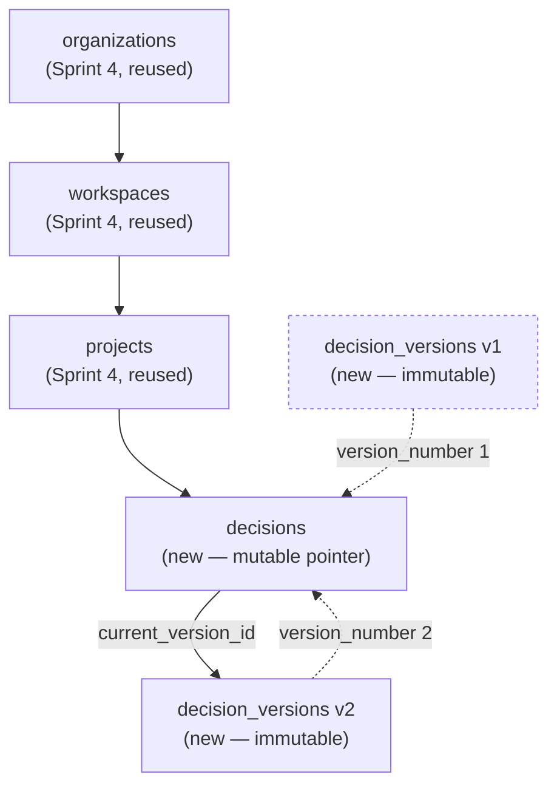
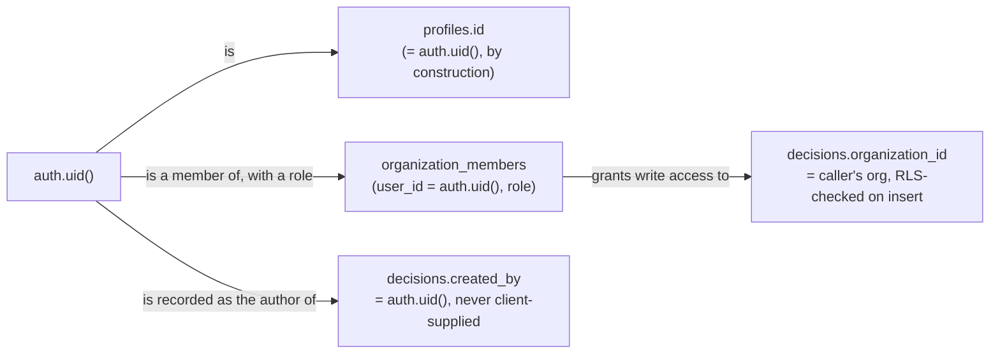

# Sprint 6.1 — Persistence Schema

**Files:** `supabase/migrations/20260806130000_sprint6_1_profiles_and_bootstrap.sql`, `supabase/migrations/20260806130100_sprint6_1_decisions.sql`.

Both are new migrations in this worktree — Sprint 4's existing migrations (`organizations`, `organization_members`, `workspaces`, `projects`, `decision_reports`, and everything else already in `main`'s tree) are **untouched**. Nothing here edits an already-applied migration file.

## Decision/version model



*Figure: `decisions` is the only table Sprint 6.1's application code ever `UPDATE`s (title, status, `current_version_id`). `decision_versions` has no UPDATE or DELETE policy for any regular role at all — immutability is a database fact, not an API convention. Sprint 6.1 only ever creates version 1; the append-only shape is already correct for a future version 2 without any schema change.*

## Tenant ownership path



*Figure: two independent facts establish "who owns this" — **membership** (does this user belong to the organization the decision is being saved into, checked by RLS on every insert) and **authorship** (`created_by`, always `auth.uid()` read server-side inside `save_decision()`, never a value the client can set). Both must hold; neither alone is sufficient — a member could not save a decision as a different member even if they tried, since `created_by` is never a parameter the client controls.*

## `profiles` vs. `users` — a disclosed overlap, not a redesign

Sprint 4's `users` table already exists, already has the right general shape for an auth-linked profile, and its own migration comment explicitly anticipated exactly this: "in production this row's id is expected to equal `auth.users.id`... no such trigger exists yet, by design." Sprint 6.1 does **not** wire that trigger onto `users`. Instead it creates a new, smaller `profiles` table (`id = auth.users.id`, `email`, `full_name`, timestamps only — no `avatar_url`, no `deleted_at`, no self-referential `created_by`) and wires the auth-sync trigger onto that.

**Why, explicitly:** the task's schema specification named `profiles` with this exact, minimal shape as a required Sprint 6.1 table. Rather than silently substitute Sprint 4's `users` table for it (a unilateral reinterpretation of an explicit spec) or silently create a redundant, undocumented duplicate, this is disclosed here as a real, intentional tension: **the schema now has two similar user-profile tables — `users` (Sprint 4, unused, no sync trigger) and `profiles` (Sprint 6.1, wired, actually used).** Reconciling them — retiring `users`, or migrating `profiles`'s data model onto it — is a genuine follow-up decision for a later phase, not resolved by this migration. Every foreign key Sprint 6.1 adds (`decisions.created_by`, `decision_versions.created_by`) references `profiles`, not `users`.

## `decisions`

```sql
id uuid primary key
human_readable_id text not null unique  -- CDD-2026-000152, assigned by a trigger, not the app
organization_id, workspace_id, project_id  -- all not null, references Sprint 4's tables
title text not null
status decision_status ('draft' | 'saved' | 'archived'), default 'saved'
current_version_id uuid references decision_versions(id)
created_by uuid references profiles(id)
created_at, updated_at
```

`human_readable_id` is assigned by a `BEFORE INSERT` trigger reading a dedicated global (not per-organization) sequence — global so the id is unambiguous even quoted out of context, the same reasoning documented in the broader Sprint 6 architecture set. A generated column can't call `nextval()` (not an immutable expression), hence a trigger rather than `generated always as`.

## `decision_versions`

```sql
id uuid primary key
decision_id uuid not null references decisions(id)
organization_id uuid not null  -- denormalized, same convention as every Sprint 4 table
version_number integer not null
decision_input_json, deterministic_output_json jsonb not null
validated_enrichment_json, provider_metadata_json, fallback_metadata_json, evidence_references_json jsonb
schema_version, scoring_engine_version, knowledge_base_version text not null
generated_at timestamptz not null
created_by uuid not null references profiles(id)
created_at timestamptz not null
change_reason text
```

No `updated_at`. No `deleted_at`. This is deliberate — the same pattern Sprint 4's `audit_logs` already established: a historical record that can be edited is not a historical record. A `BEFORE INSERT` trigger (`reject_decision_version_org_mismatch`) additionally guarantees a version's `organization_id` always matches its parent decision's — the denormalized column exists purely for single-join RLS performance, and this trigger stops that denormalization from ever silently drifting into a tenant-isolation bug.

## The `save_decision` function — atomicity, not privilege

```sql
create function save_decision(...) returns table (out_id uuid, out_human_readable_id text)
language plpgsql
security invoker  -- explicit, though it's the default
```

One function call = one transaction, so a `decisions` row can never exist with no version, and a version can never exist misattributed to the wrong decision. `security invoker` (stated explicitly rather than left implicit) means this function has **no elevated privilege of its own** — every `insert`/`update` inside it is still evaluated against the exact RLS policies below, exactly as if the caller had issued them directly. Its only job is atomicity, not a privilege escalation. `created_by` is always `auth.uid()`, read from the session inside the function — never a client-supplied parameter, closing the "save as someone else" spoofing path structurally, not just via the RLS check that would also catch it.

## What this document does not decide

- Whether/when to reconcile `profiles` and `users` — see above.
- Whether `decisions.status`'s three-value enum needs to grow toward the fuller lifecycle in the broader Sprint 6 plan (`docs/sprint-6/06-timeline.md`) — deliberately minimal here since Sprint 6.1 has no approval/review UI to drive richer states yet.
