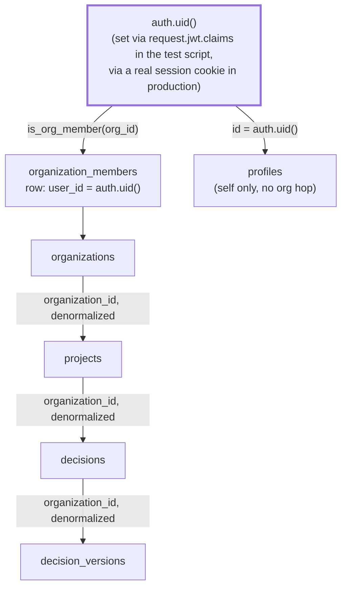

# Sprint 6.1 — RLS Verification

**File:** `supabase/tests/sprint6_1_rls_verification.sql`

## Disclosed plainly: not executed in this environment

No local Postgres/Supabase instance was available to run this against — verified directly: `supabase`, `docker`, and `psql` are all absent from this environment. The script is written to run cleanly against a real `supabase start` local instance, but its actual execution is genuinely outstanding, not silently skipped. This is stated here as plainly as Sprint 5 disclosed its own tooling gaps (no headless browser for UI screenshots) — a real limitation, not a claim of verification that didn't happen.

```
supabase start
psql "$(supabase status -o env | grep DB_URL | cut -d= -f2)" \
  -f supabase/tests/sprint6_1_rls_verification.sql
```

## RLS access path



*Figure: every `decisions`/`decision_versions` policy resolves to `auth.uid()` in exactly one join — the schema's founding design principle, unchanged. `profiles` is the one table with no organization hop at all: a user's own profile row is scoped to `id = auth.uid()` directly, deliberately not readable by other org members (see `18-persistence-schema.md`).*

## What the script tests, and why each case matters

| Test | What it proves | Why it's the right test |
|---|---|---|
| Cross-tenant `SELECT` on `decisions` returns zero rows | User B cannot read User A's decision by any means, including a guessed UUID | The exact test Sprint 5 left as `it.skip`, with the comment "requires real authentication ... neither of which exists in Phase 5.1." This is where that gap finally gets a real (if unexecuted-here) test. |
| Cross-tenant `SELECT` on `decision_versions` returns zero rows | The denormalized `organization_id` on versions actually enforces isolation, not just the parent table | `decision_versions` is the table holding the actual sensitive content (scores, narrative) — isolation on `decisions` alone wouldn't be enough if this policy were missing or wrong. |
| Cross-tenant `INSERT` on `decisions` is rejected | A malicious or buggy client cannot write into another organization's project even with a crafted request | This is the same property `handle-save-decision-request.ts`'s own tests assert indirectly (via a mocked RLS-rejection error) — this script proves it against a real Postgres RLS evaluation, not a mock. |
| Same-tenant `SELECT` succeeds | The policies aren't accidentally too restrictive — a real user can read their own data | Isolation tests alone can't catch an overly-strict policy that breaks the product; this is the necessary counterpart. |
| `decision_versions` rejects `UPDATE` for any regular role | Immutability holds even for a legitimate, same-organization, otherwise-authorized user | The strongest form of the "append-only" claim — not just "outsiders can't write," but "nobody can rewrite history," including someone with every other permission. |
| `profiles` RLS scopes strictly to self | A user cannot enumerate other users' emails via the profiles table | `profiles` deliberately has no "read my org's members" policy (that's `organization_members`'s job) — this confirms that boundary holds. |

## Recommended CI integration (not set up in this task — no CI exists in this repository yet)

```
supabase start
supabase db reset  # applies every migration in supabase/migrations/, fresh
psql "$DB_URL" -f supabase/tests/sprint6_1_rls_verification.sql
```

A script that exits non-zero (via any `RAISE EXCEPTION`) fails the build. This is a genuine, actionable next step — not implemented here because no GitHub Actions workflow exists anywhere in this repository yet (confirmed during the Platform Foundation v1 release's own safety review), and adding one is a real, separate infrastructure decision.
