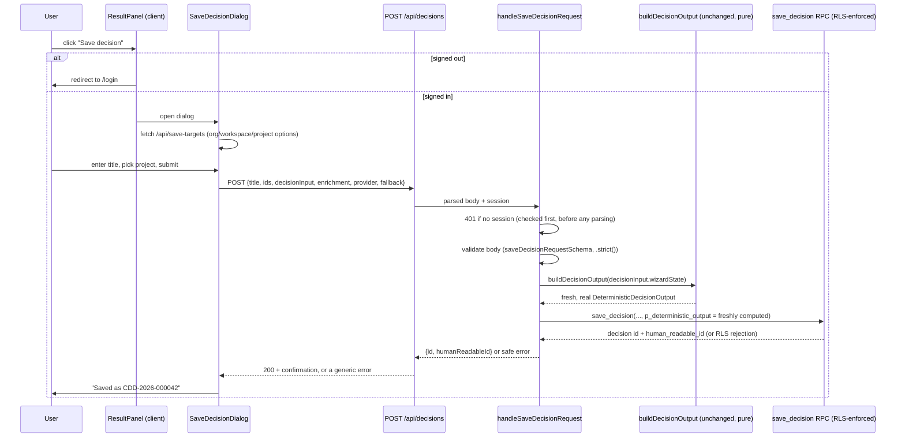

# Sprint 6.1 — Save Decision Flow

**Files:** `components/donna-ai/persistence/{save-decision-schema,decisions-repository,handle-save-decision-request,SaveDecisionDialog}.tsx`, `app/api/decisions/route.ts`, `app/api/save-targets/route.ts`, `ResultPanel.tsx` (modified).

## End-to-end sequence

## Signed-out behavior, precisely

`ResultPanel.handleSaveClick()` checks `isSignedIn` (a prop threaded down from `/donna-ai/page.tsx`'s server-side `getCurrentUser()` call, never a client-side guess) before doing anything else. Signed out: `router.push("/login")` — no dialog ever opens, no fetch to `/api/save-targets` or `/api/decisions` is ever made, nothing is silently persisted. Signed in: the real `SaveDecisionDialog` mounts.

## Why the dialog is conditionally *rendered*, not just conditionally *visible*

`{isSignedIn && saveDialogOpen && <SaveDecisionDialog onClose={...} .../>}` — the component only exists in the tree while open. Every mount starts fresh from its own `useState` initializers (`status: "idle"`, no stale title, no stale options), and closing discards all in-progress state automatically. This also avoids calling `setState` synchronously inside a `useEffect` body purely to reset state on open (a pattern React's own lint rules flag, caught during this task's own lint gate — see `22-test-report.md`).

## Why `output` is recomputed, not trusted from the client — restated as the flow's central guarantee

The dialog sends `decisionInput` (the wizard answers) and `enrichment`/`provider`/`fallback` (Sprint 5's own validated narrative metadata) — but **never** a `deterministic_output` or score field; `saveDecisionRequestSchema` has no field for one, and is `.strict()`, so even an attempt to add one is rejected outright. The handler computes the real output itself, server-side, from the validated wizard state, using the exact same `buildDecisionOutput` function every other code path already trusts. A client cannot make Donna save a fabricated score no matter what it sends — not because the input is checked for a fabricated score, but because there was never anywhere for one to go. See `21-security-review.md` for the full threat-model account.

## The "required org/workspace/project selection" requirement, and Sprint 6.1's actual scope

The dialog does present a real project picker (`GET /api/save-targets` → `listSaveTargetsForCurrentUser`), fulfilling the literal UI requirement — but because Sprint 6.1 auto-provisions exactly one organization/workspace/project per user (`17-auth-implementation.md`'s bootstrap trigger) and builds no UI for creating additional ones, the picker will show exactly one option for every user in this slice. The picker is real, working, and forward-compatible with a multi-project future (Sprint 6.2's organization/workspace management), not a placeholder — it just has nothing to pick between yet.

## What this document does not decide

- Whether a save failure should offer an automatic retry — the current UI surfaces the error and lets the user resubmit manually, consistent with Sprint 5's own "never silently retry" precedent for AI enrichment failures.
