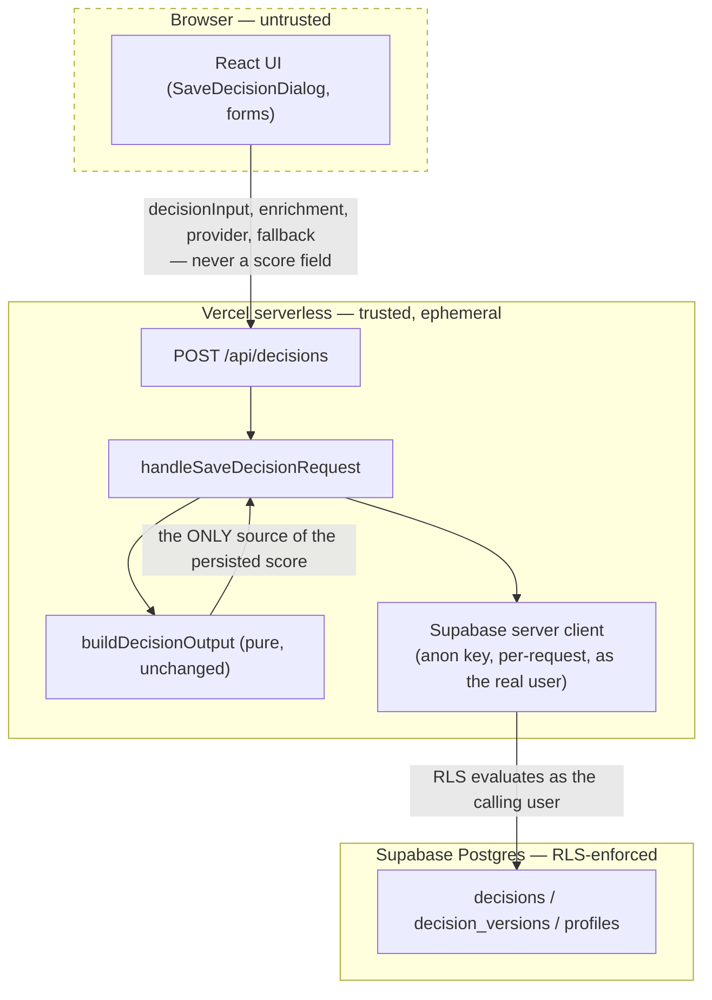

# Sprint 6.1 — Security Review

Checked directly against the code, not asserted from intent — every claim below has a corresponding grep, test, or build-output check run during this task.

## Trust boundaries

## Verified findings

- **No secret in the browser bundle.** `grep -rl "SUPABASE_SERVICE_ROLE\|service_role\|OPENAI_API_KEY" apps/web/.next/static` → zero matches, checked against the actual production build output produced during this task's own quality gate, not assumed from `server-only` guards alone.
- **No raw prompt persistence.** `save-decision-schema.ts`'s `saveDecisionRequestSchema` has no field capable of holding a prompt — `decisionInput` is `decisionInputSchema` (wizard answers only), `enrichment` is `intelligenceEnrichmentSchema` (bounded narrative fields only). There is structurally nowhere for a prompt to go.
- **No raw OpenAI response persistence.** Same argument — `enrichment` is the already-validated `IntelligenceEnrichment` shape, never the SDK's raw response envelope. This was true of Sprint 5's own contract and Sprint 6.1 changes nothing about it, only adds a second, independent validation pass at the save boundary.
- **No service-role use for normal reads/writes.** Confirmed by absence: no admin/service-role client was created anywhere in this slice (`17-auth-implementation.md`, "Why no admin client"). Every query in `decisions-repository.ts` takes an already-constructed per-request server client as a parameter; none constructs its own.
- **All persisted input is validated.** `decisionInput`/`enrichment`/`provider`/`fallback` via Zod (`.strict()`); `deterministic_output` via server-side recomputation, which is strictly stronger than schema validation — see below.
- **API errors are generic and safe.** `classifySupabaseError()` maps every Postgres/PostgREST error to one of three fixed strings, never the raw message. Directly tested: `handle-save-decision-request.test.ts`'s "surfaces a database-level rejection... never the raw Postgres error" asserts the literal RLS violation message text does not appear in the response.
- **No cross-tenant access.** Enforced by RLS (`is_org_member()`/`is_org_admin()`, the schema's existing pattern, no new mechanism). Verification script written (`19-rls-verification.md`) but **not executed** in this environment — disclosed, not hidden.
- **No full `DecisionReport` in logs.** `grep -rn "console\." lib/supabase/ components/donna-ai/persistence/ components/auth/ app/{login,signup,app,auth,api/decisions,api/save-targets}` → zero matches. This codebase does not log at all in this domain, so there is nothing to leak.
- **No free-text notes in audit logs.** Trivially true in a stronger sense than intended: **Sprint 6.1 writes no audit log entries at all.** `audit_logs` exists (Sprint 4) and is untouched. This is a real, disclosed scope gap, not a passed test — see "Known limitation" below.

## Why `output` is recomputed, not validated — the central integrity guarantee

A naive save-boundary design would accept a client-supplied `deterministic_output` and Zod-validate its shape. This was deliberately rejected as insufficient: **a tampered score is still a validly-shaped number between 0 and 100.** Schema validation alone cannot distinguish a real `donnaScore: 84` from a fabricated `donnaScore: 100` sent by a modified client. `handle-save-decision-request.ts` instead **never accepts an output field from the client at all** (`saveDecisionRequestSchema` has no such field, and is `.strict()`) and recomputes it server-side from the validated `decisionInput.wizardState`, using the same pure, already-tested `buildDecisionOutput` function every other code path calls. This proves the persisted score is the real, current, correct answer for that input — not merely plausible-looking. Directly tested: `handle-save-decision-request.test.ts`, "recomputes the deterministic output server-side rather than trusting any client-supplied score," and "rejects a body with an unknown extra field (e.g. an attempted score override)."

## Known limitation: no audit logging in this slice

Sprint 4's `audit_logs` table (already metadata-shaped correctly, already append-only with no update/delete policy for any role) is not written to by anything in Sprint 6.1. Creating a decision, saving a version — none of it produces an audit event yet. This is a genuine gap against the broader Sprint 6 mission's "full auditability" principle, explicitly out of Sprint 6.1's phase list (the task's own scope was profiles/auth/save/history, not audit), and is the first thing the next phase (`docs/sprint-6/12-roadmap.md`, Phase 6.7's timeline work, or an earlier dedicated pass) should add.

## No compliance claim

Consistent with every prior sprint's own disclosure: **no GDPR-compliance claim is made.** Real customer data reaching this system still requires a documented lawful basis, a data-processing agreement covering Supabase's actual terms/region, and explicit retention/export/deletion policies — none of which this implementation task can resolve unilaterally.

## What this document does not decide

- Whether the missing audit-logging gap should be closed before any real user data reaches this system, or can wait for the next phase — a founder call, not an engineering one.
