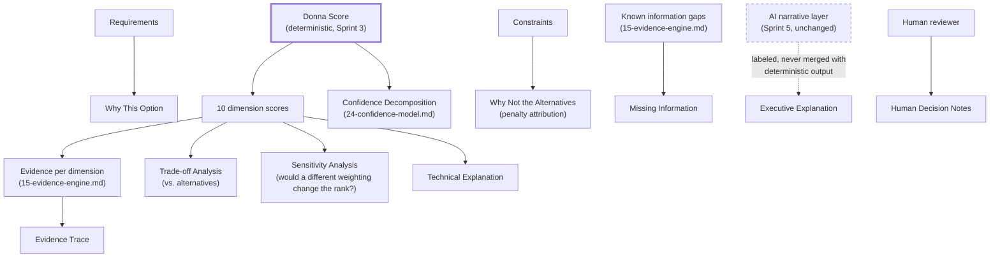

# Sprint 6 — 23. Explainability Layer

**Note on numbering:** this document continues the sequence at 23, not 16, because `docs/sprint-6/16` through `20` are already the Sprint 6.1 *implementation* documentation (`16-implementation-slice-6-1.md` etc.), completed in the immediately preceding work and pending founder approval. Reusing those numbers for unrelated content would have overwritten real, finished work — flagged explicitly rather than done silently. See this package's final report for the full renumbering map.

## Explainability as a first-class platform capability, not a UI feature

Everything this document defines is a *read* over data that already exists by the time it's needed — the deterministic engine's output (Sprint 3), the evidence graph (`13`–`15`), and Sprint 6.1's persisted decision. Explainability adds no new authoritative computation; it is entirely a structured presentation layer over facts that were already computed and validated elsewhere. This is the load-bearing design constraint: **an explanation that required its own separate computation would itself need to be trusted and audited as a second scoring path — exactly what this platform's deterministic-authority principle forbids.**

## What it must explain

Why the leading option ranked first; why alternatives ranked lower; which requirements drove the result; which constraints caused penalties; which evidence supports each conclusion; which assumptions were made; what information is missing; what could change the recommendation; how sensitive the result is to weighting changes; what the AI layer added versus what the deterministic engine decided.

## Explainability trace

*Figure: every solid arrow into an explanation output traces back to `Score` or its inputs — deterministic, reproducible data. The one dashed arrow (`AI` → `Executive Explanation`) is deliberately the exception, and it's labeled as one: the AI layer's narrative contributes prose, never a number, and the output it feeds is explicitly, visibly distinct from the technical/evidence-based outputs.*

## Design outputs, and what each actually is

| Output | Computed from | Already exists today? |
|---|---|---|
| Executive Explanation | Sprint 5's `IntelligenceEnrichment.executiveSummary` | **Yes** — unchanged, just formally named here as one of this layer's outputs. |
| Technical Explanation | Dimension scores + evidence, structured, not prose | New — a structured rendering, not a new computation. |
| Evidence Trace | `13-knowledge-graph.md`'s backward traversal, `15-evidence-engine.md`'s provenance tracing | New. |
| Trade-off Analysis | Diff between recommended and alternative dimension scores | Partially exists (Sprint 3's `ComparisonMatrix`); this formalizes it as an explainability output, not just a UI component. |
| Why This Option | Requirements → capabilities → the recommended product's coverage of them | New. |
| Why Not the Alternatives | Constraints → penalty attribution on each alternative | New. |
| Assumption Register | `DecisionOutput.assumptions` (Sprint 3) | **Yes** — already exists, formally named here. |
| Risk Register | `DecisionOutput.risks` (Sprint 3) | **Yes** — already exists. |
| Missing Information | `knownInformationGaps` (Sprint 5's evidence package) | **Yes** — already exists. |
| Sensitivity Analysis | Re-running the deterministic engine with perturbed weights, comparing rank stability | New — genuinely new computation, but still deterministic and reproducible, never AI-driven. |
| Confidence Decomposition | `24-confidence-model.md` | New (this package). |
| Human Decision Notes | Free text, tenant-authored, attached to a decision version | New — a natural extension of Sprint 6.1's `change_reason` field, generalized. |

**Roughly half of this layer already exists.** This document's real contribution is formalizing what's scattered across Sprint 3/5's output into a named, complete, cross-referenced set — plus three genuinely new capabilities (Evidence Trace, Why Not the Alternatives as structured penalty attribution, Sensitivity Analysis).

## Sensitivity analysis — how it stays deterministic, not a new AI capability

"How sensitive is this result to weighting changes" is answered by literally re-running `scoring/engine.ts` with perturbed weights and observing whether the ranking changes — the same pure, reproducible function Decision Replay (`docs/sprint-6/07-replay.md`) already re-runs for a different purpose. No new scoring logic, no AI call, no approximation — a sensitivity result is either "the top rank is stable across a ±10% weight perturbation" or it isn't, computed exactly.

## Rules, verified against what already exists

- **No black-box explanation.** Every output above traces to a named, inspectable source (a table, a computed diff, a specific evidence row) — never "the model said so."
- **No unsupported claim.** Enforced by the same claim-validation machinery Sprint 5 already built (`findUnsupportedNumericClaims`/`findUnsupportedVendorMentions`), extended to cover the new structured outputs, not a new validator per output type.
- **No AI-generated score.** Unchanged, structural guarantee since Sprint 3 — `IntelligenceEnrichment` has no numeric field.
- **Every numeric result must be reproducible.** True by construction for everything in the table above marked "New" except Executive Explanation (prose is not expected to be byte-reproducible; its *underlying facts* are).
- **Every explanation must point back to deterministic output and evidence.** The explicit design constraint stated at the top of this document.
- **Provider-generated narrative must remain clearly labeled.** Already true (Sprint 5's `disclosure` field, `provider.providerId`); this layer's job is making sure every new output that touches AI-generated text (only Executive Explanation) inherits that same labeling, never presents it unmarked alongside deterministic outputs.

## What this document does not decide

- The exact UI layout for presenting these 12 outputs together — a real design task, not resolved here (see `10-ui.md` for the existing UI architecture this extends).
