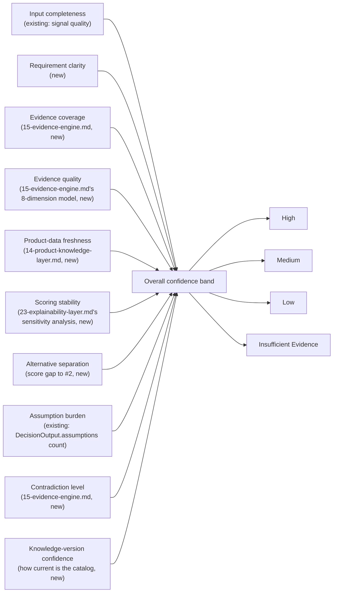

# Sprint 6 — 24. Confidence Model

## Confidence as a decomposed model, not a decorative percentage

Today's confidence score (Sprint 3's `computeConfidence()`) is already a real, formula-based number, not decoration — but it's a single number with no visible decomposition. This document doesn't replace that formula; it wraps it in a structure that shows *why* the number is what it is, and adds new dimensions the current formula doesn't yet account for because the data behind them (Evidence Engine, Product Knowledge Layer) didn't exist until this package.

## Confidence decomposition



## Dimensions, and what's new vs. already computed

| Dimension | Status |
|---|---|
| Input completeness | **Exists** — Sprint 3's `computeConfidence()` already factors in wizard-answer completeness and signal quality. |
| Assumption burden | **Exists** — a function of `DecisionOutput.assumptions.length`, already implicitly part of today's formula. |
| Requirement clarity | New — how many requirements were vague free text vs. structured/specific. |
| Evidence coverage | New — from `15-evidence-engine.md`'s coverage calculation. |
| Evidence quality | New — the mean (or worst-case; a real design decision for implementation, not pre-decided here) of the 8-dimension evidence quality model. |
| Product-data freshness | New — from `14-product-knowledge-layer.md`'s per-fact freshness scoring. |
| Scoring stability | New — from `23-explainability-layer.md`'s sensitivity analysis: does the top rank survive a weight perturbation? |
| Alternative separation | New — the score gap between the recommended option and the next-best alternative; a 2-point gap warrants lower confidence in "this is clearly the right choice" than a 15-point gap, independent of anything else. |
| Contradiction level | New — from `15-evidence-engine.md`'s contradiction detection: how many disputed facts touch this recommendation's evidence. |
| Knowledge-version confidence | New — a function of `knowledge_base_version`'s age (the same provenance field Sprint 6.1 already persists per decision version). |

## Output contract

```ts
interface ConfidenceDecomposition {
  overallBand: "High" | "Medium" | "Low" | "Insufficient Evidence";
  dimensions: Array<{
    name: string;
    band: "High" | "Medium" | "Low" | "Insufficient Evidence";
    explanation: string;  // plain-language, references the actual underlying fact
  }>;
  knownUncertainty: string[];      // e.g. "Pricing data for Vendor X is 14 months old"
  requiredNextInformation: string[]; // e.g. "No verified compliance evidence for EU data residency"
}
```

**Never a bare number without this structure alongside it.** If a percentage is shown anywhere in the UI, it is always paired with the dimension breakdown and the exact deterministic formula that produced it — documented in the same release that ships the percentage, not left implicit. This is a direct, literal response to the explicit instruction not to invent an arbitrary single confidence number: the number, if shown at all, is a *summary* of this structure, never a replacement for it.

## Bands, not false precision

`High` / `Medium` / `Low` / `Insufficient Evidence` — four bands, not a continuous 0–100 scale presented as if it were more precise than the underlying inputs actually support. `Insufficient Evidence` is a genuine fourth state, not a synonym for `Low`: it means the Evidence Engine found too little material to compute the other dimensions meaningfully at all, which is a qualitatively different situation from "we have evidence and it points to low confidence."

## Relationship to today's `confidenceScore`

Sprint 3's existing `DecisionOutput.confidenceScore` (a single 0–100 number) is not removed or renamed by this document — it remains the deterministic, reproducible, already-tested value it is today. This document's `ConfidenceDecomposition` is a new, additive structure that *explains* that number (and extends it with dimensions the current formula doesn't yet weigh) — implementation must decide whether `confidenceScore` itself eventually incorporates the new dimensions (a `scoring/engine.ts` change, requiring the same review rigor as any other authoritative-scoring change) or whether the decomposition remains purely explanatory alongside an unchanged score. **Not decided here** — flagged explicitly in this package's critical review as a real open question, not silently resolved either way.

## What this document does not decide

- Whether `Evidence quality`'s per-recommendation value is a mean, minimum, or weighted combination of the underlying claims' individual quality scores — an implementation-phase decision for `27-sprint-6-4-implementation-plan.md`'s vertical slice.
