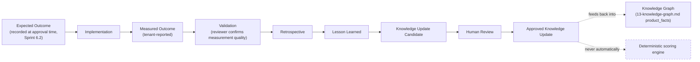

# Sprint 6 — 25. Outcome Intelligence

**Relationship to `docs/roadmap/09-outcome-intelligence.md`:** that document states the cross-cutting, roadmap-level non-negotiable principle ("never train scoring from unverified outcomes") and the high-level loop. This document is its detailed schema and workflow design, scoped specifically for how it lands inside Sprint 6's architecture — the two are complementary, not competing; neither supersedes the other. Where they'd ever conflict, the roadmap document's principle wins, since it's the cross-sprint constraint everything else must satisfy.

## Lifecycle



*Figure: `Approved Knowledge Update` can update a `product_facts` row (e.g., "implementation complexity for this product is higher than vendor documentation suggested, per three independent implementations") — that's knowledge, and knowledge updates through the same human-reviewed path as any other fact. It cannot touch the scoring engine. This is the same distinction `docs/roadmap/09-outcome-intelligence.md` draws, now shown against the concrete `product_facts` table this package introduces.*

## Outcome data

Time to value, implementation duration, budget variance, adoption, user satisfaction, technical performance, business KPI improvement, operational risk, security incidents, integration complexity, partner performance, decision success assessment.

## Schema

```sql
create table decision_outcomes (
  id uuid primary key default gen_random_uuid(),
  decision_id uuid not null references decisions(id),  -- Sprint 6.1's table
  organization_id uuid not null references organizations(id),
  measurement_period_start date not null,
  measurement_period_end date,
  outcome_data jsonb not null,  -- the twelve fields above, typed at the application layer
  validation_status text not null default 'unreviewed',  -- 'unreviewed' | 'validated' | 'disputed'
  reviewer_id uuid references profiles(id),
  benchmark_eligible boolean not null default false,
  anonymization_status text not null default 'not_anonymized',
  measurement_confidence text,  -- 'high' | 'medium' | 'low' — the reporter's own stated confidence
  retrospective_notes text,
  retrospective_visibility text not null default 'tenant_private',  -- 'tenant_private' | 'shared'
  created_by uuid not null references profiles(id),
  created_at timestamptz not null default now()
);
```

Immutable-append-only, the same discipline as `decision_versions` and `product_facts` — a corrected outcome measurement is a new row referencing the one it corrects, never an edit.

## Non-negotiable rules, and their concrete enforcement

- **Outcomes never automatically update authoritative scoring.** No code path exists from `decision_outcomes` to `scoring/weights.ts` or `scoring/engine.ts` — enforced by absence, the same way Sprint 6.1 enforced "no raw prompt persistence" by never giving the schema a field for one.
- **All updates require provenance and review.** `reviewer_id`/`validation_status` — an outcome record with `validation_status = 'unreviewed'` cannot become a Knowledge Update Candidate.
- **Distinguish correlation from causation.** A UI/reporting rule, not a schema constraint: any aggregate view ("products with X characteristic tend to have shorter time-to-value") must be labeled as correlation, never phrased as a causal claim the data doesn't support.
- **Tenant consent is mandatory.** `retrospective_visibility` defaults to `tenant_private`; nothing becomes `shared` (eligible for cross-tenant aggregation) without an explicit, separate consent action — not a default opt-in buried in a settings page.
- **Cross-tenant benchmarking must be aggregated and anonymized; minimum cohort thresholds are required; no customer-identifying benchmark output.** `benchmark_eligible` and `anonymization_status` are separate fields specifically so "this tenant consented to benchmarking" and "this specific record has actually been anonymized" can't be conflated — a record can be `benchmark_eligible = true` while `anonymization_status = 'not_anonymized'` still blocks it from appearing in any aggregate output until the anonymization step actually runs. A minimum-cohort-size check (e.g., never surface an aggregate computed from fewer than five tenants) is an application-layer rule enforced at query time, not a schema constraint — flagged here as required, not yet specified in exact number.
- **Outcome confidence and measurement quality must be stored.** `measurement_confidence`, distinct from the Confidence Model's (`24-confidence-model.md`) decision-time confidence — this is the *reporter's* confidence in their own measurement, a different thing entirely.
- **Retrospective notes remain tenant-private unless explicitly shared.** `retrospective_visibility`, same mechanism as consent above.

## Sprint mapping for Outcome Intelligence specifically

Per the explicit instruction to identify which elements belong where, rather than overloading one sprint:

| Element | Sprint |
|---|---|
| `decision_outcomes` schema, expected-outcome capture at approval time, basic measured-outcome entry UI | **Sprint 6.2** (decision lifecycle already reaches `Implemented`/`Measured` states there) |
| Validation workflow, retrospective notes, Lesson Learned → Knowledge Update Candidate pipeline | **Sprint 6.4** (needs the Knowledge Graph's `product_facts` to exist as the update target) |
| Cross-tenant benchmarking, anonymization pipeline, minimum-cohort enforcement | **A later, dedicated Outcome Intelligence release** — explicitly not Sprint 6.2 or 6.4; this is real, sensitive, cross-tenant-data-handling work that deserves its own scoped review, not a feature riding along inside a knowledge-graph sprint. |

## What this document does not decide

- The exact anonymization technique (k-anonymity, differential privacy, or a simpler minimum-cohort-plus-aggregation approach) for the later dedicated release — a real privacy-engineering decision, not made here.
