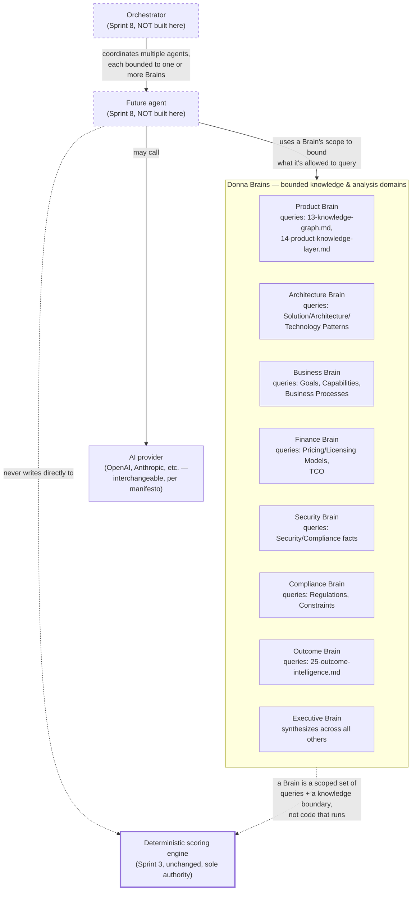

# Sprint 6 — 26. Donna Brains — Future Architecture

**This document describes a future conceptual separation. Nothing in it is implemented, scheduled for implementation in any sprint through 6.4, or a commitment to build agent code.** It exists so that when Sprint 8 (`docs/roadmap/08-sprint-8-agent-orchestration.md`) eventually starts, the conceptual boundaries were thought through in advance rather than improvised under delivery pressure.

## The eight Brains

Product Brain, Architecture Brain, Business Brain, Finance Brain, Security Brain, Compliance Brain, Outcome Brain, Executive Brain.

## What a "Brain" is, precisely

*Figure: dashed boxes (`Agent`, `Orchestrator`) are Sprint 8 concepts, not built by this document or any Sprint 6 stage. Solid boxes (the eight Brains) are knowledge-domain boundaries this document defines now, even though nothing queries them through an agent yet — a Brain's actual "implementation" today is nothing more than a documented scope of which Knowledge Graph node types and Evidence Engine queries belong to it.*

## Explicit distinctions

- **Knowledge domain** (a "Brain," as defined here) — a bounded slice of the Knowledge Graph and Evidence Engine, defined by which node types and fact domains it's scoped to query. Not code. Not a service. A boundary a future agent or a future deterministic service is scoped to.
- **Deterministic service** — real, running code with no AI involvement, like `scoring/engine.ts` or the Evidence Engine's coverage/contradiction calculations (`15-evidence-engine.md`). Deterministic services exist today; Brains as defined in this document do not run anything.
- **AI provider** — an interchangeable model execution backend (OpenAI, Anthropic, Gemini, Azure OpenAI, a local model), behind the `IntelligenceProvider` interface Sprint 5 already established. A provider has no inherent knowledge-domain boundary of its own; a Brain's boundary is what would constrain *what a provider is given to work with*, if and when an agent using that Brain calls a provider.
- **Future agent** (Sprint 8, not built here) — a bounded process that: is scoped to one or more Brains, may call an AI provider, produces structured output validated against a strict schema (the same `.strict()` Zod discipline Sprint 5/6.1 already use), and never writes directly to authoritative scoring.
- **Orchestrator** (Sprint 8, not built here) — coordinates multiple agents toward a single user objective, performs contradiction detection across agent outputs (reusing `15-evidence-engine.md`'s contradiction-detection concept, generalized from "two facts disagree" to "two agents disagree"), and hands the result to deterministic scoring and human review, per `docs/roadmap/08-sprint-8-agent-orchestration.md`'s orchestration diagram.

## Why this document exists now, three stages before Sprint 8

Two reasons, both structural, not speculative:

1. **The Knowledge Graph's ontology (`13-knowledge-graph.md`) needs to already be shaped in a way that supports Brain-scoped queries later** — e.g., "Security Brain" needs `Security`/`Compliance`/`Certification` facts to already be queryable as a coherent slice, not scattered across an undifferentiated `product_facts` table with no way to filter by domain. `fact_domain` (already in `14-product-knowledge-layer.md`'s schema) is the concrete hook a future Brain's query boundary would filter on.
2. **The Evidence Engine's contradiction detection (`15-evidence-engine.md`) is deliberately the same mechanism this document reuses for cross-agent conflict, not a new one invented for Sprint 8** — designing them as the same concept now means Sprint 8 doesn't have to invent conflict-resolution semantics from scratch under its own delivery pressure.

## Do not implement agent code

Restated as the closing line of this document because it's the single most important instruction governing it: everything above is a naming and boundary exercise for a future sprint, evaluated now only because doing so shapes decisions (the Knowledge Graph's `fact_domain` field, the Evidence Engine's contradiction-detection design) that Sprint 6.4 is making anyway.
