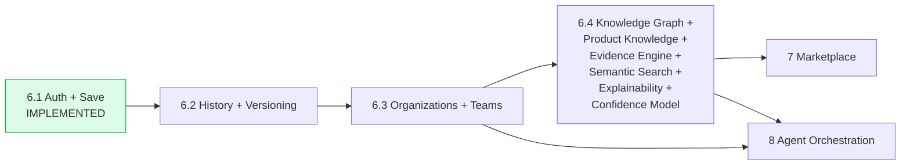

# Sprint 6 — 27. Sprint 6.4 Implementation Plan

## Sprint dependency sequence

*Unchanged from `docs/roadmap/10-release-sequencing.md`'s own dependency chain — restated here because this document's whole purpose is showing exactly what Sprint 6.4 (a single box in that diagram) actually decomposes into.*

## Sprint mapping, as specified

- **Sprint 6.1** — Supabase Auth, Explicit Save Decision, initial persistence. **Implemented.**
- **Sprint 6.2** — Decision History, Immutable Versioning, Replay.
- **Sprint 6.3** — Organizations, Workspaces, Teams, tenant governance.
- **Sprint 6.4** — Knowledge Graph, Product Knowledge Layer, Evidence Engine, Semantic Search, Explainability, Confidence Model.
- **Sprint 7** — Marketplace, Partner Matching, commercial-neutrality separation.
- **Sprint 8** — Donna Orchestration, multi-model and future multi-agent execution.

## Do not overload Sprint 6.4 — the smallest production-suitable vertical slice

Everything in `13` through `26` describes the *complete* target architecture. Sprint 6.4 itself should ship a deliberately narrow first cut, chosen so each piece is genuinely useful on its own rather than half-built scaffolding waiting on the rest:

| In the first Sprint 6.4 slice | Deferred to a later pass |
|---|---|
| `product_facts` table + the fact-status taxonomy (`14-product-knowledge-layer.md`) | Automated ingestion tooling — first slice is manual/reviewer-entered facts only |
| The core Knowledge Graph node types actually needed by the *existing* scoring engine's inputs (Capability, Solution Pattern, Architecture Pattern, Technology Pattern, Vendor, Product) | The full 27-node ontology — Business Process, Regulation, Certification, Customer Reference, and similar peripheral node types wait for a second pass once the core is proven |
| Migrating the existing `vendor-intelligence/catalog.ts` into `Vendor`/`Product` rows, read-only from the engine's perspective (the engine still reads its current shape; the graph becomes the source that shape is generated from) | Rewiring `scoring/engine.ts` to query the graph directly at runtime — a larger, separately-reviewed change |
| Evidence Engine: ingestion, normalization, source classification, freshness scoring, basic coverage/missing-information calculation | Contradiction detection, the full 8-dimension evidence quality model, duplicate detection via embeddings — real but genuinely second-priority |
| Confidence Model: the decomposition *structure* (`ConfidenceDecomposition`), populated with the dimensions that already have real data (input completeness, assumption burden, evidence coverage) | The dimensions that depend on not-yet-built Evidence Engine features (contradiction level, evidence quality) — the structure supports them being added later without a breaking change |
| Explainability: Evidence Trace, Why This Option, Why Not the Alternatives — the three outputs that are purely structural reads over data already computed | Sensitivity Analysis (needs a real perturbation-testing harness) and the full 12-output UI — a second pass |
| Semantic search: `pgvector` on the new `product_facts.embedding` column, basic similarity query | Semantic search across the full graph (lessons learned, claims, etc.) |

## Files, schema, and gates this slice would touch (illustrative — not committed to by this document)

- New migrations: `product_facts`, the core node tables (capabilities, solution_patterns, architecture_patterns, technology_patterns, vendors, products — some possibly reusing/renaming Sprint 3's TypeScript catalog's shape directly), the edge tables connecting them.
- New repository layer additions in `packages/database` (following the existing pattern, not `apps/web`'s Sprint 6.1 pattern of a locally-scoped repository — this is genuinely shared, cross-app knowledge, the reason `packages/database` exists).
- RLS: the same hybrid global/tenant-private pattern (`organization_id nullable`) already used everywhere in this schema — no new mechanism.
- Tests: schema/RLS tests following `docs/sprint-6/19-rls-verification.md`'s established (if still unexecuted) pattern; unit tests for the evidence-quality and confidence-decomposition pure functions, following Sprint 5/6.1's mocked-dependency testing discipline.

## What this document does not decide

- The exact column-level schema for the "in the first slice" node tables — a real implementation-phase task, deliberately not pre-decided at the architecture-extension stage, consistent with how Sprint 6.1's own architecture docs (`00`–`12`) left implementation-phase column decisions to the implementation task itself.
